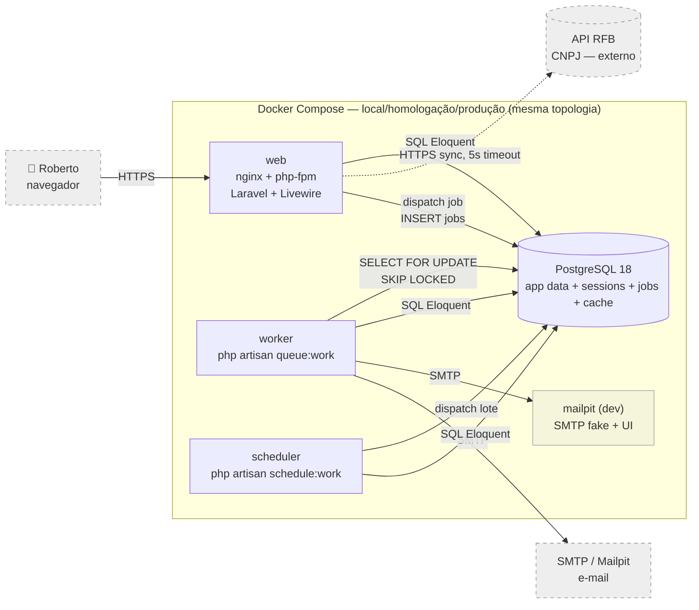

# ADR-002 — Topologia do DEFOnline

## Contexto

A ADR-001 fixou a stack (Laravel 13 + Livewire 4 + PostgreSQL 18 + Pest 4 + Dusk 8), mas não decide **quantos processos** o sistema executa em runtime, **como esses processos se comunicam** e **como tudo sobe localmente**. Sem essa decisão, STORY-007 (hello-world deployado) não sabe quantos containers orquestrar, STORY-004 (Infra) não sabe quantos targets de deploy provisionar e os épicos da onda ficam ambíguos quanto à fronteira de cada módulo.

Restrições topológicas relevantes derivadas da especificação e RNFs:

- **Fluxos que não cabem no request HTTP** (precisam de processamento fora do ciclo síncrono):
  - **Geração de PDF assíncrona** — `RNF §1.2`: < 10 s com feedback visual; `Spec funcional §4.7`.
  - **Envio de e-mail transacional** — confirmação de cadastro (EPIC-001), aviso D-7 antes de expiração do diagnóstico de 12 meses (EPIC-003, `Spec §4.8`), recuperação de senha (Breeze, ADR-001).
  - **Expiração de rascunho de quiz** após 90 dias parametrizável — `RNF §2.2`.
  - **Retenção de diagnósticos** com aviso D-7 + exclusão automática após 12 meses — `RNF §2.2` + `Spec §4.8`.
  - **Anonimização LGPD** assíncrona ao excluir conta — `Spec §4.3.2`.
- **Integração externa síncrona** — consulta CNPJ na RFB com timeout curto + fallback manual (`Spec §3.2`, `arquitetura-tecnica.md §3.1`); permanece no request, **não** exige worker.
- **Time muito pequeno** — operar mais de 1 codebase é hostil (PDR-001 + ADR-001 F6); microsserviços são desqualificados por default (princípio #2).
- **Princípio #3 (Postgres-first)** — adicionar Redis/RabbitMQ/SQS exige prova com números que o Postgres não dá conta; volume do MVP (300 concurrent users, dezenas de PDFs/dia, dezenas de e-mails/dia) está confortavelmente dentro do envelope do driver `database` de queue com `SKIP LOCKED`.
- **Princípio #6 (100% local)** — toda a topologia precisa subir com **um único comando** (`docker compose up`) na máquina do dev, sem internet (após pull inicial).
- **Princípio #5 (coesão alta / acoplamento baixo)** — módulos do monolito precisam ser nomeados pela razão de negócio, não por camada técnica, para que a evolução do código não dependa de refactor topológico depois.

A decisão precisa ser tomada agora porque destrava STORY-007 (hello world deployado), informa a STORY-004 (Infra) sobre quantos targets/containers existem e a STORY-005 (CI/CD) sobre quantos processos rodam em runtime.

## Forças (drivers) da decisão

- **F1 — Princípio #2 (monolito até evidência forte do contrário)** — **Alto**. Central. Quebrar o sistema em serviços sem dor concreta é violação direta.
- **F2 — Princípio #5 (fronteiras pela razão de negócio)** — **Alto**. Módulos nomeados por domínio (cadastro, diagnostico, historico, auth), não por camada técnica.
- **F3 — Princípio #6 (sobe local em 1 comando, sem internet)** — **Alto**. Toda a topologia tem que caber em `docker compose up`.
- **F4 — Princípio #3 (Postgres-first)** — **Alto**. Fila de jobs vive no Postgres; sem Redis no MVP.
- **F5 — Fluxos assíncronos reais do MVP** — **Alto**. PDF, e-mail, retenção, expiração, anonimização LGPD **exigem** processamento fora do request HTTP. Sem worker, o produto não funciona.
- **F6 — Operabilidade por time muito pequeno** — **Alto**. Cada processo extra é uma fonte extra de incidente, log, alerta, deploy.
- **F7 — Compatibilidade com TDD + E2E em browser real** — **Alto**. Cada processo da topologia precisa ser exercitável em teste sem heroísmo (princípio #10).
- **F8 — Princípio #8 (observabilidade desde dia 1)** — **Alto**. Um request que cruza web → fila → worker precisa de trace ID propagado, senão debug em prod vira arqueologia. Estratégia de correlação tem que estar definida **antes** da STORY-006 escolher a ferramenta.
- **F9 — Reversibilidade** — **Médio**. Manter web e worker no mesmo codebase (mesma imagem Docker, mesmos providers) preserva opção de promover um módulo a serviço **se** uma dor concreta aparecer no futuro.
- **F10 — Custo recorrente** — **Médio**. Cada processo extra em produção é RAM extra paga no VPS (`princípio #11`).

## Opções consideradas

### Opção A — Monolito modular único Laravel, com `web` + `worker` + `scheduler` como processos auxiliares do mesmo codebase

- **Resumo:** uma **única base de código Laravel** (`composer.lock` único, mesma imagem Docker, mesmos providers, mesmos módulos de domínio) executando em **três modos de processo** em runtime:
  - **`web`** — `nginx` + `php-fpm` servindo HTTP/HTTPS. Responde a todo request síncrono (área logada Livewire, hotsite Blade, consulta CNPJ → RFB, login, quiz POST, comparativo de histórico). Único processo exposto ao mundo.
  - **`worker`** — `php artisan queue:work --queue=default,emails,pdf,lgpd`. Consome jobs enfileirados na tabela `jobs` do Postgres via `SELECT ... FOR UPDATE SKIP LOCKED`. Trata: geração de PDF, e-mail transacional, anonimização LGPD em cascata.
  - **`scheduler`** — `php artisan schedule:work` (long-running). Dispara, no horário configurado em `app/Console/Kernel.php`, os jobs batch: expirar rascunhos com 90+ dias, varrer diagnósticos com 12 meses, enfileirar e-mails de aviso D-7. **Não executa o trabalho pesado** — ele **enfileira** jobs que `worker` consome.
- **Comunicação interna:**
  - **Inter-módulo (cadastro ↔ diagnóstico ↔ histórico ↔ auth):** chamadas síncronas de função via classes de Serviço com interfaces explícitas (PHP `interface` + binding no Service Provider). Sem evento interno, sem barramento. Princípio #5 garante que essas fronteiras existam por contrato, não por convenção.
  - **Web → Worker (assíncrono):** `dispatch(new ProcessPdf(...))` insere linha na tabela `jobs`. Worker consome com `SKIP LOCKED`. Idempotência: cada job carrega um `idempotency_key`; tabela `job_results` (decisão de modelagem fica para ADR de Persistência, mas convenção topológica é estabelecida aqui).
  - **Scheduler → Worker:** scheduler enfileira jobs idênticos aos disparados pela web; worker é agnóstico à origem.
  - **App → Postgres:** SQL via Eloquent. Cada processo (web/worker/scheduler) abre seu próprio pool de conexões.
  - **App → RFB (externo):** chamada HTTPS síncrona dentro do request com timeout de 5 s + fallback manual (`Spec §3.2`). Não é assíncrona — não usa worker. **Provedor concreto** é selecionável via configuração entre `cnpja` (primário em produção — IDR-005) e `receitaws` (secundário pronto para troca manual), ambos por trás da abstração `RfbCnpjClient` (IDR-004). **Rate-limit por provedor** via `Illuminate\Support\Facades\RateLimiter` com chave `rfb:provider:{provider}` sobre o cache `database` em Postgres (IDR-006) — contagem global entre `web` e `worker`. Cache de respostas bem-sucedidas (`rfb:cnpj:{sha256(cnpj)}`, TTL parametrizado) usa o mesmo driver `database` (IDR-006), respeitando o princípio Postgres-first.
  - **App → Mailpit (dev) / Provedor SMTP (prod):** worker abre conexão SMTP por job de e-mail. Provedor real é decisão da ADR de Infra/Observabilidade futura.
- **Local (Docker Compose conceitual):**
  - `web` (porta 8090 → 80), `worker`, `scheduler`, `db` (Postgres 18), `mailpit` (SMTP fake em :1025, UI em :8025).
  - **5 containers**, todos a partir de 2 imagens (a imagem do app é a mesma para web/worker/scheduler — só muda o `command`).
  - `docker compose up -d` resolve tudo. Sem internet após pull inicial (`princípio #6`).
- **Estratégia de trace / correlação:**
  - **Web:** middleware global `AssignRequestId` (Laravel middleware) injeta cabeçalho `X-Request-Id` (UUID v7, ordenável) em **toda requisição entrante**; se já vier do reverse proxy à frente, respeita. Coloca em `Log::withContext(['request_id' => ...])` e expõe via helper `request_id()`.
  - **Job enfileirado:** ao chamar `dispatch()`, a aplicação anexa o `request_id` atual ao payload do job (campo padronizado `meta.request_id`). Mecanismo: trait `PropagatesRequestId` aplicada às base job classes ou listener global em `JobQueueing`.
  - **Worker:** ao iniciar o processamento de um job, lê `meta.request_id` do payload e re-injeta em `Log::withContext()`. Mesmo `request_id` aparece em todos os logs do request original **e** do(s) job(s) que ele disparou.
  - **Scheduler:** ao enfileirar batch noturno, gera um novo `request_id` por execução de tarefa cron (`schedule:cadastro:expira-rascunhos:UUID`) e propaga para todos os jobs daquele lote — assim um lote de 1.000 e-mails D-7 compartilha o mesmo `request_id` raiz.
  - **Independente de ferramenta:** essa convenção é só formato de log/payload. Qualquer escolha futura da STORY-006 (Pail, Sentry, OpenTelemetry, Loki, etc.) consome um campo `request_id` padronizado.
- **Como atende aos princípios:**
  - ✅ **#1 Simplicidade:** 1 codebase, 1 imagem Docker, 3 modos de processo, 1 banco. Operacionalmente trivial — não há "qual repositório tem este bug".
  - ✅ **#2 Monolito:** referência da categoria. Worker e scheduler são o **mesmo monolito** em modo diferente, não outro serviço.
  - ✅ **#3 Postgres-first:** fila vive no Postgres via driver `database`. Sem Redis, sem RabbitMQ, sem SQS.
  - ✅ **#4 Opinativo:** segue 100% o default do Laravel (queue, scheduler, middleware, providers, eventos). Zero decisão de "qual lib".
  - ✅ **#5 Coesão/acoplamento:** módulos nomeados pela razão de negócio (auth, cadastro, diagnostico, historico) com contratos via interfaces PHP. Estrutura final de pastas é IDR do Programador, mas o **princípio** está fixado aqui.
  - ✅ **#6 Local total:** `docker compose up` levanta tudo, inclusive Mailpit para e-mail visual sem internet.
  - ✅ **#7 Reversibilidade:** worker pode ser desmembrado em serviço só **se** dor concreta aparecer — sem refactor de domínio, só de deploy.
  - ✅ **#8 Observabilidade:** `request_id` propagado via middleware + job payload garante trace cross-process desde o dia 1.
  - ✅ **#9 Automatizável:** processos rodam idênticos em local/homologação/produção. CI exercita cada um.
  - ✅ **#10 TDD + E2E:** jobs testáveis com `Queue::fake()`; Dusk exercita web; scheduler testável com `$this->travel(7)->days()`.
  - ✅ **#11 Custo:** 3 processos PHP-CLI em VPS = ~150 MB RAM extra além do php-fpm. Coube no orçamento da ADR-001.
  - ✅ **#12 Restrições:** explicitamente fora — Redis, RabbitMQ, microsserviços (ver "Fora de escopo").
- **Prós concretos:**
  - Um único `composer install`, um único `php artisan migrate`, um único deploy.
  - `request_id` único cruza web → fila → worker — debug de "cliente reclamou que PDF não chegou" vira `grep request_id` em 1 lugar.
  - Scheduler **enfileira**, não executa. Se uma tarefa noturna travar, o worker isola — o scheduler segue.
  - Conexões com Postgres são por processo (web, worker, scheduler têm pools separados). Worker travado não derruba o web.
  - Filas nomeadas (`emails`, `pdf`, `lgpd`, `default`) permitem priorizar a partir de configuração — sem novo container.
- **Contras concretos:**
  - Worker e scheduler são **processos extras** para operar. Cada um tem PID, log, restart policy, health check. Custo de complexidade > 0.
  - Fila no Postgres tem limites — para o MVP (centenas de jobs/dia) é folgado; **se** virar 10k msg/s sustentado, reabre-se a decisão (sinal de revisão registrado abaixo).
  - Scheduler ser long-running (`schedule:work`) exige que o container fique de pé; se ele cair sem ser detectado, tarefas noturnas falham silenciosamente. Mitigação: health-check + alerta na STORY-006.

### Opção B — Mesmo monolito em runtime worker-mode (Laravel Octane / FrankenPHP) com queue embarcada

- **Resumo:** Octane (sobre Swoole, RoadRunner ou FrankenPHP) faz o PHP rodar em modo worker (estado de aplicação mantido entre requests). Permite ainda **embarcar** o queue worker no mesmo processo (`octane:start --workers=4 --task-workers=2`), reduzindo a topologia para `app + db` (+ mailpit em dev).
- **Como atende aos princípios:**
  - ✅ #1 menos containers, **aparentemente** mais simples.
  - ⚠️ #2 monolito ok, mas Octane introduz um modelo de runtime PHP **diferente do default** Laravel; muda contrato implícito (estado, singletons, conexões long-lived) e exige disciplina contra vazamento de memória/estado entre requests.
  - ✅ #3 mantém Postgres como fila.
  - ⚠️ #4 ainda é Laravel opinativo, mas Octane é um **add-on opcional**, não o default — princípio #4 prefere defaults.
  - ✅ #6 ainda funciona local.
  - ⚠️ #7 trocar Octane → default Laravel depois é fácil; mas trocar **dentro** de Octane (ex: Swoole → FrankenPHP) já tem fricção.
  - ⚠️ #10 testar jobs de longa duração competindo com requests no mesmo runtime é mais ruidoso que em processo separado.
- **Prós:** 2 containers no MVP em vez de 5; latência menor por request (sem bootstrap por request).
- **Contras concretos:**
  - **Estado entre requests** é um pé de cano clássico do Octane — singletons, conexões e configs precisam ser explicitamente "resetados" por request. Times pequenos vazam estado e descobrem só em produção (incidente).
  - **Worker e request no mesmo runtime** significam que job pesado (PDF de 8 s) bloqueia threads que poderiam servir HTTP, ou exige separar `task-workers` — voltando à mesma multiplicidade de processos da Opção A, só com menos clareza operacional.
  - Em Laravel 13 + Livewire 4, Octane é suportado mas **menos battle-tested** do que o default php-fpm. Times pequenos pagam caro por sutilezas.
  - Performance não é gargalo no MVP (NFRs folgados em php-fpm); otimizar runtime antes de existir produto = princípio #1 violado.
- **Veredicto:** rejeitada como **default da topologia inicial**. Pode virar otimização futura via supersede caso latência de bootstrap vire dor mensurada — sinal de revisão explícito abaixo.

### Opção C — Separação técnica natural: BE Laravel API JSON + worker + FE SPA separado

- **Resumo:** voltar ao padrão pré-reset com FE separado consumindo API. Worker separado. 3 codebases.
- **Já rejeitada implicitamente em ADR-001** (Livewire elimina FE separado). Reabri-la aqui contradiria a ADR-001 aceita.
- **Veredicto:** rejeitada por conflito com ADR-001. Mantida na ADR só como contraprova didática.

### Opção D — Status quo / microsserviços (cadastro, diagnóstico, histórico como serviços separados)

- **Resumo:** quebrar o monolito por domínio desde o dia 1.
- **Consequência se mantivermos:** time de 1 dev humano operando 3+ serviços, com rede no caminho crítico do cálculo do diagnóstico, transações distribuídas entre cadastro e histórico, observabilidade multiplicada por N.
- **Custo de adiar:** baixo — o caminho de promover um módulo a serviço **depois** existe (mesmo codebase, mesmas interfaces). Decidir adiar é decidir bem.
- **Veredicto:** **rejeitada** por violação direta do princípio #2 sem evidência concreta de dor que justifique.

## Matriz comparativa

| Critério (força) | Peso | A — Monolito + worker + scheduler | B — Octane/FrankenPHP worker-mode | C — BE API + FE SPA + worker | D — Microsserviços |
|---|---|---|---|---|---|
| F1 — Princípio #2 (monolito) | Alto | ✅ referência | ✅ ainda monolito | ⚠️ 3 codebases | ❌ violação direta |
| F2 — Fronteiras por razão de negócio | Alto | ✅ módulos de domínio | ✅ mesmo | ⚠️ camada técnica | ⚠️ pode, mas com custo |
| F3 — Local em 1 comando | Alto | ✅ `docker compose up` | ✅ idem | ⚠️ FE separado puxa node | ❌ orquestração pesada |
| F4 — Postgres-first | Alto | ✅ fila no PG | ✅ fila no PG | ✅ fila no PG | ⚠️ tendência a Redis/SQS |
| F5 — Atende fluxos async do MVP | Alto | ✅ worker dedicado | ✅ task-workers | ✅ worker | ✅ |
| F6 — Operável por time muito pequeno | Alto | ✅ 1 codebase, 3 modos | ⚠️ runtime exótico | ❌ 3 codebases | ❌ N codebases |
| F7 — TDD/E2E sem heroísmo | Alto | ✅ Queue::fake, Dusk | ⚠️ runtime exige cuidado | ⚠️ E2E cross-app | ❌ contract tests |
| F8 — Trace cross-process | Alto | ✅ request_id no payload | ✅ idem | ⚠️ N hops | ❌ N hops, exige tracing distrib. |
| F9 — Reversibilidade | Médio | ✅ extrair worker é fácil | ⚠️ dentro do Octane é menos | ⚠️ unificar custa | ❌ unificar custa muito |
| F10 — Custo recorrente | Médio | ✅ ~150MB extra | ✅ menos containers | ⚠️ FE build/host | ❌ N VPS |

Notas: ✅ atende plenamente; ⚠️ atende com ressalva; ❌ não atende ou atende mal.

## Decisão proposta

> **Optamos pela Opção A — Monolito modular único Laravel, com `web` + `worker` + `scheduler` como processos auxiliares do mesmo codebase, fila no Postgres via driver `database`, comunicação inter-módulo síncrona via interfaces PHP, e propagação de `request_id` (UUID v7) via middleware no web e via payload de job no worker/scheduler. Local Docker Compose: `web` + `worker` + `scheduler` + `db` + `mailpit`.**

Esta topologia é a expressão direta dos princípios centrais #2 (monolito), #3 (Postgres-first), #5 (fronteiras por domínio) e #6 (local total) sobre a stack fixada em ADR-001. Worker e scheduler **não** são serviços separados — são **modos de execução do mesmo monolito**, com a mesma imagem Docker e o mesmo `composer.lock`. A fronteira que importa é o **domínio** (cadastro, diagnostico, historico, auth), não a camada técnica.

## Fronteira de módulos pela razão de negócio (CA-2 — princípio #5)

A ADR fixa **a regra**: módulos são nomeados pela razão única de mudar, derivada dos épicos da WAVE-2026-01. A **organização concreta de pastas** (PSR-4, namespaces, suffix de classes) fica como **IDR do Programador** na primeira história de implementação.

Módulos esperados no MVP:

| Módulo | Razão única de mudar | Estória mãe | Comunicação externa | Comunicação interna |
|---|---|---|---|---|
| `auth` | Política de autenticação muda (MFA, social, SSO) | Default Laravel Breeze (ADR-001) | Sessão cookie HttpOnly | Expõe `Auth::user()` ao resto |
| `cadastro` | Regras de cadastro de Empresa Analisada/Usuário mudam | EPIC-001 | Consulta CNPJ na RFB (HTTPS sync, 5s timeout) + dispara `EnviarEmailConfirmacao` (async) | Publica `EmpresaCadastrada` para `historico`/`diagnostico` via call direta |
| `diagnostico` | Regras do quiz / motor de 14 indicadores mudam | EPIC-002 | Dispara `GerarPdfDiagnostico` (async) | Lê `Empresa` via interface `CadastroQuery`; gera `Diagnostico` consumido por `historico` |
| `historico` | Política de retenção/comparação muda | EPIC-003 | Scheduler dispara `EnfileirarAvisoExpiracaoD7`, `ExpurgarDiagnosticos12Meses` | Lê `Diagnostico` via interface `DiagnosticoQuery` |
| `lgpd` (transversal) | Política LGPD muda | Princípio transversal, RNF §2.2 e §4 | Dispara `AnonimizarConta` (async) | Recebe sinal de qualquer módulo (exclusão de conta) |

**Não há barramento de eventos no MVP.** Quando o `cadastro` precisa avisar o `historico`, chama a interface do `historico` diretamente (chamada de função). Async **só** quando o trabalho não cabe no request HTTP.

## Diagrama (topologia)



**Legenda:**

- Cilindros = armazenamentos. `db` é fonte única de estado durável (princípio #3): tabelas de domínio, `sessions`, `jobs`, `cache`, `job_batches`, `failed_jobs`.
- Linhas tracejadas = chamadas externas (fora da nossa fronteira).
- `mailpit` só existe local/dev; em homologação/produção o caminho SMTP é para um provedor real (decisão de Infra — STORY-004).
- `web`, `worker`, `scheduler` são **a mesma imagem Docker** com `command` diferente.

## Comunicação entre componentes (CA-2)

| De → Para | Sincronicidade | Protocolo | Observações |
|---|---|---|---|
| `user` → `web` | Sync | HTTPS (Livewire roundtrip e HTTP padrão) | Borda do sistema. TLS termina no reverse proxy de infra (STORY-004). |
| `web` ↔ `db` | Sync | TCP / SQL (Eloquent + `pdo_pgsql`) | Pool por processo PHP-FPM. |
| `web` → `rfb` | Sync | HTTPS, timeout 5 s | Provedor selecionável (`cnpja` primário, `receitaws` secundário) — IDR-004/IDR-005. Rate-limit por provedor via `RateLimiter` no driver `database` (IDR-006). Cache `database`, TTL parametrizado (IDR-006). Fallback manual (`Spec §3.2`). Fora da nossa borda. |
| `web` → `worker` | Async | Postgres `jobs` (driver `database`) | `dispatch(new ProcessPdf(...))` insere linha; worker consome. Sem broker externo. |
| `worker` ↔ `db` | Sync | TCP / SQL | `SELECT ... FOR UPDATE SKIP LOCKED`. Próprio pool. |
| `worker` → `smtp` | Sync (dentro do job) | SMTP | Retry com backoff exponencial (Laravel default: tries=3, backoff=[60,180,600]). |
| `scheduler` → `worker` | Async | mesma fila no `db` | Scheduler **enfileira**, worker executa. |
| `scheduler` ↔ `db` | Sync | TCP / SQL | Própria conexão. |
| Inter-módulo (dentro do `web`/`worker`/`scheduler`) | Sync | Chamada de função PHP via interface (Service binding) | Sem barramento de eventos no MVP. |

**Idempotência de jobs:** todo job carrega um `idempotency_key` (UUID derivado do evento de domínio que o originou). Convenção topológica fixada aqui; persistência da tabela de unicidade é IDR do Programador na STORY-007.

## Plano de funcionamento local (CA-2)

Topologia local = topologia de produção (princípio #6). O `docker-compose.yml` conceitual (a forma exata é IDR do Programador na STORY-007):

```yaml
services:
  web:        # nginx + php-fpm sirvindo Laravel
    image: defonline/app:dev
    command: ["nginx", "-g", "daemon off;"]  # ou frankenphp/octane se evoluirmos
    ports: ["8090:80"]
    depends_on: [db, mailpit]
  worker:     # mesma imagem, comando diferente
    image: defonline/app:dev
    command: ["php", "artisan", "queue:work", "--queue=pdf,emails,lgpd,default", "--tries=3", "--backoff=60,180,600"]
    depends_on: [db]
  scheduler: # mesma imagem, comando diferente
    image: defonline/app:dev
    command: ["php", "artisan", "schedule:work"]
    depends_on: [db]
  db:
    image: postgres:18-alpine
    volumes: ["pgdata:/var/lib/postgresql/data"]   # volume nomeado, não bind mount (lição aprendida)
  mailpit:
    image: axllent/mailpit:latest
    ports: ["1025:1025", "8025:8025"]
volumes:
  pgdata: {}
```

**Lição aprendida aplicada** (memória do projeto sobre bind-mount inode): usar **volume nomeado** para `db` em vez de bind-mount em diretório de host para evitar invalidação de inode em deploys com `git reset --hard`.

**Comandos esperados:**

- `docker compose up -d` — sobe os 5 containers em ~10 s após cache.
- `docker compose exec web php artisan migrate` — schema. Idempotente.
- `docker compose exec web php artisan test` — Pest.
- `docker compose exec web php artisan dusk` — E2E.
- `docker compose logs -f worker` — observa jobs sendo consumidos.
- http://localhost:8025 — UI do Mailpit para ver e-mails enviados em dev sem internet.

## Estratégia de trace / correlação entre componentes (CA-2)

**Independente da ferramenta** (STORY-006 escolhe a ferramenta de log/trace; aqui se fixa só o **formato e a propagação**):

1. **Geração do `request_id`:**
   - **UUID v7** (ordenável por tempo) gerado no middleware global `AssignRequestId` no entrypoint HTTP.
   - Se a requisição vier com cabeçalho `X-Request-Id` válido (de reverse proxy à frente), **respeita o recebido** em vez de gerar novo.
   - Helper `request_id()` exposto globalmente para qualquer ponto da request acessar.
2. **Logs estruturados:**
   - Driver de log padrão: `stack` com canais `json` (stdout, formato JSON) em todos os ambientes. Inclui sempre: `timestamp`, `level`, `request_id`, `user_id` (se autenticado), `module`, `action`, `message`, contexto adicional.
   - Mecanismo: `Log::withContext(['request_id' => request_id(), ...])` chamado no middleware.
3. **Propagação para jobs:**
   - Base class `App\Jobs\BaseJob` (ou trait `PropagatesRequestId`) carrega automaticamente `$this->meta['request_id'] = request_id()` na construção.
   - Convenção: **todos** os jobs do projeto estendem essa base — verificado em CI por Larastan rule custom (decisão de IDR do Programador implementar o check).
4. **No worker:**
   - Job handler abre `Log::withContext(['request_id' => $this->meta['request_id'], 'job_class' => static::class])` no `handle()`.
   - Toda chamada de log dentro do job carrega o mesmo `request_id` do request que o originou.
5. **No scheduler:**
   - Cada execução de tarefa cron gera um `request_id` próprio (UUID v7) e propaga para os jobs daquele lote.
   - Convenção de nome do `request_id` para batches: prefixo `sched:` (ex.: `sched:0190b1...`).
6. **Erros e falhas:**
   - Jobs falhos vão para `failed_jobs` carregando o `meta.request_id` original — possibilita diagnóstico cruzando web ↔ worker mesmo após o failure.

**Resultado prático:** uma reclamação "PDF do diagnóstico #42 não chegou" vira `grep request_id=0190b1xx` cruzando logs de `web` + `worker` + `scheduler` em uma única linha do tempo. Quando a STORY-006 introduzir a ferramenta concreta (Sentry, Pail, OTEL, Loki), o campo `request_id` já existe — só vira label.

## Justificativa

A Opção A vence porque **converge simultaneamente** com os princípios centrais e com as restrições reais do MVP:

1. **F1 + F4 + F6 combinados são decisivos:** monolito + Postgres-first + time muito pequeno desqualificam qualquer topologia que adicione codebase, broker externo ou processo opcional sem dor concreta.
2. **F5 (fluxos async reais) exige worker** — não dá pra fingir que PDF de 10 s cabe em request HTTP. Worker é não-negociável; a única decisão é se ele é processo separado **do mesmo codebase** (A) ou embarcado em runtime worker-mode (B). O default Laravel (A) ganha pelo princípio #4 e #1.
3. **F8 (trace cross-process) tem que ser definido AGORA**, antes da STORY-006. Sem um `request_id` propagado por convenção desde o dia 1, o sistema entra em prod com observabilidade cega entre web e worker. A propagação via middleware + payload de job é **trivial em Laravel** e zero-cost.

Trade-offs honestamente reconhecidos:

- **Operar 3 processos é mais complexo que operar 1.** Aceito porque a alternativa (Octane) troca essa complexidade por uma **outra** (runtime exótico, estado entre requests).
- **Fila no Postgres tem ceiling.** No MVP é folgado; reabrir a decisão é um IF claro (>10k msg/s sustentado), não um WHEN.
- **Scheduler long-running pode cair silencioso.** Mitigação: health check + alerta (STORY-006).
- **Sem barramento de eventos.** Aceito porque time pequeno em domínio simples não justifica overhead de event bus; chamadas diretas via interface mantêm acoplamento explícito e rastreável. Se a complexidade do domínio crescer, vira ADR supersedendo este ponto.

## Plano de verificação

### Como verificar conformidade (a cobrar em IDRs e CIs futuros)

- **Linter custom** (decisão de IDR do Programador) que valida: (a) toda classe `Job` estende `App\Jobs\BaseJob`; (b) nenhum módulo importa diretamente classes de outro módulo (apenas via interfaces declaradas em `Contracts/`).
- **Suíte de testes** (Pest) exercita: (a) `web` (HTTP/Livewire); (b) `worker` via `Bus::fake()` e jobs reais em integração; (c) `scheduler` via `Schedule::shouldRun()` e `$this->travel()`.
- **E2E (Dusk)** valida pelo menos um fluxo end-to-end com job assíncrono (ex.: solicitar PDF → fazer worker executar → ver PDF disponível).
- **Health check da topologia em produção** (STORY-004 + STORY-006): `web` responde `/health`; `worker` reporta heartbeat via tabela `worker_heartbeats` ou variante; `scheduler` idem.

### Sinais de revisão (quando reabrir esta decisão)

Cada um abre um ADR de **supersede**, não uma edição silenciosa:

1. **Fila no Postgres saturada:** > 10k msg/s sustentado, ou p95 de tempo até worker pegar job > 5 s sob carga MVP. Trigger: avaliar `pgmq` (extensão) **antes** de Redis/RabbitMQ — princípio #3.
2. **Worker derruba o web sob carga:** evidência de contenção de conexões Postgres ou recursos compartilhados. Trigger: extrair worker para outro VPS, mesma imagem.
3. **Bootstrap por request vira gargalo:** p95 de latência HTTP > NFR §1.2 por causa de cold start PHP-FPM em homologação/produção sob carga MVP. Trigger: avaliar Octane (Opção B) como supersede.
4. **Scheduler cai sem detecção:** incidente real onde tarefa noturna falhou silenciosa por > 1 noite. Trigger: revisar mecanismo de heartbeat + alerta na ADR de Observabilidade.
5. **Módulo (cadastro/diagnostico/historico) vira hotspot independente:** evidência mensurada de que um deles consome > 70% de CPU/RAM enquanto outros < 10%. Trigger: avaliar extração para serviço, **mesma imagem, mesmo codebase no início** (princípio #2 mantido até virar dor de verdade).

### Spike de validação proposto

**Esta topologia é validada parcialmente pelo spike da STORY-001** (`spike-stack/app` em `spike/STORY-001-stack`), que já provou: subir Laravel + Postgres com `docker compose up`, conexão Postgres real funcionando, Pest + Dusk passando. **O que falta** validar tecnicamente para esta ADR específica:

- **Worker consumindo job** com `request_id` propagado de web → fila → worker.
- **Scheduler enfileirando lote** com `request_id` próprio.
- **Mailpit recebendo e-mail** disparado por job assíncrono.

**Recomendação:** a STORY-007 (hello world deployado) deve incluir, no mínimo, **um endpoint que dispara um job que envia um e-mail para Mailpit**, validando os 3 processos + propagação de `request_id`. **Não é necessária spike separada para esta ADR** — a STORY-007 absorve essa validação naturalmente. Princípio #1: não criar mais cerimônia que o necessário.

### Estimativa de custo recorrente (delta vs. ADR-001)

ADR-001 estimou ~R$ 200/mês (2 ambientes, web + db). Esta ADR adiciona:

- **Worker:** mesmo VPS do web (compartilha CPU/RAM), ~50–100 MB RAM extra por processo. Sem custo incremental no MVP.
- **Scheduler:** ~30–50 MB RAM extra. Sem custo incremental no MVP.
- **Mailpit:** só local/dev; zero custo em produção (provedor SMTP real é decisão da ADR de Infra, custo no orçamento dela).

**Delta de custo desta ADR sobre a ADR-001: ~zero.** A VPS de R$ 80–150/mês comporta os 3 processos PHP-CLI + Postgres confortavelmente no MVP.

## Consequências

### Positivas (o que ganhamos)

- **Trace cross-process desde o dia 1.** `request_id` propagado por convenção elimina debug-arqueologia em produção.
- **Local = produção topologicamente.** Dev exercita os 3 processos + Postgres + Mailpit no notebook. Bug de "só acontece em prod" perde uma das suas origens clássicas.
- **Worker isolado do web protege latência da área logada.** Job de PDF de 10 s não trava resposta HTTP.
- **Scheduler enfileira em vez de executar.** Falha em uma tarefa noturna não derruba as outras.
- **Filas nomeadas dão priorização barata.** `pdf` baixa prioridade, `emails` média, `lgpd` alta — sem novo container.
- **Reversibilidade preservada (princípio #7).** Extrair um worker para outro VPS no futuro é mudar `docker-compose.yml`, não refatorar domínio.

### Negativas / trade-offs aceitos

- **3 processos para operar em vez de 1.** Cada um precisa health check, restart policy, observabilidade.
- **Postgres concentra ainda mais responsabilidade:** dados de domínio + sessões + jobs + cache. Backup/restore (RNF + ADR de Persistência) tem que ser sólido — falha de Postgres é falha total. Aceito porque é exatamente o que o princípio #3 propõe e o que viabiliza simplicidade.
- **Scheduler long-running é um SPOF para tarefas batch.** Mitigação fica como requisito na STORY-006.
- **Sem barramento de eventos = chamadas diretas entre módulos.** Pode "vazar" acoplamento se a fronteira de módulo for desrespeitada. Mitigação: linter arquitetural (Larastan rule) é IDR do Programador.

### Neutras (mudanças que precisam ser notadas)

- **Mailpit entra desde a STORY-007 no docker-compose.** Confirmado pelo PO em 2026-05-21. Provedor SMTP real para homologação/produção fica para ADR de Infra (STORY-004) + Observabilidade (STORY-006).
- **A imagem Docker do app é única para `web`, `worker`, `scheduler`.** O que muda é o `command`. Build single, tag única, deploy three-way.
- **Não há barramento de eventos no MVP.** Se EPIC-004+ trouxer evento de domínio multi-consumidor, vira ADR (provavelmente `Spatie\Laravel\Events` ou eventos Laravel nativos com listeners assíncronos — decisão futura).

### Para o time

- **Impacto em estórias existentes:**
  - **STORY-001 (Stack):** sem impacto retroativo — esta ADR pressupõe a stack daquela.
  - **STORY-003 (Persistência):** **input fixado** — tabela `jobs` (driver `database`), tabela `sessions` (driver `database`), tabela `cache` (driver `database`), tabela `failed_jobs`. Modelagem dos agregados de domínio fica naquela ADR.
  - **STORY-004 (Infra):** **input fixado** — 1 imagem Docker, 3 modos de processo, 2 ambientes (homologação + produção) inicialmente. Reverse proxy / TLS é decisão daquela ADR.
  - **STORY-005 (CI/CD):** **input fixado** — pipeline produz UMA imagem, deploy a três processos no host alvo.
  - **STORY-006 (Observabilidade):** **input fixado** — `request_id` UUID v7 propagado web → fila → worker. Ferramenta concreta (Pail, Sentry, OTEL, Loki) é decisão daquela ADR.
  - **STORY-007 (Hello world):** **destravada parcialmente** por esta ADR + ADR-001. Implementação deve exercitar os 3 processos + Mailpit.
- **ADRs/PDRs relacionados que esta decisão limita ou destrava:**
  - **Destrava:** STORY-003, 004, 005, 006, 007 (parcialmente — todas dependem de ADRs próprias também).
  - **Limita:** qualquer ADR futura propondo broker externo (Redis/RabbitMQ/SQS) precisa argumentar contra Postgres-first com números; qualquer ADR propondo microsserviço precisa argumentar contra princípio #2 com dor mensurada.
- **Necessidade de spike de validação:** **não específica** — a STORY-007 absorve a validação dos 3 processos + propagação de `request_id` + Mailpit como parte natural do "hello world deployado".

## Fora de escopo (princípio #12 — restrições são informação)

Decisões deliberadamente **não** tomadas nesta ADR:

- **Provedor SMTP de produção** — ADR de Infra (STORY-004) ou ADR específica de envio de e-mail.
- **Ferramenta de log/trace/métricas** — ADR de Observabilidade (STORY-006).
- **Reverse proxy / TLS termination em produção** — ADR de Infra (STORY-004).
- **Storage de PDFs gerados** — ADR de Persistência (STORY-003) ou ADR de Infra (STORY-004), conforme onde "storage" cair na divisão de escopo daquelas ADRs.
- **Schema de domínio, multi-tenancy, audit log, soft-delete vs hard-delete** — ADR de Persistência (STORY-003).
- **Layout exato de pastas / namespaces / convenção de nome de módulo** — IDR do Programador na STORY-007.
- **Convenção exata do payload de job (campos, versionamento)** — IDR do Programador na primeira história que dispara job real.
- **Octane / FrankenPHP** — desqualificado **agora**; pode ser supersede futuro se um dos sinais de revisão disparar.
- **Barramento de eventos / event sourcing** — não no MVP; vira ADR se EPIC-004+ exigir.
- **Redis / RabbitMQ / SQS / Kafka / pgmq** — fora; reabrir só se a fila Postgres saturar.

---

## Aprovação humana

> Esta seção é o registro formal do aceite.

- **Status final:** ✅ aceita
- **Aprovado por:** Alexandro
- **Data:** 2026-05-21
- **Forma do aceite:** aprovado em chat (sessão de 2026-05-21).
- **Condicionantes do aceite:** nenhuma.

### Em caso de rejeição

- **Motivo:** —
- **Próximos passos sugeridos:** —

---

## Histórico

- 2026-05-21 — criada como `proposed` pelo Arquiteto (STORY-002 SPIKE de topologia). Opção A confirmada pelo PO em chat antes da redação (Mailpit no compose desde a STORY-007 também confirmado).
- 2026-05-21 — aceita pelo PO Alexandro em chat; status `proposed` → `accepted`.
- 2026-05-23 — **acréscimo retrospectivo (informação derivada, não mudança de decisão)** no §"Comunicação interna" (bloco "App → RFB (externo)") e na tabela "Comunicação entre componentes" (linha `web → rfb`): explicitada a abstração `RfbCnpjClient` com `cnpja` primário e `receitaws` secundário (IDR-004/IDR-005), rate-limit por provedor via `RateLimiter` no driver `database` (IDR-006), cache `database` no Postgres. Nenhuma decisão arquitetural reaberta — só consolidação textual de IDRs aceitos que aterrissam neste ADR. Edição inicial feita in-place pelo PO em 2026-05-23; entrada de histórico adicionada e ratificada pelo Arquiteto na mesma data.
