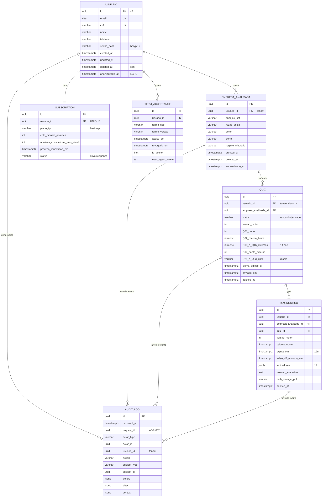

# ADR-003 — Persistência do DEFOnline

## Contexto

A ADR-001 fixou PostgreSQL 18 como banco principal e Eloquent ORM (default opinativo do Laravel). A ADR-002 fixou a topologia (monolito modular único; web + worker + scheduler compartilhando a mesma imagem) e estabeleceu que o Postgres é fonte única de estado durável (domínio + sessions + jobs + cache + failed_jobs). Esta ADR decide as **estruturas de persistência** que não cabem nas duas anteriores:

1. Agregados de domínio do MVP em alto nível e suas relações.
2. Ferramenta + padrão de migrations.
3. Mecanismo de **multi-tenancy** (`RNF §4.3`: usuário A nunca acessa dado de usuário B; resposta `404` em vez de `403` para não vazar existência).
4. Padrão de **audit log** (`RNF §5`).
5. Política de **soft vs hard delete** + intersecção com **LGPD direito de eliminação** (`RNF §7.2`, anonimização em D+30).
6. **Extensões do Postgres** adotadas (princípio #3 + #12).
7. Convenção de **identificadores** (PKs).
8. Pré-requisitos de tabelas técnicas vindas das ADRs anteriores (`sessions`, `cache`, `jobs`, `failed_jobs`).

Restrições derivadas da especificação V2.5 (`especificacao-funcional.md §1.5.2, §3, §4.3.2, §4.4, §4.7, §4.8, §6.1`) e dos NFRs (`RNF §4, §5, §7`):

- **Modelo 1:N** (`§1.5.2 + §6.1 RESOLVIDO`): **Usuário** (pessoa física, raiz) → N **Empresas Analisadas**. **Sem N:M no MVP** (compartilhamento de empresa entre usuários fica para v1.2, `roadmap-pos-v1.md §1.1`).
- **Quiz** (`§4.4` + `anexo-A-campos-quiz.md`): formulário com 23 campos tipados (Q01 enum; Q02–Q16 numéricos monetários/dias/%; Q17 condicional; Q21–Q23 CPF). Rascunho persistido a cada passo. **Não-jsonb** — colunas tipadas.
- **Diagnóstico** (`§4.7`): resultado do motor (14 indicadores + balanço + DRE + Resumo Executivo), persistido por Quiz **com versão do motor** para reprodutibilidade histórica. Geração de PDF é assíncrona (ADR-002) — `path_storage` referencia objeto fora do DB.
- **Retenção**: rascunho 90 dias (`RNF §2.2`); diagnóstico 12 meses + aviso D-7 (`§4.8`); audit log 5–10 anos (`RNF §7.3`).
- **LGPD eliminação** (`§4.3.2 + RNF §7.2`): D+30 corridos, soft delete imediato + anonimização diferida via job.
- **Audit log** (`RNF §5, §6`): login (sucesso/falha), CRUD de Usuario/EmpresaAnalisada/Quiz/Diagnostico, mudança de permissão, exportação, acesso a dado sensível. Append-only.
- **Multi-tenancy obrigatória desde o início** — retrofit é doloroso (`adr-types.md` Tipo 4).
- **Princípio #3 (Postgres-first)** central: adicionar outro armazenamento exige números, não opinião.
- **Princípio #4 (opinativo) + #1 (simplicidade)**: seguir o default Laravel sempre que ele resolver.

A decisão precisa ser tomada agora porque destrava STORY-007 (rodar `php artisan migrate`) e dá inputs concretos para EPIC-001 (Cadastro) e EPIC-002 (Diagnóstico).

## Forças (drivers) da decisão

- **F1 — Princípio #3 (Postgres-first)** — **Alto**. Sem armazenamento extra; uso pleno das capacidades do PG (extensões justificadas).
- **F2 — Princípio #4 (opinativo) + #1 (simplicidade)** — **Alto**. Eloquent + Migrations + Soft Delete + Policy são o default Laravel; cada desvio precisa de justificativa.
- **F3 — Multi-tenancy obrigatória (`RNF §4.3`)** — **Alto**. Isolamento por usuário precisa ser nativo, automatizável (`princípio #9`), e blindar bug de query.
- **F4 — LGPD (`§7.2`, eliminação D+30; `§7.3` retenção 5–10 anos audit log)** — **Alto**. Não-negociável. Soft delete + job de purga é o caminho.
- **F5 — Auditabilidade jurídica (`§5, §6`)** — **Alto**. Audit log append-only com correlação cross-process (`request_id` da ADR-002).
- **F6 — Reprodutibilidade do motor de diagnóstico (`§4.7`)** — **Alto**. Diagnóstico antigo precisa ser reproduzível mesmo após upgrade do motor → versão do motor persistida; respostas do Quiz imutáveis após envio.
- **F7 — Reversibilidade de migrations (`princípio #7` + `adr-types.md` Tipo 4)** — **Alto**. Toda migration reversível ou explicitamente documentada como não-reversível.
- **F8 — Time muito pequeno** — **Alto**. Soluções que exigem operador dedicado de DB são desqualificadas.
- **F9 — Compatibilidade com TDD + E2E** (`princípio #10`) — **Alto**. Isolamento de tenant precisa ser testável com `Pest` e `RefreshDatabase`.
- **F10 — Performance no MVP (NFR §1.2: p95 < 1.5s login, < 3s diagnóstico, < 2s relatório)** — **Médio**. Postgres folgado nesse envelope; sem precisar de cache externo.
- **F11 — Custo (`princípio #11`)** — **Médio**. Postgres único = backup/restore único; menos serviços = menos cobrança.

## Opções consideradas

### Decisão 1 — Mecanismo de multi-tenancy

#### Opção 1A — FK `usuario_id` + Global Scope + Policy (Laravel default)

- **Resumo:** toda entidade tenant-scoped (`EmpresaAnalisada`, `Quiz`, `Diagnostico`, `Subscription`, `TermAcceptance`, `AuditLog`) carrega coluna `usuario_id UUID NOT NULL REFERENCES usuarios(id) ON DELETE RESTRICT`. Trait PHP `BelongsToUsuario` (aplicada nos models tenant-scoped) registra **Global Scope** que adiciona automaticamente `WHERE usuario_id = Auth::id()` em toda query que não opte-out explicitamente. Policies do Laravel autorizam por operação (criar/ler/atualizar/excluir). Quando o resource não pertence ao tenant atual, controller retorna **404** (não 403) — `RNF §4.3`.
- **Como atende aos princípios:**
  - ✅ #1 simples; ✅ #3 vive no Postgres; ✅ #4 default Laravel; ✅ #5 fronteira clara por FK; ✅ #9 automatizável (linter Larastan custom valida que todo model tenant-scoped usa a trait); ✅ #10 testável com `actingAs(User $a)` + asserções de 404.
- **Prós:** Zero cerimônia. Test friendly. Mesma forma para web + worker + scheduler (basta autenticar o contexto no entrypoint).
- **Contras:** Bug em query crua (`DB::select(...)`) escapa do Global Scope. Mitigação: linter veta `DB::` direto em código de domínio, força passar por Eloquent ou Repository com escopo explícito.

#### Opção 1B — Row-Level Security (RLS) do Postgres

- **Resumo:** policies RLS no banco usando `current_setting('app.user_id', true)`; aplicação faz `SET LOCAL app.user_id = :user` no início de cada request/job.
- **Como atende aos princípios:** ✅ #3 usa o PG pleno; ⚠️ #4 escapa do default Laravel (sem suporte nativo a SET LOCAL por conexão); ⚠️ #1 complica pool de conexões + cada conexão "lembra" de setting.
- **Prós:** Segurança "by design" — mesmo bug de query não vaza.
- **Contras:** Laravel **não** tem suporte nativo elegante a `SET LOCAL` por request; precisaria middleware custom + DB connection wrapper + cuidado especial em jobs (que pegam conexão fresh). Em time pequeno, é mais cerimônia do que valor antes do primeiro incidente.

#### Opção 1C — Defesa em profundidade (1A + 1B juntos)

- **Resumo:** ambos.
- **Veredicto:** descartado pelo princípio #1. Custo duplicado, benefício marginal antes de incidente real. **Sinal de revisão registrado** abaixo para reabrir como supersede se a primeira ADR sofrer falha de isolamento em pré-produção.

### Decisão 2 — Migrations: ferramenta e padrão

#### Opção 2A — Laravel Migrations (default)

- **Resumo:** `database/migrations/YYYY_MM_DD_HHMMSS_<slug>.php`. Toda migration tem `up()` e `down()`. Convenção:
  - **Reversíveis sempre que possível** (`princípio #7`); migrations destrutivas (drop coluna, drop tabela) **registram a irreversibilidade em comentário** + têm `down()` mínimo que documenta o que seria necessário.
  - **Idempotência defensiva** (`Schema::hasColumn`, `Schema::hasTable`) em alterações em produção, especialmente em hotfix.
  - **Zero-downtime via convenção expand → migrate → contract** (refator em 3 deploys):
    1. Expand: adicionar coluna/tabela nova compatível com código antigo.
    2. Migrate dados (job assíncrono).
    3. Contract: remover coluna/código antigo em deploy posterior, **nunca no mesmo deploy** que removeu o uso.
  - **Naming**: nome do arquivo descreve a mudança no domínio (`2026_06_01_120000_create_empresas_analisadas_table.php`, `2026_06_15_140000_add_anonymized_at_to_usuarios.php`).
- **Como atende aos princípios:** ✅ #1, #4, #7, #9 (CI roda `php artisan migrate --pretend` em PR + `php artisan migrate` em homologação).
- **Veredicto:** **adotada**. Sem alternativa real considerada (princípio #4 fixa Laravel = ferramenta de migrations default).

### Decisão 3 — Identificadores (PKs)

#### Opção 3A — UUID v7 em todas as PKs, geradas em app

- **Resumo:** `Str::uuid7()` do Laravel 11+ (ordenável por tempo, ótimo para B-tree, evita fragmentação de índice característica do UUID v4). Coluna `id UUID NOT NULL PRIMARY KEY`. Consistente com `request_id` (UUID v7) da ADR-002.
- **Como atende aos princípios:** ✅ #1, #4, #5 (chave técnica estável, separada de chave natural como CPF/CNPJ que podem mudar de regulação), #11 (sem extensão extra do Postgres — `pgcrypto.gen_random_uuid()` gera v4 e exigiria extensão; v7 em app é grátis).
- **Veredicto:** **adotado**. Alternativas (BIGSERIAL, ULID, UUID v4) descartadas: BIGSERIAL vaza ordem global e dificulta merge de bases; ULID e UUID v4 perdem para v7 em ordenação temporal.

### Decisão 4 — Audit log

#### Opção 4A — Tabela `audit_logs` append-only, populada via aplicação

- **Resumo:** tabela `audit_logs` com schema:
  ```
  id UUID PK (v7)
  occurred_at TIMESTAMPTZ NOT NULL
  request_id UUID NOT NULL                  -- correlação ADR-002
  actor_type VARCHAR(32)                    -- 'user' | 'system' | 'scheduler'
  actor_id UUID                             -- null para system/scheduler
  usuario_id UUID                           -- tenant ao qual o evento pertence (null para system-wide)
  action VARCHAR(64) NOT NULL               -- ex 'usuario.created', 'diagnostico.exported'
  subject_type VARCHAR(64) NOT NULL         -- ex 'Usuario', 'Diagnostico'
  subject_id UUID                           -- id do recurso
  before JSONB                              -- estado antes (campos relevantes)
  after JSONB                               -- estado depois
  context JSONB                             -- ip, user_agent, etc
  ```
- **Implementação via aplicação** (helper `AuditLogger::log(...)` chamado em pontos de mudança nos services), **não via trigger Postgres**. Justificativa:
  - Trigger Postgres não conhece `request_id`, `actor_id`, `ip`, `user_agent` (esses vivem na sessão da app).
  - Worker e scheduler também geram eventos auditáveis — precisam do mesmo caminho.
  - Testabilidade: `AuditLogger::fake()` em testes; trigger seria intransparente em Pest.
- **Append-only** garantido por:
  - Sem rota CRUD para `AuditLog` — modelo Eloquent não tem métodos `update`/`delete` (override que lança exceção).
  - GRANT no Postgres restringe `audit_logs` a `INSERT, SELECT` (sem `UPDATE`, `DELETE`) — defesa em profundidade (IDR Programador implementa).
- **Retenção 5–10 anos** (`RNF §7.3`): tabela particionada por mês via `pg_partman` *ou* migração mensal para tabela arquivo, decidido em IDR quando o volume justificar. No MVP: tabela única (`princípio #1`).
- **Opção 4B (rejeitada):** triggers Postgres + tabela shadow. Rejeitada pelos motivos acima.

### Decisão 5 — Soft delete + LGPD direito de eliminação

#### Opção 5A — Soft delete padrão + job de anonimização em D+30 + hard delete diferido para dados não-obrigatórios

- **Resumo:** entidades de domínio com PII (`Usuario`, `EmpresaAnalisada`, `Quiz`, `Diagnostico`) usam trait `SoftDeletes` (coluna `deleted_at TIMESTAMPTZ NULL`). Quando usuário solicita exclusão (`§4.3.2`):
  1. **T+0 (síncrono):** soft delete no `Usuario`. Cascata soft delete em entidades-filho via Service (não usar `ON DELETE CASCADE` físico — perde rastro). Sessões do usuário invalidadas. Token de exclusão emitido para o usuário com prazo de arrependimento.
  2. **T+30d (job no scheduler):** `AnonimizarUsuario` no worker. Substitui PII por valores anonimizados:
     - `Usuario.email → 'anon-{hash}@deleted.local'`
     - `Usuario.cpf → NULL` (e flag `cpf_anonimizado_at`)
     - `Usuario.nome → 'Usuário anonimizado'`
     - `Usuario.telefone → NULL`
     - `EmpresaAnalisada.cnpj_cpf` e `razao_social` → NULL (com flag `anonimizado_at`)
     - `Quiz`: respostas mantidas (sem PII de pessoa física exceto se Q21–Q23 trouxer CPF → NULL); `usuario_id` mantido para integridade referencial.
     - `Diagnostico`: mantido **agregável anonimamente** para base futura de medianas setoriais (`roadmap-pos-v1.md`) — **legítimo interesse** registrado.
     - `AuditLog`: **nunca anonimizado** — exigência legal de 5–10 anos. Cumpre LGPD porque o titular não pode ser re-identificado a partir do audit log isolado (entradas referenciam `usuario_id` que já não tem PII).
- **Hard delete** apenas em:
  - **Rascunhos de quiz** sem edição há 90+ dias — sem PII relevante, sem valor histórico; job `ExpurgarRascunhosExpirados` (scheduler → worker).
  - **`failed_jobs`** com idade > 30 dias (configurável). Job `php artisan queue:prune-failed`.
  - **`sessions`** expiradas (Laravel `php artisan session:prune` ou TTL via tabela).
- **Como atende aos princípios:** ✅ #1, #4 (`SoftDeletes` é trait padrão), #8 (auditável), #12 (restrições explícitas — audit log NÃO anonimiza).

### Decisão 6 — Criptografia em repouso de CPF (e dados financeiros)

#### Opção 6A — **Não** criptografar at-rest no MVP

- **Resumo:**
  - **CPF**: `VARCHAR(11) NOT NULL` (sem máscara armazenada). Índice `UNIQUE`. Mascaramento obrigatório em log (helper `LogSanitizer` aplicado por `Log::tap()`).
  - **Dados financeiros do Quiz (Q02–Q16)**: `NUMERIC(15,2)` em texto claro. Mascaramento em log (`LogSanitizer` redige campos marcados como sensíveis no schema).
  - **Senha**: `bcrypt cost 12` (já fixado em ADR-001).
  - **E-mail**: `CITEXT NOT NULL UNIQUE` (case-insensitive nativo do Postgres).
  - **Tokens** (reset de senha, exclusão diferida): armazenados como `SHA-256(token)` na tabela, valor em claro só vive no e-mail/UI do usuário.
- **Proteção real vem de:**
  - TLS in-transit (decisão de Infra — STORY-004).
  - Controle de acesso ao Postgres (VPC, credenciais não compartilhadas; STORY-004).
  - Audit log de **quem** acessou (`AuditLogger` em endpoints sensíveis).
  - Mascaramento em log (`LogSanitizer`).
  - Backup criptografado (STORY-004).
- **Justificativa pelos princípios:** ✅ #1 (cerimônia simétrica at-rest com chave no mesmo servidor é teatro de segurança em pequena escala); #11 (sem custo extra de gerenciamento de chave/HSM); ⚠️ #12 (restrição explícita registrada).
- **Veredicto:** **adotado para MVP**. Sinal de revisão explícito abaixo.

#### Opção 6B — Hash determinístico + crypt (rejeitada para MVP)

- **Resumo:** `cpf_hash` (SHA-256 com pepper em `APP_KEY`, UNIQUE) + `cpf_encrypted` (`Crypt::encryptString`). Busca via hash; leitura via decrypt.
- **Por que não no MVP:** dobra colunas, complica todos os reads/writes, rotação de chave é manual e cara, não protege contra app comprometida. Custo > benefício no MVP. Reabrir se DPO/auditoria externa exigir.

### Decisão 7 — Extensões do Postgres adotadas

| Extensão | Adotada no MVP? | Justificativa | Reabrir quando |
|---|---|---|---|
| `citext` | ✅ **Sim** | E-mail case-insensitive nativo; substitui `LOWER(email)` em índice/comparação. Custo: extensão builtin Postgres, zero operação. | — |
| `pgcrypto` | ✅ **Sim** | `digest()` para hash de tokens; `gen_random_bytes()` para tokens criptograficamente seguros. Não usaremos `gen_random_uuid()` (UUID v7 vem do app). | — |
| `pg_trgm` | ❌ não | Busca por similaridade em razão social/CNPJ. Pode ser útil, mas não há requisito no MVP (cadastro busca por match exato). | Se EPIC-002 ou EPIC-003 introduzirem busca textual real. |
| `pgvector` | ❌ não | Embeddings; não há ML no MVP. | Roadmap pós-v1 (medianas setoriais com ML). |
| `PostGIS` | ❌ não | Geo; não há feature geo no MVP. | Se feature geo entrar (improvável). |
| `TimescaleDB` | ❌ não | Time-series; volume MVP não justifica. | Se métricas de produto exigirem agregação massiva. |
| `pg_partman` | ❌ não | Particionamento; `audit_logs` cabe em tabela única no MVP. | Quando `audit_logs` ultrapassar ~10M linhas ou retenção legal exigir purga por partição. |

### Decisão 8 — Tabelas técnicas já fixadas por ADRs anteriores

Reafirmadas (sem nova decisão aqui; só registro de quem mora onde):

| Tabela | Origem | Driver |
|---|---|---|
| `sessions` | ADR-001 | Laravel session driver `database` |
| `cache` | ADR-001 | Laravel cache driver `database` |
| `jobs` | ADR-002 | Laravel queue driver `database` |
| `failed_jobs` | ADR-002 | idem |
| `job_batches` | ADR-002 | idem |

## Agregados de domínio do MVP — modelo macro (CA-3)

> Identificadores: todos UUID v7 (`id` em todas as tabelas). Tipos: `EM_CLARO` para texto/numérico legível; `CITEXT` para e-mail; `JSONB` para campos explicitamente marcados; `NUMERIC(15,2)` para monetários; `INT` para enums.

### Agregado **Usuario** (root tenant)

- **Raiz:** `Usuario` — pessoa física que se cadastra e loga.
- **Razão única de mudar:** política de autenticação/identidade do titular.
- **Chave natural:** `cpf` (UNIQUE); **chave técnica:** `id` UUID v7.
- **Campos PII:** `nome`, `email` (`CITEXT`), `cpf`, `telefone`. Senha como hash bcrypt (ADR-001).
- **Soft delete:** `deleted_at`. **Anonimização diferida:** `anonimizado_at`.

### Agregado **EmpresaAnalisada** (filho de Usuario)

- **Raiz:** `EmpresaAnalisada`.
- **Razão única de mudar:** regras de empresa-objeto-de-análise.
- **Chave natural:** `cnpj_ou_cpf` (UNIQUE **por usuario_id**, não global — duas pessoas podem cadastrar o mesmo CNPJ se suas regras permitirem).
- **Tenant:** `usuario_id` (FK, NOT NULL).
- **Campos:** `razao_social`, `setor`, `porte`, `regime_tributario`, ...
- **Soft delete:** `deleted_at`.

### Agregado **Quiz** (filho de EmpresaAnalisada)

- **Raiz:** `Quiz`.
- **Razão única de mudar:** estrutura de campos do diagnóstico (versionamento, parametrização).
- **Tenant:** `usuario_id` (denormalizado para Global Scope), `empresa_analisada_id` (FK).
- **Status:** `rascunho` | `enviado` (transição one-way ao enviar; após enviado, respostas imutáveis — auditabilidade).
- **Campos**: colunas tipadas para Q01–Q23 (`anexo-A-campos-quiz.md`). **Não-jsonb** — query e validação ficam diretas.
- **Versionamento:** `versao_motor INT NOT NULL` (snapshot da versão do motor de cálculo no momento do envio — reprodutibilidade `§4.7`).
- **Soft delete:** `deleted_at`. Hard delete via job para rascunhos > 90d.
- **Timestamps:** `ultima_edicao_at` (para job de expiração).

### Agregado **Diagnostico** (filho de Quiz)

- **Raiz:** `Diagnostico`.
- **Razão única de mudar:** estrutura do resultado do motor (indicadores, resumo executivo).
- **Tenant:** `usuario_id` (denormalizado), `empresa_analisada_id`, `quiz_id` (FK).
- **Campos:** `versao_motor` (mesma do Quiz no envio), `calculado_em`, `expira_em` (12m após `calculado_em`), `aviso_d7_enviado_em`, `indicadores JSONB` (14 indicadores — uso justificado de JSONB: estrutura potencialmente versionada com motor, leitura sempre como bloco), `resumo_executivo TEXT`, `path_storage_pdf` (referência externa — storage decidido na STORY-004).
- **Soft delete:** `deleted_at`. Após `expira_em`, scheduler dispara aviso D-7 (`aviso_d7_enviado_em`) e em D+0 marca `deleted_at`.

### Agregado **Subscription** (filho de Usuario)

- **Raiz:** `Subscription`.
- **Razão única de mudar:** regras de plano/cota.
- **Tenant:** `usuario_id` (FK, UNIQUE — 1:1 no MVP; futuras múltiplas assinaturas mudariam isso).
- **Campos:** `plano_tipo` (`basico` | `pro`), `cota_mensal_analises`, `analises_consumidas_mes_atual`, `proxima_renovacao_em`, `status` (`ativa` | `suspensa`).
- **Sem soft delete** (Subscription nunca é "excluída" — só fica `suspensa` ou é substituída por nova versão).

### Agregado **TermAcceptance** (registro de consentimento LGPD)

- **Raiz:** `TermAcceptance`.
- **Razão única de mudar:** política de consentimento/LGPD.
- **Tenant:** `usuario_id` (FK).
- **Campos:** `termo_tipo` (`uso` | `privacidade` | `dpa`), `termo_versao`, `aceito_em`, `revogado_em` (NULL se vigente), `ip_aceite`, `user_agent_aceite`.
- **Append-only** — revogação cria novo registro com `revogado_em` preenchido; nunca update destrutivo.

### Agregado **AuditLog**

- Já detalhado na Decisão 4. Append-only, transversal, retenção 5–10 anos.

### Tabelas técnicas (não-agregado)

- `sessions`, `cache`, `jobs`, `failed_jobs`, `job_batches` — Laravel defaults.

## Diagrama ER (CA-4)



**Notas do diagrama:**

- Cardinalidades: `||--o{` = 1-para-N opcional; `||--||` = 1-para-1 obrigatório; `||--o|` = 1-para-0-ou-1.
- Campos truncados (ex.: "Q03_a_Q16_diversos" = 14 colunas tipadas separadas) para não poluir o diagrama; nomes exatos seguem `anexo-A-campos-quiz.md` e IDR do Programador.
- Campos `created_at`/`updated_at` omitidos em quase tudo por ser ruído — assume-se que toda tabela os tem (default Eloquent).

## Decisão proposta (resumo)

> **Persistência do DEFOnline:**
>
> 1. **Modelo de domínio** orientado a agregados pela razão de negócio (`Usuario`, `EmpresaAnalisada`, `Quiz`, `Diagnostico`, `Subscription`, `TermAcceptance`, `AuditLog`).
> 2. **Migrations** via Laravel Migrations, reversíveis quando possível, idempotentes em alteração, com convenção expand → migrate → contract para zero-downtime.
> 3. **Identificadores** UUID v7 em todas as PKs, gerados em app (`Str::uuid7()`).
> 4. **Multi-tenancy** via coluna `usuario_id` + trait `BelongsToUsuario` aplicando Global Scope automático no Eloquent + Policies; resposta `404` (não 403) em violação de tenant. Sem RLS no MVP.
> 5. **Audit log** em tabela `audit_logs` append-only, populada via aplicação (`AuditLogger::log(...)`), correlacionada por `request_id` (ADR-002), com retenção mínima de 5 anos.
> 6. **Soft delete** padrão em entidades com PII, com cascata via Service (não `ON DELETE CASCADE`). LGPD: T+0 soft delete + invalidação de sessão + token de arrependimento; T+30d job `AnonimizarUsuario` substitui PII; audit log **nunca anonimiza**. Hard delete só para rascunhos > 90d, `failed_jobs`, `sessions`.
> 7. **CPF e dados financeiros não criptografados at-rest no MVP**. Mascaramento em log via `LogSanitizer`; tokens (reset, exclusão) armazenados como `SHA-256` na tabela.
> 8. **Extensões Postgres adotadas:** `citext`, `pgcrypto`. **Não** adotadas (com sinal de revisão): `pg_trgm`, `pgvector`, `PostGIS`, `TimescaleDB`, `pg_partman`.

## Justificativa

Convergência simultânea dos princípios centrais:

1. **#3 (Postgres-first) é honrado integralmente.** Domínio, sessões, cache, jobs, audit log — tudo no PG. Adoção de extensões só onde há ganho concreto (`citext` para e-mail, `pgcrypto` para hash de token). As que ficaram de fora estão registradas com gatilho de retomada.
2. **#1 (simplicidade) + #4 (opinativo).** Eloquent + Migrations + SoftDeletes + Policies + Global Scope é o **default Laravel inteiro**. Cada item desta ADR é "use o default" — não estamos reinventando.
3. **#5 (coesão/acoplamento).** Agregados nomeados pela razão de negócio (Usuario, EmpresaAnalisada, Quiz, Diagnostico, Subscription, TermAcceptance, AuditLog), não por camada técnica (sem `BaseEntity` genérico, sem `lookup_table`).
4. **#8 (observabilidade) + ADR-002.** `request_id` propagado entra como coluna do `AuditLog` — debug cross-process passa por `grep request_id` em `audit_logs` e `logs` ao mesmo tempo.
5. **#7 (reversibilidade).** Migrations reversíveis sempre que possível; soft delete preserva a opção de "ajuda, o usuário desistiu da exclusão" até a janela D+30.
6. **#9 (automatizável).** Multi-tenancy via Global Scope é trivialmente verificável por linter (`Larastan` rule custom verifica que todo model tenant-scoped usa a trait `BelongsToUsuario`). Idempotência de migrations idem.

Trade-offs reconhecidos:

- **Sem RLS no Postgres.** Aceito. Sinal de revisão explícito se houver incidente de isolamento em pré-produção ou se auditoria externa exigir.
- **CPF em claro at-rest.** Aceito com mitigações claras (TLS + audit log + mascaramento em log + acesso restrito ao DB + backup criptografado). Sinal de revisão: exigência de DPO/auditoria.
- **Audit log app-side** (não trigger). Aceito — perde-se "garantia DBMS-level" em troca de correlação cross-process e testabilidade. Mitigado por GRANT restritivo (`INSERT, SELECT` apenas) na tabela.
- **JSONB no campo `indicadores` do `Diagnostico`.** Aceito — estrutura versionada com motor; uso sempre como bloco. Reabrir se virar necessária query por indicador específico (improvável; relatório pré-renderizado).

## Plano de verificação

### Como verificar conformidade (a cobrar em IDRs/CIs futuros)

- **Linter custom Larastan** (IDR do Programador na primeira história de implementação) que valida:
  - Todo model em `App\Models\Domain` que não seja `Usuario`/`AuditLog`/`Subscription` (tenant-scoped) **usa** a trait `BelongsToUsuario`.
  - Nenhum código de domínio importa `DB::` direto (força passar por Eloquent ou Repository explícito).
  - Toda classe `AuditableAction` (convenção a definir em IDR) chama `AuditLogger::log(...)`.
- **CI** roda em cada PR:
  - `php artisan migrate --pretend` (valida migrations sintaticamente).
  - `php artisan migrate:fresh --seed` em base efêmera + Pest (`RefreshDatabase`).
  - Larastan no nível custom acima.
- **Teste de isolamento de tenant** obrigatório por entidade tenant-scoped: dado `Usuario A` autenticado, criar `EmpresaAnalisada` como `Usuario B` e validar que `A` recebe `404` ao tentar acessar (não 403). Pattern de teste documentado em IDR.
- **Teste de anonimização LGPD**: criar `Usuario` com PII completa → solicitar exclusão → avançar tempo 30d → rodar scheduler/worker em modo síncrono → asserir que PII foi substituída e `AuditLog` mantém `usuario_id` original.

### Sinais de revisão (cada um abre ADR de supersede)

1. **Incidente de isolamento de tenant** em pré-produção/produção (vazamento de dados de A para B). → reabrir Decisão 1, avaliar adicionar RLS como camada extra.
2. **Exigência de DPO ou auditoria externa** para criptografia at-rest de CPF. → reabrir Decisão 6, migrar para Opção 6B.
3. **Volume de `audit_logs` > 10M linhas** ou retenção legal exigindo purga por partição. → adotar `pg_partman` ou migração mensal manual.
4. **Busca textual em razão social/CNPJ** vira requisito (EPIC-002+ ou comercial). → adotar `pg_trgm`.
5. **Query analítica em `indicadores` de `Diagnostico`** (ex.: filtrar diagnósticos por indicador X > Y). → considerar normalização para tabela `indicadores` em vez de JSONB.
6. **Falha em rollback de migration crítica** em homologação. → reabrir Decisão 2, formalizar política de reversibilidade obrigatória ou ferramenta complementar (sqitch?).

### Estimativa de custo

Nenhum custo recorrente novo introduzido por esta ADR (tudo vive no Postgres já incluído na ADR-001). Espaço em disco: `audit_logs` com retenção de 5 anos a uma taxa estimada de 10–50 eventos/usuario/mês × 500 usuários (north-star 12m) = 30k–150k linhas/mês = ~360k–1.8M linhas/ano = ~50–250 MB/ano. Folgado para qualquer VPS razoável.

## Consequências

### Positivas

- **EPIC-001 (Cadastro)** recebe modelo de `Usuario` + `TermAcceptance` + `Subscription` prontos para implementar.
- **EPIC-002 (Diagnóstico)** recebe modelo de `EmpresaAnalisada` + `Quiz` + `Diagnostico` com versionamento de motor já decidido.
- **EPIC-003 (Histórico)** recebe `Diagnostico.expira_em` + `aviso_d7_enviado_em` prontos para o scheduler agir.
- **STORY-007** pode rodar `php artisan migrate` no hello-world deploy.
- **Audit log + request_id** desde o dia 1 — debug em produção tem ponto único de correlação.
- **LGPD** com pipeline operacionalmente claro (T+0 soft + T+30 anonimiza).

### Negativas / trade-offs aceitos

- Bug em query crua escapa do Global Scope → mitigado por linter.
- CPF em claro at-rest → mitigado por log/acesso/backup, mas é trade-off.
- Cascata de soft delete por Service exige disciplina — `ON DELETE CASCADE` físico seria mais simples mas perde rastro.
- JSONB no `indicadores` perde query relacional — aceito por estabilidade do contrato motor-relatório.

### Neutras

- **Migrations zero-downtime são convenção, não automação** — Programador precisa internalizar.
- **`AuditLogger` em todos os pontos sensíveis** é disciplina nova para o programador; linter ajuda mas não cobre 100% (eventos de domínio "negativos" como "tentativa de acesso negada" exigem chamada explícita).
- **Anonimização preserva agregação anônima do `Diagnostico`** — base futura de medianas setoriais (`roadmap-pos-v1.md`) viável sem reidentificação.

### Para o time

- **Impacto em estórias existentes:**
  - **STORY-004 (Infra)**: input — Postgres 18 com extensões `citext` e `pgcrypto` habilitadas; storage off-DB para PDFs; backup criptografado obrigatório.
  - **STORY-005 (CI/CD)**: input — `php artisan migrate --pretend` em PR; `migrate` em homologação a cada merge; Larastan no nível custom em PR.
  - **STORY-006 (Observabilidade)**: input — `request_id` já está no `audit_logs`; alerta mínimo se taxa de `audit_log` por minuto cair a zero (sinal de bug no `AuditLogger`).
  - **STORY-007 (Hello world)**: **destravada** parcialmente (junto com ADR-001, ADR-002). Hello world inclui migration de `usuarios` + uma rota simples + uma entrada no `audit_logs`.
  - **EPIC-001 (Cadastro)**: recebe schema de `Usuario`, `EmpresaAnalisada`, `TermAcceptance`, `Subscription`.
  - **EPIC-002 (Diagnóstico)**: recebe schema de `Quiz` (23 colunas tipadas), `Diagnostico` (JSONB para `indicadores`, `versao_motor`).
  - **EPIC-003 (Histórico)**: recebe `Diagnostico.expira_em`, `aviso_d7_enviado_em`, semântica de soft delete + job de purga.
- **ADRs relacionadas:**
  - **Destrava:** STORY-007 (junto com ADR-001/002).
  - **Limita:** qualquer ADR futura propondo armazenamento extra (Redis, S3 para queue, ElasticSearch) precisa argumentar contra princípio #3 com números.
- **Necessidade de spike de validação:** **não específica.** STORY-007 valida o caminho `migrate → seed → query` na prática.

## Fora de escopo (princípio #12)

Decisões deliberadamente **não** tomadas aqui:

- **Layout de pastas / namespaces / convenção de nome de classe** → IDR do Programador (STORY-007 e EPIC-001).
- **Pacote concreto para audit log** (`spatie/laravel-activitylog` vs implementação interna) → IDR do Programador.
- **Estratégia de backup, restore, DR formais** → ADR de Infra (STORY-004) — referência ao `nfr-architecture.md` é suficiente aqui.
- **Storage físico do PDF** (S3, MinIO, disco local) → ADR de Infra (STORY-004).
- **Particionamento de `audit_logs`** → IDR do Programador quando o volume justificar.
- **Modelo de "compartilhamento" Empresa↔Usuário N:M** → roadmap pós-v1 (`roadmap-pos-v1.md §1.1`); ADR de supersede no momento.
- **Ferramenta de migration alternativa** (sqitch, dbmate) → desqualificadas pelo princípio #4 (Laravel default).
- **CreditPackage / pacotes avulsos de crédito** → pós-v1.

---

## Aprovação humana

> Esta seção é o registro formal do aceite.

- **Status final:** ✅ aceita
- **Aprovado por:** Alexandro
- **Data:** 2026-05-21
- **Forma do aceite:** aprovado em chat (sessão de 2026-05-21).
- **Condicionantes do aceite:** nenhuma.

### Em caso de rejeição

- **Motivo:** —
- **Próximos passos sugeridos:** —

---

## Histórico

- 2026-05-21 — criada como `proposed` pelo Arquiteto (STORY-003 SPIKE de persistência). Direção confirmada com PO em chat: multi-tenancy via FK + Global Scope (rejeitada RLS no MVP); CPF não criptografado at-rest no MVP (mitigações documentadas).
- 2026-05-21 — aceita pelo PO Alexandro em chat; status `proposed` → `accepted`.
