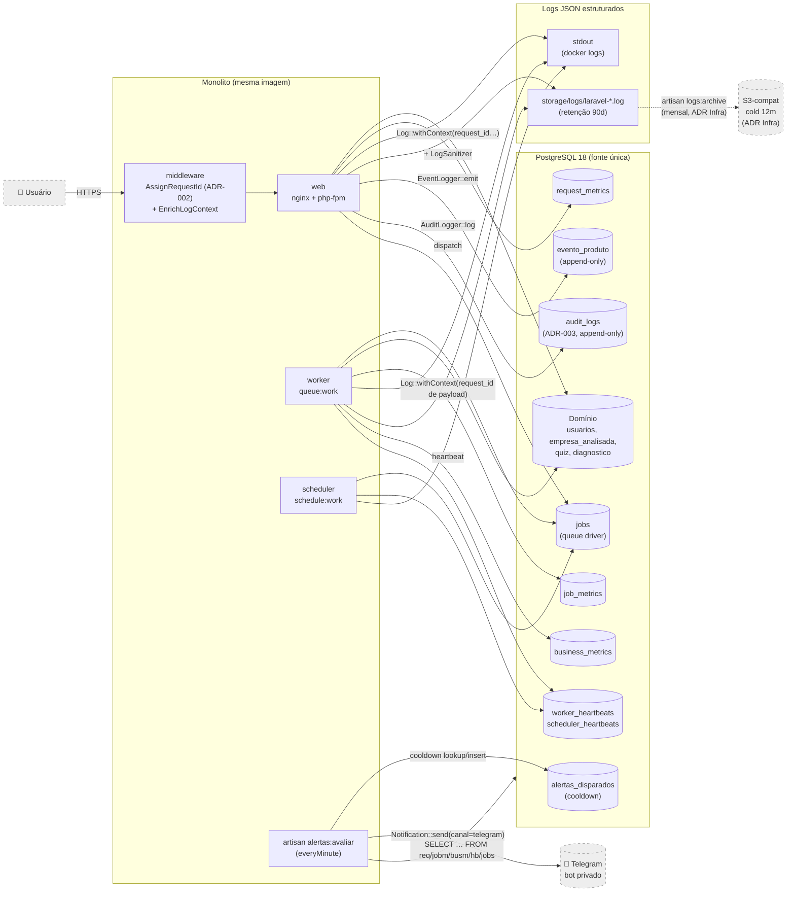

# ADR-004 — Observabilidade do DEFOnline

## Contexto

ADR-001 fixou Laravel 13 + Postgres 18 + Pest 4 + Dusk 8. ADR-002 fixou a topologia (monolito modular `web` + `worker` + `scheduler`, mesma imagem) e **estabeleceu o `request_id` UUID v7 propagado por middleware HTTP e payload de job** como convenção de correlação cross-process. ADR-003 fixou Eloquent + multi-tenancy via FK `usuario_id` + Global Scope, **`AuditLog` append-only via aplicação** (`AuditLogger::log(...)`), **`LogSanitizer` aplicado por `Log::tap()`** para mascarar PII em log estruturado, e retenção 5–10 anos para audit.

Esta ADR decide as três faces correlatas do "encanamento de telemetria" que faltavam, todas exigidas pelo EPIC-000 e por dependências dos EPICs seguintes:

1. **Observabilidade técnica do MVP:** stack de logs, métricas e tracing; health checks; alertas mínimos; retenção; estimativa de custo.
2. **Captura dos eventos de produto do north star** (`product/north-star.md`): nome final, propriedades obrigatórias, destino, latência aceitável.
3. **Política operacional de PII** em log e em evento de produto — autoria automática, não "lembrar de mascarar".

Restrições estruturais relevantes herdadas (não reabrir):

- **`request_id` UUID v7 já é a chave de correlação** (ADR-002).
- **Postgres é fonte única de estado durável** (ADR-001/002/003).
- **`LogSanitizer` já é o ponto único de mascaramento em log** (ADR-003).
- **`AuditLog` é o registro jurídico** — não é "evento de produto", não é "log de aplicação". As três coisas são separadas (`observability-discipline.md` reforça).
- **`RNF §6` (especificação V2)** define: logs JSON; retenção 90d online + 12 meses cold; INFO em prod / DEBUG em staging; PII proibida em log; métricas RED por endpoint + métricas de negócio enumeradas (motor, PDF, gateway, e-mail, fila, conexões DB); 5 alertas mínimos com criticidade P1/P2 (uptime, taxa de erro, fila PDF, falha gateway, ataque).
- **`product/north-star.md`** lista 6 eventos canônicos: `usuario_cadastrado`, `empresa_cadastrada`, `quiz_iniciado`, `diagnostico_concluido`, `diagnostico_visualizado`, `comparativo_aberto`.
- **Time muito pequeno + custo importa (princípio #11)** — qualquer SaaS de observabilidade pago no MVP precisa de justificativa forte.

A decisão precisa ser tomada agora porque **destrava STORY-007** (hello world deployado **já vem com** `/health`, `/ready`, log estruturado e métrica RED — não retrofita) e porque **EPIC-001 emite `usuario_cadastrado` e `empresa_cadastrada`** no primeiro endpoint funcional — sem ADR de eventos, ou emitimos errado, ou emitimos depois (e perdemos o aprendizado da onda).

## Forças (drivers) da decisão

- **F1 — Princípio #3 (Postgres-first) + princípio #11 (custo)** — **Alto**. Concentrar logs/métricas/eventos em Postgres elimina dependência externa, satisfaz princípio #3 sem distorção, e tem custo incremental ~R$0. Provar que Postgres não dá conta exige número — e o volume do MVP (dezenas de empresas, centenas de requests/min em pico) está confortavelmente dentro do envelope.
- **F2 — RNF §6 (logs JSON, retenção 90d/12m, PII proibida, métricas RED + de negócio enumeradas, 5 alertas mínimos)** — **Alto**. Não-negociável. Esta ADR materializa cada item da §6 em mecanismo concreto.
- **F3 — North star instrumentável desde o EPIC-001** — **Alto**. Se `usuario_cadastrado` não é capturado no dia em que o cadastro entra em homologação, a métrica de norte (MPEs ativas com diagnóstico em 90d) é cega no momento crítico — a wave de validação da hipótese do Roberto.
- **F4 — Correlação cross-process já decidida (ADR-002)** — **Alto**. `request_id` UUID v7 propaga web → fila → worker → log → audit. Esta ADR **consome** essa convenção; não cria uma nova.
- **F5 — LGPD / PII proibida em log e evento** (`security-architecture.md`, RNF §6.1 e §7) — **Alto**. CPF, e-mail pleno, telefone, dados financeiros do quiz **não podem** vazar para log ou evento de produto. Mecanismo **automático** (não "lembrar de mascarar"), automatizável > documentável (princípio #9).
- **F6 — Time muito pequeno opera tudo** — **Alto**. Cada peça de observabilidade extra (SaaS, agent, broker) é um caminho extra para incidente. Tudo que dá pra fazer no Postgres + Laravel default ganha por simplicidade (princípio #1).
- **F7 — Reversibilidade / supersede futuro** — **Médio**. Se a fila Postgres saturar, ou se cobrança (que entra pós-WAVE-2026-01) trouxer volume de eventos 10× maior, esta ADR é supersedida — sem refator do domínio, só de pipeline. Manter eventos em formato JSON estruturado + propriedades JSONB permite exportar tudo para SaaS depois.
- **F8 — Latência da observabilidade não pode ser obstáculo de produto** — **Médio**. Inserir uma linha de log/métrica/evento por request não pode dobrar o tempo de resposta. Mitigação: inserts assíncronos quando justificável (eventos em job opcional), logs em canal `daily` com escrita non-blocking.
- **F9 — Alertas P1 precisam acordar alguém (ou pelo menos chegar instantaneamente em mobile)** — **Médio**. RNF §6.4 não nomeia canal; e-mail tem latência de minutos e some na caixa, on-call profissional (PagerDuty) é overkill no MVP.
- **F10 — Princípio #10 (TDD + E2E)** — **Médio**. Toda a observabilidade tem que ser testável: `Log::fake()`, `Event::fake()`, `Notification::fake()`, asserção sobre tabela `evento_produto`. Sem ferramenta externa, todos os testes rodam offline em < 1s — alinha com `quality-standards.md`.

## Opções consideradas

### Opção A — Postgres-first puro (logs Laravel + métricas e eventos no Postgres + Telegram para alertas)

- **Resumo:** três camadas, todas dentro da stack já fixada.
  - **Logs estruturados:** driver `stack` do Laravel com dois canais paralelos — `stdout` (JSON, consumido pelo `docker logs` em todos os ambientes) e `daily` (arquivo `storage/logs/laravel-YYYY-MM-DD.log` em JSON, retenção 90 dias automática). `LogSanitizer` (ADR-003) aplicado via `Log::tap()` — todo log passa por ele antes de escrever. `Log::withContext(['request_id', 'user_id', 'empresa_id', 'module', 'action'])` no middleware (`AssignRequestId` da ADR-002 + extensão `EnrichLogContext`).
  - **Métricas:** três tabelas dedicadas no Postgres, populadas por middleware/listener.
    - **`request_metrics`** (uma linha por request HTTP) — `path`, `method`, `status`, `duration_ms`, `request_id`, `usuario_id`, `empresa_id NULL`, `inserido_em`. Particionada por mês (`pg_partman` em IDR do Programador quando volume justificar; no início, tabela única + índice `BRIN` em `inserido_em`).
    - **`job_metrics`** (uma linha por job concluído ou falho) — `job_class`, `queue`, `status` (`ok`/`failed`/`retried`), `duration_ms`, `request_id`, `inserido_em`.
    - **`business_metrics`** (uma linha por evento técnico de negócio) — `tipo` (`pdf_gerado`, `motor_calculado`, `email_enviado`, `gateway_chamado`), `duracao_ms`, `sucesso bool`, `meta jsonb`, `inserido_em`. Cobre RNF §6.2 (motor, PDF, gateway, e-mail).
    - **Fila/backlog e conexões DB** não precisam de tabela própria — consultados ao vivo em `jobs` e `pg_stat_activity` pelo dashboard e pelo alertador.
  - **Eventos de produto:** **tabela `evento_produto`** dedicada, append-only, schema separado das métricas técnicas. Helper `EventLogger::emit($nome, array $propriedades = [], ?Usuario $usuario = null, ?EmpresaAnalisada $empresa = null)` chamado nos services/Livewire components. **Síncrono dentro da mesma transação do agregado** quando aplicável (princípio #1 e atomicidade); job assíncrono **só** se o volume justificar (sinal de revisão registrado). Schema dedicado (`nome_evento`, `ocorrido_em`, `usuario_id`, `empresa_id`, `propriedades jsonb`, `request_id`) com índices para query do PO e para análise de funil.
  - **Tracing:** **sem ferramenta de tracing distribuído no MVP**. `request_id` UUID v7 (ADR-002) já correlaciona web → fila → worker → audit log → request_metrics → evento_produto. Cross-process tracing é `grep request_id=0190b1xx` em logs + `WHERE request_id = '0190b1xx'` no Postgres. OpenTelemetry/Tempo/Jaeger ficam **fora** do MVP (sinal de revisão: 3+ módulos com chamadas async cruzadas dentro do monolito, ou EPIC pós-MVP que adicione um serviço externo).
  - **Health checks:** `/health` (liveness) — rota pública sem middleware, retorna `{"status":"ok"}` em < 100ms, sem tocar Postgres; serve o load balancer dizer "PHP-FPM está respondendo". `/ready` (readiness) — `SELECT 1` no Postgres + check de driver de cache + check de driver de queue. Se algum falhar, 503; senão 200 com `{"checks": [...]}`.
  - **Alertas:** comando artisan `php artisan alertas:avaliar` agendado a cada 1 minuto pelo scheduler. Roda queries SQL sobre as tabelas de métricas + heartbeat tables. Quando threshold é atingido, **dispara notificação via canal Telegram custom** (`Notification` Laravel com canal `telegram`, usando `irazasyed/telegram-bot-sdk` ou `Http::post` direto na API do Bot — escolha de lib é IDR do Programador). Em dev/local, canal vira `log` (escreve em log, não envia). Idempotência: cooldown de 30 minutos por tipo de alerta (mesma falha não dispara 60 mensagens em 1h).
  - **Custo recorrente:** **~R$0 sobre ADR-001/002** (logs e métricas vivem no Postgres já dimensionado; Telegram bot é gratuito; cold storage de logs 12m fica para ADR de Infra, ~R$5/mês de S3-compatible).

- **Como atende aos princípios** (`references/architecture-principles.md`):
  - ✅ **#1 Simplicidade:** zero serviço externo no MVP. Dashboard via Metabase ou Grafana auto-hospedado (decisão de ferramenta de viz é IDR do Programador ou ADR de Infra). Time pequeno opera 1 banco, não 4 sistemas.
  - ✅ **#2 Monolito:** alerting é um comando artisan; nada vira novo processo de borda.
  - ✅ **#3 Postgres-first:** referência da categoria — logs (parcialmente, no canal `daily` em disco; agregação via SQL), métricas, eventos, alerting state, todos no Postgres.
  - ✅ **#4 Opinativo:** usa logger nativo do Laravel (Monolog), `Notification` nativa, scheduler nativo, sem montar stack à mão.
  - ✅ **#5 Coesão:** `EventLogger`, `MetricsCollector`, `AlertEvaluator`, `LogSanitizer` (este já vindo de ADR-003) são módulos transversais (`Infra/Observabilidade/` em IDR do Programador) com responsabilidade única cada.
  - ✅ **#6 Local total:** tudo roda dentro do `docker compose up` da ADR-002. Dashboard local: Metabase rodando em container opcional (`docker compose --profile dashboard up`) ou query SQL direta.
  - ✅ **#7 Reversibilidade:** dado em formato JSON estruturado + `propriedades jsonb` exporta para qualquer SaaS futuro (PostHog, Mixpanel, Datadog, Sentry, Better Stack). Migração é ETL, não refator de produto.
  - ✅ **#8 Observabilidade:** referência da categoria — a ADR é a observabilidade.
  - ✅ **#9 Automatizável:** `LogSanitizer` por `Log::tap()`, teste arquitetural Pest verificando que nenhum evento de produto carrega PII, middleware automático de métricas. Não confia em "dev se lembra".
  - ✅ **#10 TDD + E2E:** `Log::fake()`, `Event::fake()`, `Notification::fake()`, asserção direta em tabela `evento_produto` via Pest. Dusk E2E exercita um evento real ponta-a-ponta no fluxo de hello world (STORY-007).
  - ✅ **#11 Custo:** ~R$0 incremental no MVP.
  - ✅ **#12 Restrições:** explícitas em "Fora de escopo" abaixo.

- **Prós concretos:**
  - **Custo R$0.** Cabe no orçamento de ADR-001 (~R$200/mês para 2 ambientes).
  - **Sem lock-in.** Dado é JSON em tabela Postgres — exporta para qualquer ferramenta futura.
  - **Mesma janela de query.** PO consulta north star em SQL no mesmo banco onde mora o domínio — sem ETL entre "produção" e "analytics".
  - **`request_id` correlaciona tudo.** Reclamação de cliente → log → métrica → audit → evento de produto, todos pelo mesmo ID.
  - **Testável trivialmente offline.** Toda a suíte (Pest + Dusk) roda sem internet.

- **Contras concretos:**
  - **Tabelas de métricas crescem.** `request_metrics` particionada por mês, retenção 90 dias online. Sob carga MVP (centenas de req/min em pico), ~4M linhas/mês — Postgres aguenta com folga. **Sinal de revisão registrado** para o dia que isso virar dor.
  - **Sem dashboard pronto out-of-the-box.** Metabase ou Grafana precisam ser configurados (uma vez, IDR do Programador). Trade-off contra SaaS pronto-pra-usar (Opção C).
  - **Alerting é "feito em casa".** Cooldown, deduplicação, escalonamento P1/P2 são lógica do `AlertEvaluator`. Pequena superfície a manter; aceita pela ausência de overhead operacional de SaaS.
  - **Telegram exige número celular + grupo/chat configurado.** Onboarding inicial leva ~10min; depois é estável. Bot privado, não público.

### Opção B — Self-hosted "lite" (Sentry self-hosted ou Grafana Loki + Prometheus + Tempo no mesmo VPS)

- **Resumo:** containers adicionais no mesmo VPS rodando Sentry (logs/exceptions + dashboard) ou stack Grafana (Loki para logs, Prometheus para métricas, Tempo para traces). Eventos de produto ainda exigem decisão separada (ainda iria para tabela Postgres ou para PostHog separado).
- **Como atende aos princípios:**
  - ⚠️ #1 Simplicidade: 3–5 containers extras, mais 4–6 conceitos para o time pequeno gerenciar (Loki retenção, Prometheus scrape, Tempo storage, Sentry workers).
  - ⚠️ #3 Postgres-first: divide o estado durável — alguns sinais em Postgres (audit, domínio), outros em Loki/Sentry. Aceita só se Postgres prove não dar conta — e não prova.
  - ✅ #4 Opinativo: Sentry/Grafana são opinativos no seu próprio mundo.
  - ⚠️ #6 Local total: dá pra rodar local, mas dobra o tamanho do `docker compose up`.
  - ❌ #11 Custo: +R$30–60/mês de RAM no VPS sustentando 3–5 containers. Não trivial em MVP de R$200/mês total.
- **Prós:** UI pronta de log/trace. Dashboards prontos.
- **Contras concretos:**
  - **Manutenção operacional não-trivial:** retenção do Loki/Sentry, restart, upgrade — overhead extra que time pequeno paga.
  - **Sentry self-hosted exige Redis + ClickHouse + Postgres dedicado** — explosão de superfície operacional, viola #1.
  - **Não resolve eventos de produto** — ainda precisa de tabela ou ferramenta separada.
- **Veredicto:** rejeitada por custo operacional e por violar #3 sem evidência. Pode virar supersede se Opção A começar a doer (sinal explícito abaixo).

### Opção C — Cloud SaaS no free tier (Better Stack / Axiom / Sentry SaaS / Grafana Cloud)

- **Resumo:** logs + métricas + traces enviados para SaaS no free tier (Better Stack: 30GB/mês; Axiom: 500GB/mês; Sentry SaaS Developer: 5k errors/mês; Grafana Cloud Free: 50GB logs/14d). Eventos de produto: ainda exige decisão (PostHog SaaS no plano Free 1M eventos/mês, ou continuar em tabela Postgres).
- **Como atende aos princípios:**
  - ✅ #1: UI pronta, configuração inicial em 1 dia.
  - ❌ #3 (parcial): logs/métricas saem do Postgres para fora. Trade-off explícito.
  - ⚠️ #6: requer internet em dev para enviar; ou usar mock em dev (mais 1 config).
  - ⚠️ #7 Reversibilidade: dado vai pra SaaS; trazer de volta exige ETL e custa caro depois de ~12 meses.
  - ⚠️ #11 Custo: free tier basta no MVP, mas o plano pago de "graduação" (Better Stack: US$25+/mês; Sentry: US$26/mês) entra rápido com 50+ empresas ativas.
- **Prós:** UI pronta, alertas multi-canal nativos (Slack/Discord/Telegram/PagerDuty), retenção gerenciada, escala paga depois.
- **Contras concretos:**
  - **Lock-in moderado-a-alto.** 12 meses de logs num SaaS são caros de migrar.
  - **PII saindo da nossa borda** exige cláusula DPA com o vendor — atrito jurídico que time pequeno paga.
  - **Free tier estoura sem aviso.** O dia que estoura, ou cortou observabilidade, ou virou conta de surpresa.
- **Veredicto:** rejeitada como **default do MVP** pela combinação de lock-in + atrito LGPD + custo de graduação. Reabrir como supersede se Opção A virar dor e Opção B não couber.

### Opção D — Status quo / não decidir agora

- **Consequência se mantivermos:** STORY-007 vai pra homologação **sem `/health`, sem log estruturado, sem métrica RED, sem alerta**, e EPIC-001 entra produção sem evento `usuario_cadastrado`. Significa que **a wave de validação da Hipótese do Roberto começa cega** — não dá pra medir north star, não dá pra alertar de uptime, não dá pra debugar incidente em homologação. Adiamento custa caro.
- **Custo de adiar:** **alto**. Princípio #8 do PO ("qualidade é requisito") e princípio arquitetural #8 ("observabilidade é requisito") são violados sem essa ADR.
- **Veredicto:** rejeitada. Adiamento é antipadrão neste ponto.

## Matriz comparativa

| Critério (força) | Peso | A — Postgres-first | B — Self-hosted lite | C — Cloud SaaS free | D — Status quo |
|---|---|---|---|---|---|
| F1 — Postgres-first + custo | Alto | ✅ R$0 + #3 máximo | ⚠️ R$30–60 + divide estado | ⚠️ R$0 free, lock-in depois | ❌ não atende |
| F2 — Atende integralmente RNF §6 | Alto | ✅ todos os itens | ✅ todos | ✅ todos | ❌ nenhum |
| F3 — North star instrumentável EPIC-001 | Alto | ✅ tabela própria | ⚠️ precisa decisão extra | ⚠️ precisa decisão extra | ❌ nenhum |
| F4 — Consome `request_id` ADR-002 | Alto | ✅ direto | ✅ via label/tag | ✅ via tag | ❌ irrelevante |
| F5 — PII/LGPD automática | Alto | ✅ `LogSanitizer` único | ⚠️ exige replicar em cada agente | ⚠️ atrito DPA + replicar | ❌ |
| F6 — Operável por time muito pequeno | Alto | ✅ 0 sistemas extras | ❌ 3–5 containers extras | ⚠️ vendor a gerenciar | ❌ nada |
| F7 — Reversibilidade | Médio | ✅ JSON em PG → ETL trivial | ⚠️ dado em Loki/Sentry | ❌ dado em SaaS | ⚠️ nenhum sunk-cost |
| F8 — Latência aceitável | Médio | ✅ insert PG é < 1ms | ✅ async | ✅ async | ✅ trivial |
| F9 — Alertas P1 instantâneos | Médio | ✅ Telegram bot | ✅ multi-canal | ✅ multi-canal | ❌ |
| F10 — TDD + E2E sem heroísmo | Médio | ✅ `Log::fake()` + asserção SQL | ⚠️ mock de Sentry/Loki | ⚠️ mock de SaaS | ❌ |

Notas: ✅ atende plenamente; ⚠️ atende com ressalva; ❌ não atende.

## Decisão proposta

> **Optamos pela Opção A — Postgres-first puro:**
>
> - **Logs estruturados JSON** via Laravel Monolog em dois canais paralelos (`stdout` + `daily` 90 dias), com `LogSanitizer` (ADR-003) por `Log::tap()` e `Log::withContext()` injetando `request_id`, `user_id`, `empresa_id`, `module`, `action`.
> - **Métricas no Postgres** em três tabelas dedicadas: `request_metrics` (RED automático por middleware), `job_metrics` (RED de worker), `business_metrics` (motor, PDF, gateway, e-mail). Fila e conexões DB consultadas ao vivo em `jobs` e `pg_stat_activity`.
> - **Eventos de produto** em **tabela `evento_produto`** append-only com schema dedicado (nome, ocorrido_em, usuario_id, empresa_id, propriedades JSONB, request_id). Helper `EventLogger::emit(...)` síncrono dentro da transação do agregado.
> - **Tracing distribuído:** ausente como ferramenta externa; `request_id` UUID v7 da ADR-002 + tabelas correlacionáveis cobrem cross-process por SQL/grep.
> - **Health checks:** `/health` (liveness, < 100ms, sem dependência) e `/ready` (readiness, `SELECT 1` + checks de cache/queue, 503 se falha).
> - **Alertas via canal Telegram custom** do `Notification` Laravel, disparados por `php artisan alertas:avaliar` agendado a cada 1 minuto. Cooldown de 30 min por tipo. Em dev, canal vira `log`.
> - **Dashboard de visualização:** decisão de ferramenta (Metabase, Grafana, Filament dashboard nativo) é **IDR do Programador** ou ADR de Infra subsequente — esta ADR não escolhe; ela fixa que a fonte é Postgres.
> - **Custo recorrente:** ~R$0 sobre ADR-001 (Telegram bot grátis; tabelas vivem no Postgres já dimensionado; cold storage 12m fica para ADR de Infra).

## Decisão 1 — Observabilidade técnica (CA-2)

### 1.1 Logs estruturados

**Stack:** Laravel Monolog (default opinativo).

**Driver `stack` com canais paralelos** configurados em `config/logging.php`:

```php
// conceitual — IDR do Programador faz o config exato
'channels' => [
    'stack' => [
        'driver' => 'stack',
        'channels' => ['stdout', 'daily'],
        'ignore_exceptions' => false,
    ],
    'stdout' => [
        'driver' => 'monolog',
        'handler' => StreamHandler::class,
        'with' => ['stream' => 'php://stdout'],
        'formatter' => JsonFormatter::class,
        'tap' => [LogSanitizer::class],
    ],
    'daily' => [
        'driver' => 'daily',
        'path' => storage_path('logs/laravel.log'),
        'days' => 90,                       // RNF §6.1 (90 dias online)
        'formatter' => JsonFormatter::class,
        'tap' => [LogSanitizer::class],
    ],
],
```

**Formato JSON padrão de cada linha de log** (consistente com `observability-discipline.md`):

```json
{
  "timestamp": "2026-05-21T14:32:08.123Z",
  "level": "info",
  "message": "diagnostico_calculado",
  "service": "defonline-app",
  "env": "production",
  "process": "web|worker|scheduler",
  "request_id": "0190b1aa-0000-7000-8000-000000000000",
  "user_id": "<uuid|null>",
  "empresa_id": "<uuid|null>",
  "module": "diagnostico",
  "action": "calcular",
  "duration_ms": 142,
  "extra": { "...": "campos específicos do evento" }
}
```

**Convenções fixas (CA-2):**

- **`message`** é **substantivo de evento** (`user_login`, `diagnostico_calculado`, `pdf_gerado`), **não verbo no passado**, **não interpolação**. Contexto vai em campos. Consistente com `observability-discipline.md`.
- **`level`**: `debug` (apenas dev), `info` (marcos do fluxo normal), `warn` (anormal mas não-falha), `error` (falha que impede operação). Em produção: nível mínimo `info` (RNF §6.1).
- **Contexto correlacionável** sempre presente quando aplicável: `request_id` (ADR-002), `user_id` (de `Auth::id()`), `empresa_id` (de Global Scope da ADR-003), `module`, `action`.
- **`process`** discrimina web vs worker vs scheduler — mesmo log estruturado, processos diferentes.
- **Stack trace** de exceções vai em campo dedicado `extra.exception` estruturado, não no `message`.

**Mecanismo de enriquecimento de contexto:** middleware `EnrichLogContext` (vem depois de `AssignRequestId` da ADR-002) chama `Log::withContext([...])` no início do request. Para jobs: `BaseJob` da ADR-002 já injeta `request_id` via trait `PropagatesRequestId`; estende-se para `Log::withContext()` no `handle()`.

**Mascaramento de PII:** `LogSanitizer` (ADR-003) — **única implementação**, aplicada via `Log::tap()` em **ambos** os canais `stdout` e `daily`. Lista de chaves redigidas (CA-4):

| Categoria | Chaves | Tratamento |
|---|---|---|
| Credencial | `password`, `senha`, `token`, `api_key`, `authorization`, `secret` | `[REDACTED]` total |
| PII direta | `cpf`, `cnpj`, `email`, `telefone` | máscara parcial (`***.***.***-12` para CPF, `j***@*****.com` para e-mail, `(11) *****-1234` para telefone); CNPJ pleno **proibido**, só primeiros 8 dígitos |
| PII derivada | `nome_completo`, `endereco`, `cep`, `data_nascimento` | `[REDACTED]` total em log; em audit log, mantido (Auditável por lei) |
| Financeiro do quiz | `faturamento_*`, `balanco_*`, `receita_*`, `custo_*` (regex match) | `[REDACTED]` em log; mantido em domínio e audit |

**Verificação automatizada** (princípio #9): teste arquitetural Pest que tenta logar payload com cada chave acima e asserta que a linha de saída contém `[REDACTED]` ou máscara — falha bloqueia merge.

**Retenção** (RNF §6.1): 90 dias online via canal `daily` (Laravel rotaciona automaticamente). 12 meses cold storage — **fica fora desta ADR** (decisão da ADR de Infra: provedor S3-compatible, comando `php artisan logs:archive` mensal que move `.log` antigos para o bucket).

### 1.2 Métricas

**Três tabelas no Postgres**, populadas por middleware/listener Laravel — sem agente externo, sem scrape.

**`request_metrics`** — uma linha por request HTTP que entra no `web`:

```sql
CREATE TABLE request_metrics (
  id          BIGSERIAL PRIMARY KEY,
  request_id  TEXT NOT NULL,
  path        TEXT NOT NULL,             -- ex.: '/cadastro' (normalizado, sem query string)
  method      TEXT NOT NULL,             -- GET|POST|...
  status      SMALLINT NOT NULL,         -- HTTP status
  duration_ms INTEGER NOT NULL,
  usuario_id  UUID NULL REFERENCES usuarios(id) ON DELETE SET NULL,
  empresa_id  UUID NULL REFERENCES empresa_analisada(id) ON DELETE SET NULL,
  inserido_em TIMESTAMPTZ NOT NULL DEFAULT now()
);
CREATE INDEX brin_request_metrics_inserido_em ON request_metrics USING BRIN (inserido_em);
CREATE INDEX idx_request_metrics_path_status ON request_metrics (path, status, inserido_em DESC);
```

Populada por middleware `MeasureRequest` que envolve `terminate()` do request — INSERT após resposta enviada (não bloqueia latência percebida pelo usuário). Retenção: **90 dias** via job `ExpurgarRequestMetrics` no scheduler.

**Queries de RED via SQL trivial:**

```sql
-- p95 de latência por endpoint na última hora
SELECT path, method, percentile_cont(0.95) WITHIN GROUP (ORDER BY duration_ms) AS p95
FROM request_metrics
WHERE inserido_em > now() - interval '1 hour'
GROUP BY path, method;

-- taxa de erro 5xx por endpoint
SELECT path, count(*) FILTER (WHERE status >= 500)::numeric / count(*) AS erro_pct
FROM request_metrics
WHERE inserido_em > now() - interval '5 minutes'
GROUP BY path
HAVING count(*) > 10;
```

**`job_metrics`** — uma linha por job concluído ou falho no `worker`:

```sql
CREATE TABLE job_metrics (
  id          BIGSERIAL PRIMARY KEY,
  request_id  TEXT NOT NULL,
  job_class   TEXT NOT NULL,
  queue       TEXT NOT NULL,
  status      TEXT NOT NULL,           -- 'ok' | 'failed' | 'retried'
  duration_ms INTEGER NOT NULL,
  tentativas  SMALLINT NOT NULL DEFAULT 1,
  inserido_em TIMESTAMPTZ NOT NULL DEFAULT now()
);
CREATE INDEX brin_job_metrics_inserido_em ON job_metrics USING BRIN (inserido_em);
```

Populada por event listeners do Laravel queue (`JobProcessed`, `JobFailed`).

**`business_metrics`** — eventos técnicos enumerados em RNF §6.2 (motor, PDF, gateway, e-mail):

```sql
CREATE TABLE business_metrics (
  id          BIGSERIAL PRIMARY KEY,
  request_id  TEXT NOT NULL,
  tipo        TEXT NOT NULL,           -- 'pdf_gerado' | 'motor_calculado' | 'email_enviado' | 'gateway_chamado' | ...
  sucesso     BOOLEAN NOT NULL,
  duracao_ms  INTEGER NULL,
  meta        JSONB NOT NULL DEFAULT '{}'::jsonb,
  inserido_em TIMESTAMPTZ NOT NULL DEFAULT now()
);
CREATE INDEX idx_business_metrics_tipo_inserido_em ON business_metrics (tipo, inserido_em DESC);
CREATE INDEX brin_business_metrics_inserido_em ON business_metrics USING BRIN (inserido_em);
```

**Fila/backlog** (RNF §6.2): consulta direta em `SELECT count(*) FROM jobs WHERE queue = 'pdf'` — tabela do queue driver default do Laravel. Sem tabela extra.

**Conexões ativas no Postgres** (RNF §6.2): consulta direta em `SELECT count(*) FROM pg_stat_activity WHERE datname = current_database()`.

**Particionamento e crescimento:** sob carga MVP (estimativa: 300 req concorrentes pico, ~5k req/min sustentado = 300k req/h × 90 dias retenção = ~650M linhas/90d no pior caso) — Postgres aguenta com índice BRIN, mas é folgado pedir `pg_partman` em IDR do Programador quando volume real ultrapassar 50M linhas. Para o início (centenas de empresas, dezenas de req/min): tabela única, sem particionamento, sem dor.

### 1.3 Tracing

**Sem ferramenta de tracing distribuído no MVP.** A justificativa:

1. **`request_id` UUID v7 (ADR-002)** já correlaciona toda chamada cross-process. Reclamação "PDF não chegou" → `WHERE request_id = '0190b1xx'` em `request_metrics ∪ job_metrics ∪ business_metrics ∪ logs/grep` reconstrói a timeline.
2. **Monolito modular** — não há N saltos de rede que justifiquem trace distribuído. As "transições" são web → fila no Postgres → worker, dentro da mesma imagem.
3. **OpenTelemetry exige um agent + um backend** — Opção B/C disfarçada, com mesma penalidade de princípios #1/#3/#11.

**Sinal de revisão (reabrir esta seção):**

- EPIC pós-MVP adiciona um serviço externo síncrono crítico (ex.: motor de IA em Python rodando em outro VPS).
- Volume cresce ao ponto que `grep` em logs vira gargalo (estimativa: > 100k requests/dia sustentado).

Quando reabrir: **avaliar OpenTelemetry com exporter para Postgres-compatible (Tempo on Postgres é experimental; alternativa: simplesmente continuar com `request_id` enriquecido)**. Princípio #3 mantido.

### 1.4 Health checks

| Endpoint | Tipo | Verifica | Latência alvo | Resposta |
|---|---|---|---|---|
| `GET /health` | liveness | nada além de "PHP-FPM responde" | < 100 ms | 200 `{"status":"ok"}` |
| `GET /ready` | readiness | `SELECT 1` no Postgres + driver `cache` ok + driver `queue` config válido | < 500 ms | 200 `{"checks":[{"name":"db","ok":true},...]}` ou 503 com lista de falhas |

**Rotas públicas, sem middleware `auth`, sem CSRF, sem rate limit** — usadas pelo load balancer / reverse proxy (decisão da STORY-004) e pelo monitor de uptime.

**Worker e scheduler** não expõem HTTP. Heartbeat:

- **Worker:** event listener `Looping` (Laravel queue) escreve `worker_heartbeats(processo, hostname, ultimo_em)` no Postgres a cada N segundos.
- **Scheduler:** task callback (`onSuccess`) escreve `scheduler_heartbeats(task, ultimo_em)`.

Alertador (1.5) lê dessas tabelas para detectar processo travado.

### 1.5 Alertas

**Conjunto mínimo (RNF §6.4 + 2 adicionais para a topologia ADR-002):**

| ID | Trigger | Threshold | Criticidade | Canal |
|---|---|---|---|---|
| A1 | Uptime `/health` | < 99,5% em janela de 30 min | P1 | Telegram |
| A2 | Taxa de erro 5xx | > 5% em endpoint crítico em 5 min (mín. 10 req) | P1 | Telegram |
| A3 | Backlog fila `pdf` | > 50 jobs pendentes | P2 | Telegram |
| A4 | Falha gateway pagamento | > 10% em 1h (post-MVP, mecanismo já pronto) | P2 | Telegram |
| A5 | Login sob ataque | rate limit estourado por > 5 IPs simultâneos em 5 min | P1 | Telegram |
| A6 | Worker travado | sem heartbeat há > 2 min | P1 | Telegram |
| A7 | Scheduler down | tarefa cron prevista não executou em janela esperada (heartbeat) | P1 | Telegram |

**Mecanismo de avaliação:**

- Comando artisan `php artisan alertas:avaliar` registrado no `app/Console/Kernel.php` com `everyMinute()`.
- Cada alerta é uma classe `App\Alertas\Avaliadores\Avalia<Algo>` que devolve `?Alerta` (null = ok; objeto = disparar).
- Estado de cooldown em tabela `alertas_disparados (tipo, chave, ultimo_em)` — não dispara o mesmo `(tipo, chave)` antes de 30 min do último.

**Canal Telegram custom do Laravel `Notification`:**

- Variáveis de ambiente: `TELEGRAM_BOT_TOKEN`, `TELEGRAM_CHAT_ID` (chat privado ou grupo do time).
- Bot criado via `@BotFather` no Telegram (passo-a-passo em runbook na STORY-007).
- Lib: `irazasyed/telegram-bot-sdk` **ou** `Http::post('https://api.telegram.org/bot{TOKEN}/sendMessage', [...])` direto — **escolha de lib é IDR do Programador**.
- Em dev (`APP_ENV=local`) **e** em test: canal vira `log` (escreve em `storage/logs/laravel.log` em vez de chamar API real). Princípio #6 (sem internet em dev).

**Formato de mensagem Telegram** (princípio #5 coesão):

```
🚨 [P1] DEFOnline — taxa de erro 5xx alta
Endpoint: POST /api/quiz/submit
Janela: 5 min
Taxa: 8,3% (12 erros / 145 reqs)
Request IDs (3 últimos): 0190b1aa-..., 0190b1ab-..., 0190b1ac-...
Dashboard: <link Metabase/Grafana decidido em IDR>
Cooldown: próximo alerta deste tipo só após 30 min
```

**Em caso de falha do próprio Telegram** (caso aceito como aceitável no MVP): tentativa loga em `failed_jobs` (Laravel queue) e em log estruturado. Não há fallback de canal no MVP — sinal de revisão registrado para reabrir se Telegram cair > 1× no trimestre.

## Decisão 2 — Eventos de produto (CA-3)

### 2.1 Tabela `evento_produto`

```sql
CREATE TABLE evento_produto (
  id            BIGSERIAL PRIMARY KEY,
  evento_id     UUID NOT NULL DEFAULT gen_random_uuid(),
  nome_evento   TEXT NOT NULL,
  ocorrido_em   TIMESTAMPTZ NOT NULL DEFAULT now(),
  usuario_id    UUID NULL REFERENCES usuarios(id) ON DELETE SET NULL,
  empresa_id    UUID NULL REFERENCES empresa_analisada(id) ON DELETE SET NULL,
  propriedades  JSONB NOT NULL DEFAULT '{}'::jsonb,
  request_id    TEXT NULL,
  inserido_em   TIMESTAMPTZ NOT NULL DEFAULT now()
);
CREATE UNIQUE INDEX uq_evento_produto_evento_id ON evento_produto (evento_id);
CREATE INDEX idx_evento_produto_nome_ocorrido ON evento_produto (nome_evento, ocorrido_em DESC);
CREATE INDEX idx_evento_produto_usuario_ocorrido ON evento_produto (usuario_id, ocorrido_em DESC);
CREATE INDEX idx_evento_produto_empresa_ocorrido ON evento_produto (empresa_id, ocorrido_em DESC);
CREATE INDEX gin_evento_produto_propriedades ON evento_produto USING gin (propriedades jsonb_path_ops);
```

**Append-only (mesma disciplina do `audit_logs` da ADR-003):**

- Sem rota CRUD para `EventoProduto`. Model Eloquent não expõe `update`/`delete`.
- GRANT no Postgres restringe a `INSERT, SELECT` (IDR do Programador implementa).

**Retenção:** **18 meses online** (janela móvel de 90 dias do north star × 6 ciclos = cobre análises retro anuais). Após 18 meses, agregação mensal em tabela `evento_produto_mensal` (rollup por nome + tenant + mês) + purga das linhas raw. Job `ConsolidarEventosAntigos` no scheduler. **Não confundir com retenção de audit log** (5–10 anos, regulatória, ADR-003).

**Anonimização LGPD:** quando o `Usuario` é anonimizado em D+30 (ADR-003), os eventos `evento_produto` daquele usuário **continuam existindo** mas `usuario_id` aponta para o registro anonimizado — fim do vínculo identificável. **Sem PII em `propriedades`**, então não há outra ação. Validado pelo teste arquitetural (2.4).

### 2.2 Schema dos 6 eventos canônicos do north star

Toda emissão usa o helper `EventLogger::emit($nome, $propriedades, ?$usuario, ?$empresa)`. `request_id` é injetado automaticamente de `request_id()` (ADR-002).

| Evento | Quando emitir | `usuario_id` | `empresa_id` | Propriedades obrigatórias |
|---|---|---|---|---|
| **`usuario_cadastrado`** | listener de `Registered` do Breeze, **após confirmação de e-mail** (não no submit do form) | obrigatório | null | `origem` (`organico`\|`convite`\|`ads`\|`indicacao`), `aceitou_marketing` (bool) |
| **`empresa_cadastrada`** | service `cadastro/CadastrarEmpresa` ao persistir `EmpresaAnalisada` | obrigatório | obrigatório | `setor` (slug `industria`\|`comercio`\|`servicos`), `porte` (categorizado: `mei`\|`me`\|`epp`\|`medio`), `cnae_principal_2dig` (apenas 2 primeiros dígitos — **sem CNPJ pleno**) |
| **`quiz_iniciado`** | primeiro POST de resposta de Q01 que muda status `null → rascunho` | obrigatório | obrigatório | `quiz_id` (UUID interno), `quiz_versao` (versão do questionário, ex.: `2026.1`) |
| **`diagnostico_concluido`** | service `diagnostico/CalcularDiagnostico` após transição `rascunho → enviado` + motor calculado | obrigatório | obrigatório | `quiz_id`, `diagnostico_id`, `duracao_preenchimento_seg` (int), `setor`, `porte` |
| **`diagnostico_visualizado`** | controller que renderiza diagnóstico (web OU PDF baixado) — idempotência por `(usuario_id, diagnostico_id, dia, via)` para não inflar contagem | obrigatório | obrigatório | `diagnostico_id`, `via` (`web`\|`pdf`) |
| **`comparativo_aberto`** | Livewire component que renderiza o comparativo histórico (EPIC-003) | obrigatório | obrigatório | `diagnostico_atual_id`, `diagnostico_anterior_id`, `meses_entre` (int) |

**Convenção de naming:** **snake_case**, **verbo no passado** (`cadastrado`, `iniciado`, `concluido`, `visualizado`, `aberto`) — consistente com nomes em português do domínio e com o estilo já usado em audit log. Propriedades em snake_case (consistente com Postgres e com `coding-principles.md` do Programador).

**Idempotência:**

- `evento_id` UUID v4 gerado pelo helper. Duplicidade garantida pelo unique index.
- `diagnostico_visualizado` exige idempotency de aplicação: helper consulta antes de emitir se já existe `(usuario_id, diagnostico_id, via, date_trunc('day', ocorrido_em))` no dia — emite **só uma vez por dia por (usuário, diagnóstico, via)**.

### 2.3 Latência aceitável e destino

- **Síncrono inline na transação do agregado** (princípio #1, atomicidade). Exemplo: `CadastrarEmpresa` chama `DB::transaction(function () { /* save empresa */; EventLogger::emit('empresa_cadastrada', ...); })`. Se a transação rollback, o evento não fica órfão.
- **Latência percebida pelo PO:** **< 1 segundo** entre o ato no produto e o evento disponível na query (`SELECT * FROM evento_produto WHERE nome_evento = '...' ORDER BY ocorrido_em DESC LIMIT 10`).
- **Sem fila intermediária.** Tornar async **só** se o volume justificar (sinal de revisão: > 100 eventos/segundo sustentado, ou `INSERT` em `evento_produto` aparecendo no p95 de algum endpoint).
- **Quando não há transação** (ex.: `usuario_cadastrado` no listener async de `Registered`): emissão dentro do listener, com `request_id` herdado do payload do evento.

### 2.4 Política de PII em eventos (CA-4)

**Regra dura:** `propriedades` JSONB de `evento_produto` **não pode** conter:

- CPF, CNPJ pleno (apenas 2 primeiros dígitos do CNAE são aceitos como dado de segmentação).
- E-mail, telefone.
- Nome de pessoa, endereço, CEP.
- Dados financeiros do quiz (valores absolutos de faturamento, balanço, custo) — apenas categorizados (`porte`).
- Token, senha, qualquer credencial.

**Verificação automatizada** (princípio #9):

1. **Teste arquitetural Pest** (`Tests\Architectural\EventoProdutoSemPiiTest`):
   - Para cada chave proibida (lista em `LogSanitizer`), tenta emitir um evento sintético com essa chave nas propriedades.
   - Asserta que `EventLogger::emit()` lança `App\Observabilidade\Excecoes\PiiEmEventoException`.
   - **Falha bloqueia merge.**
2. **Linter custom Larastan** (IDR do Programador): qualquer chamada a `EventLogger::emit()` com array literal contendo chave proibida falha em análise estática.
3. **Defesa em profundidade no Postgres:** trigger `evento_produto_check_pii` (opcional, IDR do Programador) que inspeciona `propriedades` antes de INSERT e rejeita se chaves proibidas aparecem.

**Em audit log** (ADR-003) e em `evento_produto`, o ponto de mascaramento **é diferente** do log de aplicação:

- **Log de aplicação:** mascaramento via `LogSanitizer` por `Log::tap()` (mantém o log estruturado mas redige).
- **Audit log:** PII preservada (exigência legal de 5–10 anos), mas com `usuario_id` nullificável em anonimização.
- **Evento de produto:** PII **proibida na origem** — não há "mascaramento", há "exceção em compile-time / write-time".

## Diagrama (fluxo de telemetria cross-process)



**Legenda:**

- Setas sólidas = caminho de gravação/leitura em runtime.
- Setas tracejadas = caminho mensal/batch (cold storage).
- `request_id` (não exibido como nó para não poluir) percorre **toda** linha sólida — é a chave que cruza domínio, audit, métricas, eventos, logs.

## Justificativa

A Opção A converge simultaneamente em F1, F2, F3, F4 e F6 — os cinco drivers de peso alto:

1. **F1 + F3 + F11** (Postgres-first + custo + simplicidade): zero serviço externo, zero R$ incremental, e mesmo banco onde mora o domínio responde "quantas MPEs ativas em 90d" com `SELECT count(DISTINCT empresa_id) FROM evento_produto WHERE nome_evento = 'diagnostico_concluido' AND ocorrido_em > now() - interval '90 days'`. North star em uma query — não é meta cumprida, é meta **mensurável de cara**.
2. **F4** (`request_id` ADR-002): a ADR consome, não cria — esta é a expressão direta da coerência arquitetural que o monolito Laravel garante.
3. **F5 + F9** (PII automática + LGPD): `LogSanitizer` único (ADR-003) cobre logs, e a tabela `evento_produto` proíbe PII na origem com testes arquiteturais. **Defesa em três camadas** (helper, lint, trigger Postgres opcional) — princípio #9 aplicado.
4. **F2 + F3** (RNF §6 integral e north star instrumentável EPIC-001): cada item da §6 vira mecanismo concreto nesta ADR; cada um dos 6 eventos do north star vira linha em `evento_produto`.

Trade-offs honestamente reconhecidos:

- **Não há dashboard pronto.** Metabase ou Grafana são instaláveis em 1 dia (IDR do Programador na STORY-007 ou ADR de Infra na STORY-004); aceito como custo de um dia em troca de R$0 e zero lock-in.
- **Telegram exige onboarding.** ~10 min de configuração inicial. Mitigação: runbook na STORY-007.
- **Alertas "feito em casa".** Lógica de cooldown e dedup em ~200 linhas de PHP — aceita pela ausência de overhead operacional de SaaS.
- **`request_metrics` cresce.** Particionamento por `pg_partman` é IDR do Programador quando volume justificar; até lá, BRIN + retenção 90d cobre.

## Plano de verificação

### Como verificar conformidade (a cobrar em IDRs e CIs futuros)

- **Teste arquitetural Pest** `Tests\Architectural\LogSemPiiTest`: tenta logar payload com cada chave proibida, asserta que aparece `[REDACTED]` ou máscara na saída do canal. Bloqueia merge se quebrar.
- **Teste arquitetural Pest** `Tests\Architectural\EventoProdutoSemPiiTest`: para cada chave proibida, asserta que `EventLogger::emit` lança `PiiEmEventoException`. Bloqueia merge.
- **Teste arquitetural Pest** `Tests\Architectural\HealthEndpointsTest`: garante que `/health` retorna 200 sem tocar DB e `/ready` retorna 503 quando DB cai.
- **Teste arquitetural Pest** `Tests\Architectural\RequestIdEmTodaTabelaTest`: assert que `request_metrics`, `job_metrics`, `business_metrics`, `evento_produto`, `audit_logs` carregam `request_id NOT NULL` (exceto rotas isentas como `/health`).
- **Linter Larastan custom** (IDR do Programador): chamadas a `EventLogger::emit($nome, [...])` com array literal contendo chave proibida → erro.
- **Suíte Pest cobre** cada um dos 6 eventos: dispara o fluxo de domínio, asserta linha em `evento_produto` com propriedades obrigatórias presentes.
- **Dusk E2E** na STORY-007 exercita pelo menos um evento ponta-a-ponta (provável: `usuario_cadastrado` no fluxo de hello world).
- **`php artisan alertas:avaliar` testável** com `$this->travel()` + factories — cada um dos 7 alertas tem teste de "não dispara abaixo do threshold, dispara acima, respeita cooldown".

### Sinais de revisão (quando reabrir esta ADR via supersede)

1. **Volume de `request_metrics` ou `evento_produto`** ultrapassa 50M linhas online por tabela → particionar com `pg_partman` (IDR) ou repensar agregação.
2. **`INSERT` em `evento_produto` aparece no p95** de algum endpoint (> 5 ms de overhead) → mover emissão para job assíncrono.
3. **Volume de logs em arquivo `daily`** ultrapassa 5 GB/dia em produção → considerar Opção B (Loki self-hosted) como supersede.
4. **Telegram bot cair > 1× no trimestre** → adicionar canal secundário (e-mail SMTP + webhook genérico) na ADR de supersede.
5. **EPIC pós-MVP adiciona serviço externo síncrono crítico** (ex.: motor IA Python) → reabrir tracing (1.3) e avaliar OpenTelemetry.
6. **Métrica de produto não-prevista vira essencial** → adicionar ao schema dos 6 eventos por ADR de supersede ou IDR do PO se a propriedade não muda a tabela.

### Spike de validação proposto

**Não há spike específica desta ADR.** A STORY-007 (hello world deployado) absorve a validação natural:

- Endpoint `GET /health` + `GET /ready` exercitados pelos containers.
- Endpoint que dispara um job (e-mail para Mailpit, herdado de ADR-002) — gera linha em `request_metrics`, `job_metrics`, `business_metrics`.
- Form fake de cadastro (em STORY-007) que emite `usuario_cadastrado` no listener de `Registered` — gera linha em `evento_produto`.
- Teste Pest valida `request_id` igual em todas as 5 tabelas tocadas pelo fluxo.

Princípio #1 (sem cerimônia extra) e #7 (a spike vale só quando irreversível) — a STORY-007 cobre.

### Estimativa de custo recorrente

**Delta sobre ADR-001/002/003:**

| Item | Custo mensal | Observação |
|---|---|---|
| Tabelas de métricas e eventos no Postgres | **R$ 0** | mesmo Postgres dimensionado em ADR-001 (~R$ 80–150/mês total) |
| Logs JSON em arquivo (90d) | **R$ 0** | disco do VPS (~5 GB/mês estimado em MVP) |
| Cold storage 12 meses | ~R$ 5/mês | bucket S3-compat (Backblaze B2 / Cloudflare R2 / Wasabi); **fora desta ADR** — entra na ADR de Infra |
| Bot Telegram (Bot API) | **R$ 0** | gratuito, sem limite prático no MVP |
| Dashboard de viz (Metabase/Grafana) | **R$ 0** | self-hosted no mesmo VPS, ~150 MB RAM extra |
| **Total delta sobre ADR-001/002/003** | **~R$ 0** | (cold storage entra na ADR de Infra, não nesta) |

Estimativa de carga MVP (validação): 100 empresas ativas × 4 sessões/mês × 50 requests/sessão = ~20k requests/mês → ~720k em 90d em `request_metrics`. Trivial para Postgres.

## Consequências

### Positivas (o que ganhamos)

- **North star é uma query.** `SELECT count(DISTINCT empresa_id) FROM evento_produto WHERE nome_evento = 'diagnostico_concluido' AND ocorrido_em > now() - interval '90 days';` é a métrica de norte, disponível desde o primeiro diagnóstico em homologação. Sem ETL, sem ferramenta extra.
- **Correlação cross-process em uma chave.** `request_id` cruza domínio, audit, métricas, eventos, logs — debug em < 5 minutos em vez de arqueologia.
- **Custo zero adicional.** ADR-001 estimou ~R$ 200/mês; esta ADR mantém o orçamento.
- **PII protegida automaticamente em três camadas** (log via `LogSanitizer`; evento via helper + Pest + opcionalmente trigger; audit retém legalmente). Princípio #9 cumprido.
- **Reversível.** Dado em JSON em tabela Postgres exporta para qualquer SaaS futuro via ETL trivial. Lock-in mínimo.
- **Testável offline.** `Log::fake()`, `Event::fake()`, `Notification::fake()`, asserção direta em tabelas — toda a suíte roda em < 1s sem internet.
- **Alertas P1 no celular instantâneos** via Telegram, sem custo, sem provedor SMTP.

### Negativas / trade-offs aceitos

- **Sem dashboard pronto.** Metabase/Grafana exigem 1 dia de setup no IDR/ADR de Infra. Aceito.
- **Alerting "in-house".** Lógica de cooldown/dedup é nossa — ~200 linhas de PHP. Aceito.
- **Tabelas de métricas crescem.** Particionamento futuro é IDR — não problema do MVP.
- **`evento_produto` síncrono inline.** Acrescenta < 1ms por evento no caminho crítico. Aceito; mover para async é sinal de revisão concreto, não preocupação atual.
- **Sem tracing distribuído.** `request_id` cobre o monolito; reabrir quando houver serviço externo.

### Neutras (mudanças que precisam ser notadas)

- **`/health` e `/ready` são rotas públicas sem autenticação.** Não vazam dado (corpo é estático). Reverse proxy (STORY-004) decide se restringe acesso por IP do load balancer.
- **`evento_produto` é tabela transversal** (não pertence a um único módulo) — vive em `lgpd`/observabilidade ou em namespace próprio `Observabilidade`. Estrutura concreta de pastas é IDR do Programador.
- **`LogSanitizer` é o **mesmo** ponto de mascaramento da ADR-003** — não criar paralelo. Esta ADR estende a lista de chaves; ADR-003 fixou o mecanismo.
- **Variáveis de ambiente novas no `.env`:** `TELEGRAM_BOT_TOKEN`, `TELEGRAM_CHAT_ID`. Em dev/local, vazias → canal `log`. Princípio #6 preservado.

### Para o time

- **Impacto em estórias existentes:**
  - **STORY-001 (Stack):** sem impacto.
  - **STORY-002 (Topologia):** consumida — `request_id` UUID v7 já fixado.
  - **STORY-003 (Persistência):** consumida — `LogSanitizer` reaproveitado; tabelas `audit_logs` separadas de `evento_produto`/métricas.
  - **STORY-004 (Infra):** **input fixado** — `/health` e `/ready` para load balancer; SMTP transacional do worker; bucket S3-compat para cold storage de log 12m; instância de Metabase ou Grafana opcional no mesmo VPS.
  - **STORY-005 (CI/CD):** **input fixado** — gates Pest incluem `*_SemPiiTest` e testes dos 6 eventos; Larastan custom rule é gate.
  - **STORY-007 (Hello world):** **input fixado** — já vem com `/health`, `/ready`, log JSON, 1 evento de produto, 1 request_metric, 1 job_metric, 1 business_metric.
  - **EPIC-001 (Cadastro):** **input fixado** — `usuario_cadastrado` e `empresa_cadastrada` emitidos conforme schema 2.2.
  - **EPIC-002 (Diagnóstico):** **input fixado** — `quiz_iniciado`, `diagnostico_concluido`, `diagnostico_visualizado` emitidos conforme 2.2.
  - **EPIC-003 (Histórico):** **input fixado** — `comparativo_aberto` emitido conforme 2.2.
- **ADRs/PDRs relacionados que esta decisão limita ou destrava:**
  - **Destrava:** STORY-007 (parcialmente; também depende de STORY-004 e STORY-005).
  - **Limita:** qualquer proposta de SaaS de observabilidade ou de fila externa precisa argumentar contra Postgres-first com números. Qualquer proposta de capturar PII em evento de produto é proibida — reabre via supersede.
- **Necessidade de spike de validação:** **não específica** — STORY-007 absorve.

## Fora de escopo (princípio #12 — restrições são informação)

Decisões deliberadamente **não** tomadas nesta ADR:

- **Ferramenta de visualização** (Metabase / Grafana / Filament dashboard): IDR do Programador ou ADR de Infra.
- **Cold storage de log 12 meses** (provedor S3-compat + processo de arquivamento): ADR de Infra (STORY-004).
- **Provedor SMTP transacional** (para o worker enviar e-mail): ADR de Infra ou específica.
- **OpenTelemetry / Jaeger / Tempo:** desqualificado para o MVP; reabrir via supersede se sinal disparar.
- **A/B testing / feature flags:** fora do MVP (`STORY-006.md` lista no "Fora de escopo").
- **Análise preditiva por IA:** roadmap §2.3 — v2.0.
- **BI / data warehouse:** fora; volume não justifica.
- **Dashboards de produto detalhados** (funnels visuais, cohort matrices): não decididos aqui; emergem de IDR quando volume justificar.
- **Sentry / Datadog / New Relic / Honeycomb / Better Stack:** rejeitados como default; podem virar supersede sob sinal explícito.
- **Lib específica do canal Telegram** (`irazasyed/telegram-bot-sdk` vs `Http::post` direto): IDR do Programador.
- **Lib específica de teste arquitetural** (`pestphp/pest-plugin-arch` vs Pest puro): IDR do Programador.

---

## Aprovação humana

> Esta seção é o registro formal do aceite.

- **Status final:** ✅ aceita
- **Aprovado por:** Alexandro
- **Data:** 2026-05-21
- **Forma do aceite:** aprovado em chat (sessão de 2026-05-21).
- **Condicionantes do aceite:** nenhuma.

### Em caso de rejeição

- **Motivo:** —
- **Próximos passos sugeridos:** —

---

## Histórico

- 2026-05-21 — criada como `proposed` pelo Arquiteto (STORY-006 SPIKE de observabilidade + eventos de produto). Três escolhas estruturais (trilho técnico, destino dos eventos, canal de alerta) confirmadas pelo PO via `AskUserQuestion` antes da redação.
- 2026-05-21 — aceita pelo PO Alexandro em chat; status `proposed` → `accepted`.
