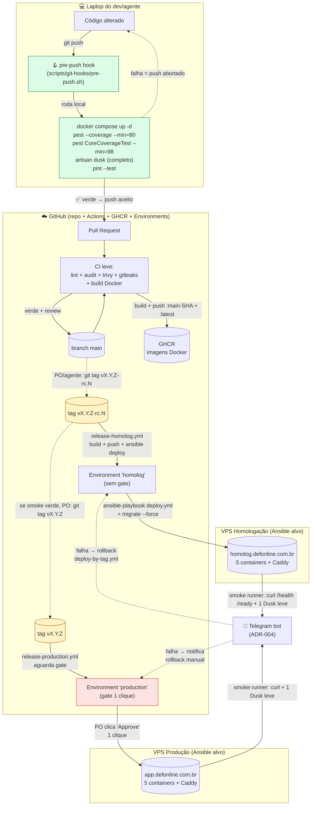

# ADR-006 — CI/CD do DEFOnline

## Contexto

ADR-001 fixou Laravel 13 + PostgreSQL 18 + Pest 4 + Dusk 8 (PHP 8.5). ADR-002 fixou a topologia "um codebase / uma imagem Docker / três modos de processo" (`web` + `worker` + `scheduler`). ADR-003 fixou Eloquent + migrations Laravel reversíveis + audit log e purga LGPD. ADR-004 fixou `/health` + `/ready` + logs JSON + Telegram para alertas. ADR-005 fixou VPS BR genérica + Ansible + Caddy + Docker Compose + Backblaze B2 (backup off-site) e definiu **`playbooks/deploy.yml`** como entrypoint operacional de deploy — qualquer pipeline de CI/CD termina chamando esse playbook.

Esta ADR decide **como o código vai do laptop do dev até a VPS de homologação (e, em seguida, até produção)** de forma automatizada. Pontos que faltam fixar:

1. **Modelo de branching** — quantas branches, vida útil, regras de PR.
2. **Ferramenta de CI/CD** — onde os jobs rodam (provedor + runners).
3. **Pipeline mínimo** — etapas, ordem, gates, paralelismo.
4. **Gates de cobertura** — `quality-standards.md` exige ≥80% geral e ≥98% no núcleo/regras de negócio.
5. **Estratégia de deploy para homologação** e para **produção**.
6. **Estratégia de rollback** — como reverter um deploy ruim.
7. **Feature flags** — ferramenta + política de remoção.
8. **Versionamento do produto** — semver, calver, ou nenhum.
9. **Política de hotfix**.

Restrições estruturais herdadas (não reabrir):

- **Automação por padrão** (PO + `quality-standards.md §2.2`). Execução de deploy nunca manual. Aceite humano pode ser um clique (gate); a execução nunca. Onde a automação **não roda no servidor remoto**, ela roda **na máquina do dev** via hook git versionado — automação ≠ "servidor remoto cobra". O que importa é que **a máquina cobra, não o humano lembra**.
- **TDD + E2E inegociáveis** (ADR-001, `quality-standards.md §1`). Cobertura 80% geral / 98% núcleo continua sendo **gate**, agora medido no **pre-push hook local** em vez do CI remoto (ver F8 abaixo).
- **CI leve, sem subir infra no runner** (decisão do PO em 2026-05-21, esta revisão). Runner GHA SaaS é caro em tempo e custo quando precisa subir Postgres + Chromium + container app. Testes que dependem de DB ou browser **rodam local** antes do `git push`, cobrados por git pre-push hook. CI no servidor remoto **não sobe Postgres**, **não roda Pest Feature** (DB-dependent), **não roda suíte Dusk completa**. Smoke pós-deploy (HTTP + 1 Dusk leve contra URL real) **continua no CI** porque o ambiente alvo já está no ar — runner não sobe nada, só faz request.
- **Uma imagem Docker = três processos** (ADR-002). Pipeline produz **uma** imagem; deploy a três processos no host alvo é responsabilidade do Ansible (ADR-005).
- **VPS BR genérica + Ansible** (ADR-005). Entry de deploy = `ansible-playbook deploy.yml`. CI/CD precisa autenticar SSH na VPS e disparar o playbook.
- **Time muito pequeno** (1 dev humano + IA). GitFlow completo é desproporcional; trunk-based simples é o caminho (princípio #1).
- **Postgres-first + 100% local** (princípios #3 e #6). Stack pesada (Postgres + Chromium + Compose) **é** o ambiente local — `docker compose up` + `php artisan migrate` + `pest` + `dusk` rodam onde sempre rodaram bem: na máquina do dev.
- **Sem orçamento de unicórnio** (princípio #11). Free tier GHA cobre MVP confortavelmente quando o CI é leve. Subir Postgres + Chromium em todo PR consumiria minutos demais sem ganho proporcional (a máquina local já roda mais rápido com cache).
- **Repo já no GitHub.** Migrar para outro provedor para usar CI/CD diferente cobraria custo alto.

Direção operacional confirmada pelo PO via `AskUserQuestion` em 2026-05-21:

1. **Ferramenta CI/CD:** **GitHub Actions** — repo já no GitHub, free tier de 2.000 min/mês cobre o MVP com folga.
2. **Cadência de deploy:** **tag-based dual** — tag `vX.Y.Z-rc.N` dispara deploy em **homologação**; tag `vX.Y.Z` (sem `-rc`) dispara deploy em **produção**. Merge em `main` **não** deploya por si só — apenas valida (CI leve) e publica imagem Docker. **Esta decisão substitui o critério "merge em main = deploy automático em homol" do `quality-standards.md §2.2`** — ação derivada registrada abaixo.
3. **Feature flags:** **Laravel Pennant desde o dia 1**, com política de owner + data-limite + alerta para flags antigas.
4. **CI leve, testes pesados no pre-push local** (revisão 2026-05-21, mesma sessão): Pest Feature (com Postgres) + Dusk E2E + cobertura 80%/98% rodam **localmente** via git pre-push hook versionado. Runner GHA SaaS **não** sobe infra; cobra apenas lint, Pest Unit puros (sem DB), análise de dependências, build de imagem, deploy e smoke contra URL já no ar. **Esta decisão substitui o critério "todo push em branch dispara unit + E2E em paralelo" do `quality-standards.md §2.2`** — testes ainda rodam, mas no laptop, não no servidor.

A decisão precisa ser tomada agora porque destrava STORY-007 (hello world deployado em homologação **via pipeline**) e fecha o último pré-requisito do EPIC-000.

## Forças (drivers) da decisão

- **F1 — Automação por padrão (PO + RNF §10)** — **Alto**. Cliques manuais para executar deploy violam diretamente. Gate humano é aceitável; execução manual não.
- **F2 — Pipeline verde como pré-requisito de merge / promoção (princípio #10)** — **Alto**. Lint + test + cobertura + segurança rodam **antes** de a imagem entrar no registry. Sem desvio.
- **F3 — Tag-based dual (homol = `-rc.N`, prod = semver)** — **Alto** (decidido pelo PO). Cada promoção é um ato explícito (criação de tag), não um efeito colateral de merge. Reduz blast radius; aumenta um pouco a cerimônia.
- **F4 — TDD + E2E desde o dia 1 (ADR-001, `quality-standards.md §1`)** — **Alto**. Pest Feature + Dusk E2E rodam contra Postgres real + Chromium real **na máquina local** do dev, cobrados pelo git pre-push hook. Hook falha = push abortado. Mesma stack que o dev usa para desenvolver, sem mock heroico.
- **F5 — Compatibilidade com Ansible (ADR-005)** — **Alto**. CI/CD termina invocando `ansible-playbook deploy.yml` em SSH-key autenticado contra a VPS alvo. Sem reinventar deploy.
- **F6 — Custo de runner e operação (princípio #11)** — **Alto**. CI leve = jobs curtos (~2-3 min cada) = free tier GHA folgadíssimo. Subir Postgres + Chromium no runner consumiria ~5x mais minutos sem ganho — quando o dev local roda mais rápido com cache quente.
- **F7 — Princípio #1 simplicidade + time pequeno** — **Alto**. Trunk-based + 1 main branch + PR curtas + 1 hook versionado é a forma mais simples viável. GitFlow é overkill.
- **F8 — Princípio #6: local roda o pesado, CI roda o leve + smoke contra URL real** — **Alto**. O comando que roda no pre-push hook é o **mesmo** comando que o dev usa para testar interativo (`composer test`, `composer dusk`) — máquina local é o ambiente canônico. CI roda apenas o subconjunto que não precisa de infra (`pint --test`, `larastan`, `composer audit`, `trivy fs`, build) + smoke HTTP/Dusk-leve contra ambiente já no ar.
- **F9 — Rollback rápido (RTO 4h, RNF §5.2)** — **Alto**. Redeploy de tag anterior tem que ser uma linha de comando — mesma imagem Docker imutável, mesma migração reversível (ADR-003).
- **F10 — Feature flags com política (princípio #1: não acumular dívida silenciosa)** — **Médio**. Pennant é o opinativo do Laravel; usar driver `database` para honrar princípio #3.
- **F11 — Segurança no pipeline (RNF §4 + `quality-standards.md §4`)** — **Alto**. Análise de dependências vulneráveis + segredos só em GitHub Secrets / Ansible Vault, nunca no repo.
- **F12 — Reversibilidade (princípio #7)** — **Médio**. Se GitHub virar problema, GHA é portável para Gitea Actions self-hosted (sintaxe compatível). Lock-in raso.
- **F13 — Risco do pre-push hook bypassado (`git push --no-verify` ou hook não instalado)** — **Médio**. Hook local é o **único** gate de cobertura e E2E nesta política. Bypass acidental (clonou repo, esqueceu de rodar `make setup`) ou intencional (`--no-verify` numa hora de aperto) quebra a garantia. Mitigação: bootstrap idempotente + hook auto-instalável + lembrete via Telegram quando padrão suspeito for detectado (a definir).

## Opções consideradas

### Opção A — GitHub Actions enxuto (lint + segurança + build + deploy + smoke) + pre-push hook local cobrando Pest/Dusk/cobertura + trunk-based + tag-based dual + Ansible deploy + Pennant

- **Resumo:** **Dois locais de execução**, com responsabilidades nítidas:
  1. **Máquina local do dev/agente** — git pre-push hook versionado (instalado por `scripts/install-hooks.sh`, idempotente) roda: Pest **Unit + Feature** com Postgres real do `docker compose`, Dusk E2E com Chromium em container, cobertura `--min=80` geral e `--min=98` no núcleo. Hook **falha = push abortado**. Mesma stack que o dev usa para desenvolver.
  2. **GitHub Actions (SaaS) — runner hosted `ubuntu-24.04`** — roda apenas o subconjunto **leve** que não precisa de infra: lint (pint, larastan, ansible-lint, commitlint), `composer audit`, `trivy fs`, `gitleaks`, Pest **Unit puros** (testes que não tocam DB nem rede, opcionais), build da imagem Docker multistage, push GHCR, deploy via Ansible, smoke HTTP/Dusk-leve contra a URL real já no ar.

  Branching: **trunk-based** com `main` como única branch protegida; features em branches curtas (`feat/*`, `fix/*`) com PR obrigatório. Merge em `main` **apenas re-valida** o SHA (sem build de imagem — revisão de 2026-05-23 da §3.2). Promoção: tag git `vX.Y.Z-rc.N` → workflow `release-homolog.yml` aciona `ansible-playbook deploy.yml -i inventories/homolog -e image_tag=vX.Y.Z-rc.N`; tag `vX.Y.Z` (sem `-rc`) → workflow `release-production.yml` aciona o mesmo playbook contra inventário de produção, com gate humano via GitHub Environment. Imagem é **imutável** — tag git aponta para SHA + imagem GHCR com a mesma tag. Rollback = recriar tag anterior **ou** acionar workflow manual `deploy-by-tag.yml`. Feature flags via **Laravel Pennant** com driver `database` (princípio #3).

- **Componentes concretos:**

  | Camada | Decisão |
  |---|---|
  | **Provedor CI/CD** | GitHub Actions (SaaS) — runners hosted GitHub `ubuntu-24.04` |
  | **Registry de imagens** | GitHub Container Registry (GHCR) — `ghcr.io/<org>/defonline-app` |
  | **Branching** | Trunk-based: `main` única branch protegida; `feat/*`, `fix/*`, `chore/*` curtas (≤ 3 dias) com PR |
  | **PR obrigatório?** | Sim para qualquer mudança em `main`. Bypass só para `chore/release` automatizado |
  | **Aprovação de PR** | 1 review humano ou agente revisor + CI verde (regra de proteção em `main`) |
  | **Versionamento** | **SemVer** (`vMAJOR.MINOR.PATCH[-rc.N]`). Tag git é a fonte da verdade |
  | **Tag → homol** | `v*.*.*-rc.*` (regex `^v\d+\.\d+\.\d+-rc\.\d+$`) |
  | **Tag → prod** | `v*.*.*` (regex `^v\d+\.\d+\.\d+$`) |
  | **Build target** | 1 imagem Docker multistage (Laravel + PHP-FPM + nginx), arquitetura amd64. ARM64 opcional pós-MVP |
  | **Cache de build** | GHA cache + Docker BuildKit (`type=gha`) |
  | **Pest Feature (DB) + Dusk E2E** | **LOCAL via pre-push hook** — `docker compose up -d` + `php artisan test` + `php artisan dusk`. Não roda no runner GHA. |
  | **Pest Unit puros (sem DB)** | Opcional no CI; rodam rapidamente sem subir nada. Não substituem o hook local. |
  | **Cobertura 80% geral / 98% núcleo** | **LOCAL via pre-push hook** — `pest --coverage --min=80` e `pest --filter=CoreCoverageTest --coverage --min=98 --coverage-filter=app/Domain`. CI **não** mede cobertura. |
  | **Lint** | CI: `pint --test` + `larastan` nível 8 + `ansible-lint` + `commitlint` |
  | **Análise de seguranças** | CI: `composer audit` + `trivy fs` + `gitleaks` — gates de pipeline |
  | **Deploy** | CI: `ansible-playbook deploy.yml -i inventories/<env>` via SSH com chave deploy (GitHub Secret, OpenSSH ED25519) |
  | **Smoke test pós-deploy** | CI: `curl -fsSL https://<alvo>/health` + `/ready` + 1 cenário Dusk crítico (`--group=smoke`) contra a URL real. Runner não sobe Postgres; Chromium baixado on-the-fly via `setup-chromedriver`. |
  | **Pre-push hook** | `scripts/pre-push.sh` (versionado em `scripts/git-hooks/`) instalado por `scripts/install-hooks.sh`. Rodado automaticamente em `composer install` via Composer script `post-install-cmd`. |
  | **Feature flags** | **Laravel Pennant** driver `database` |
  | **Política de flag** | Cada flag declarada em `app/Features/` carrega PHPDoc `@owner` + `@cleanup_due` (ISO date). CI alerta se data passou |
  | **Notificação** | Falha no pipeline ou no deploy → bot Telegram (mesmo bot da ADR-004) via `appleboy/telegram-action` ou `curl` direto ao Bot API |

- **3 ambientes (alinhado a ADR-005):**

  | Ambiente | Gatilho de deploy | Cadência típica | Aprovação |
  |---|---|---|---|
  | **local** | `docker compose up` no laptop | a cada commit/dev | n/a |
  | **homologação** | tag `vX.Y.Z-rc.N` criada (CLI ou GitHub UI) | ≥ 1× por dia em sprint ativa | sem gate humano — automação |
  | **produção** | tag `vX.Y.Z` criada após validação em homol | semanal/quinzenal no MVP | **GitHub Environment "production" exige 1 reviewer** (PO) clicando "Approve and deploy" |

  **Observação sobre o gate de produção:** mesmo escolhendo "tag-based para prod" (PO em 2026-05-21), aplicamos **adicionalmente** o gate de GitHub Environment porque ele é **gratuito**, é só configuração, e atua como segunda barreira contra "tag prod criada por engano". O PO pode aprovar com 1 clique. **Execução continua 100% automatizada** — só o disparo final tem confirmação humana.

- **Pipeline mínimo:**

  ```mermaid
  flowchart TB
    subgraph PR["Pipeline de PR (qualquer branch que abre PR para main)"]
      direction TB
      pr_lint[Lint: pint --test + larastan + ansible-lint]
      pr_unit[Testes unitários: pest --coverage --min=80]
      pr_core[Cobertura núcleo: 98% em app/Domain/**]
      pr_e2e[E2E Dusk: docker compose + 1 smoke crítico]
      pr_sec[Segurança: composer audit + trivy fs]
      pr_lint --> pr_unit --> pr_core --> pr_e2e
      pr_lint --> pr_sec
    end

    subgraph MAIN["Pipeline de merge em main (build + publish)"]
      direction TB
      m_full[Full test matrix idêntico ao PR]
      m_build[docker build multistage]
      m_push[docker push ghcr.io tag main-SHA + latest]
      m_full --> m_build --> m_push
    end

    subgraph RC["Pipeline tag vX.Y.Z-rc.N (deploy homologação)"]
      direction TB
      rc_full[Re-roda testes completos contra a tag]
      rc_build[docker build + tag vX.Y.Z-rc.N]
      rc_push[docker push ghcr.io tag vX.Y.Z-rc.N]
      rc_deploy[ansible-playbook deploy.yml -i inventories/homolog -e image_tag=vX.Y.Z-rc.N]
      rc_migrate[php artisan migrate --force]
      rc_smoke[curl /health + /ready + 1 cenário Dusk contra homolog.defonline.com.br]
      rc_alert[notifica Telegram: sucesso ou falha]
      rc_full --> rc_build --> rc_push --> rc_deploy --> rc_migrate --> rc_smoke --> rc_alert
    end

    subgraph PROD["Pipeline tag vX.Y.Z (deploy produção)"]
      direction TB
      p_full[Re-roda testes completos contra a tag]
      p_gate{{Aprovação humana<br/>GitHub Environment 'production'}}
      p_build[docker build + tag vX.Y.Z]
      p_push[docker push ghcr.io tag vX.Y.Z]
      p_deploy[ansible-playbook deploy.yml -i inventories/producao -e image_tag=vX.Y.Z]
      p_migrate[php artisan migrate --force]
      p_smoke[curl /health + /ready + smoke contra app.defonline.com.br]
      p_alert[notifica Telegram: sucesso ou falha]
      p_full --> p_gate --> p_build --> p_push --> p_deploy --> p_migrate --> p_smoke --> p_alert
    end

    PR --> MAIN --> RC --> PROD
  ```

- **Como atende aos princípios** (`references/architecture-principles.md`):
  - ✅ **#1 Simplicidade:** 1 ferramenta CI/CD remota + 1 hook local versionado; 1 branch protegida; 4 workflows YAML (`pr.yml`, `main.yml`, `release-homolog.yml`, `release-production.yml`); 1 playbook Ansible reusado.
  - ✅ **#2 Monolito:** pipeline produz 1 imagem que atende `web` + `worker` + `scheduler`. Sem pipeline-por-serviço.
  - ✅ **#3 Postgres-first:** Pennant driver `database`; cache de Composer/npm na build, dado de estado runtime no Postgres. Pre-push hook usa Postgres real (não SQLite) para Feature tests — bug de driver fica visível antes do push.
  - ✅ **#4 Opinativo:** GHA + Pest + Pennant + Pint + Larastan = todos defaults do mundo Laravel. Sem montar peças.
  - ✅ **#5 Coesão/acoplamento:** workflows separados por responsabilidade (validar PR ≠ publicar imagem ≠ deploy ambiente). Composite actions reaproveitam steps comuns.
  - ✅ **#6 Local roda o pesado (Postgres + Chromium + suite completa); CI roda o leve:** princípio "100% local" é justamente o que viabiliza esta política. Máquina do dev tem Postgres + Chromium **já rodando** (princípio #6 da ADR-001/002); reusá-los no hook custa zero. Subir o mesmo no runner SaaS a cada PR custa 5–10 min + minutos do free tier.
  - ✅ **#7 Reversibilidade:** GHA YAML é compatível com Gitea Actions. Hook é script bash POSIX puro — migra para qualquer host git. Migrar custa horas, não semanas.
  - ✅ **#8 Observabilidade:** falha/sucesso de cada job CI vira evento Telegram (canal único, mesmo bot da ADR-004). Hook local escreve logs em `storage/logs/pre-push-<timestamp>.log` — diagnóstico em mãos do dev.
  - ⚠️ **#9 Automatizável:** 100% das etapas remotas são YAML versionado; **hook local depende de instalação** — mitigação via Composer `post-install-cmd` que torna a instalação automática em qualquer `composer install`. Bypass via `--no-verify` continua possível (limitação inerente do git). Sinal de revisão registrado em F13.
  - ✅ **#10 TDD + E2E:** hook local **falha vermelho** se Pest ou Dusk falharem; cobertura abaixo de 80%/98% bloqueia o push antes de chegar ao remote. Push bloqueado = PR não pode existir = merge não pode acontecer = release não pode ser tagueada. Cadeia preserva a garantia.
  - ✅ **#11 Custo:** free tier GHA com folga — pipeline CI inteiro fica em ~2–3 min (lint + segurança + build). ~R$ 0/mês em CI por todo o MVP. CPU da máquina local já é paga.
  - ✅ **#12 Restrições:** explícitas em "Fora de escopo".

- **Prós concretos:**
  - **CI extremamente leve e barato.** Pipeline PR ~2–3 min (lint + segurança); pipeline tag rc/prod ~4–5 min (build + push + deploy + smoke). Free tier GHA cabe com folga gigante.
  - **Hook local roda em ~1 min** com cache quente do Docker Compose já levantado pelo dev. Mais rápido que esperar runner GHA inicializar + baixar imagens + rodar suíte.
  - **Lock-in raso.** Sintaxe GHA replicável em Gitea/Forgejo Actions com edits mínimos; hook é bash POSIX puro.
  - **Marketplace maduro** — `actions/checkout`, `docker/build-push-action`, `appleboy/ssh-action`, `appleboy/telegram-action` são battle-tested.
  - **Imagem Docker imutável + tag git = rollback de 1 comando.**
  - **GitHub Environments dão gate humano grátis** para produção.
  - **Pennant é o opinativo Laravel** — sem `unleash`, sem `launchdarkly`, sem custo terceiro.
  - **Hook como artefato versionado** — qualquer dev/agente que clonar e rodar `composer install` recebe o hook instalado automaticamente. Mesmas regras para todo mundo.

- **Contras concretos:**
  - **Bypass do hook é possível** (`git push --no-verify` ou commit sem rodar `composer install`). É o trade-off central desta política. **Mitigações:**
    1. `composer install` instala o hook via `post-install-cmd` (script idempotente).
    2. `scripts/install-hooks.sh` é também o primeiro passo do `README.md`/setup.
    3. CI **valida no PR** que o último commit do diff foi feito após instalação do hook? Inviável de verificar — registrado como **risco aceito** com sinal de revisão.
    4. Cultura: usar `--no-verify` exige justificativa no PR. Code review humano detecta padrão suspeito.
  - **Free tier tem limite** (2.000 min/mês em repo privado; ilimitado em público). CI leve consome estimados ~200–400 min/mês. Margem gigantesca.
  - **GHA é SaaS — depende de uptime de GitHub.** Princípio #7 mitiga.
  - **GHCR vinculado ao GitHub.** Migrar para outro registry S3-compat exige reescrita de `image: ...` em `docker-compose.yml`. Aceito.
  - **Tag-based dual exige disciplina de versionamento.** Mitigação: workflow `bump-rc.yml` automatiza criação de `-rc.N`.
  - **Smoke pós-deploy precisa de Chromium no runner** para 1 cenário Dusk leve. Custo: ~30s de setup (`browser-actions/setup-chrome`) + ~20s de execução. Cabe folgado nos minutos do free tier.

### Opção B — Gitea Actions self-hosted na VPS de homologação

- **Resumo:** runner Actions self-hosted (Gitea Actions ou Forgejo Actions) em container na VPS de homologação. Sintaxe quase 100% compatível com GHA. Repo permanece no GitHub; runner self-hosted é registrado no GitHub via runner token.
- **Como atende aos princípios:**
  - ✅ #1 simplicidade, mas adiciona 1 container extra para operar.
  - ✅ #3 + #11: custo de runner = zero direto (CPU da VPS de homol já paga); mas custo de operação ≠ zero.
  - ⚠️ #7 reversibilidade: ganha (sai do SaaS); mas dobra superfície de incidente (runner travado = pipeline travado).
  - ⚠️ #6 paridade local: idêntica à Opção A.
  - ❌ #1 conflito: time muito pequeno operando ferramenta extra antes de existir dor de custo. Princípio #11 não é violado pelo free tier de GHA.
- **Veredicto:** rejeitada **agora**. Reabrir como supersede se: (a) ultrapassar limites do free tier sustentadamente; (b) CI no SaaS virar bottleneck operacional. Sinal de revisão registrado.

### Opção C — GitLab CI (mover repo para GitLab)

- **Resumo:** migrar repo para GitLab.com (free tier inclui ~400 CI min/mês — apertado para MVP). Pipeline em `.gitlab-ci.yml`.
- **Como atende aos princípios:**
  - ⚠️ #1: mover repo, refazer integrações (issues, PRs, automação `gh`), reescrever YAML.
  - ❌ #11: free tier menor que GHA; minutos pagos custam mais.
  - ⚠️ #7: lock-in análogo ao GHA, sem ganho material.
- **Veredicto:** rejeitada por custo de migração + free tier inferior. Sem dor concreta que justifique mover hoje.

### Opção D — Status quo / sem CI/CD

- **Consequência:** STORY-007 não tem trilho automatizado; quality-standards do PO violado; toda promoção é manual via SSH + `git pull` na VPS. Bug óbvio.
- **Veredicto:** rejeitada. Adiamento custaria o critério de pronto do EPIC-000.

## Matriz comparativa

| Critério (força) | Peso | A — GHA enxuto + pre-push hook | B — Gitea self-hosted | C — GitLab CI | D — Status quo |
|---|---|---|---|---|---|
| F1 — Automação por padrão | Alto | ✅ YAML + hook versionado | ✅ idem | ✅ idem | ❌ |
| F2 — Gate antes de merge / promoção | Alto | ✅ branch protection + CI leve + hook | ✅ idem | ✅ idem | ❌ |
| F3 — Tag-based dual (homol + prod) | Alto | ✅ `on: push: tags` nativo | ✅ idem | ✅ idem | n/a |
| F4 — TDD + E2E (hook local) | Alto | ✅ Pest + Dusk no laptop, rápido | ⚠️ duplica se rodar tb no runner | ⚠️ idem | ❌ |
| F5 — Compatível com Ansible (ADR-005) | Alto | ✅ ssh-action + secret | ✅ idem | ✅ idem | n/a |
| F6 — Custo de runner (#11) | Alto | ✅ ~200 min/mês estimado | ✅ zero direto | ⚠️ minutos curtos | n/a |
| F7 — Simplicidade + time pequeno | Alto | ✅ SaaS, zero op, hook simples | ⚠️ +1 serviço | ⚠️ migrar repo | n/a |
| F8 — Local roda pesado, CI roda leve | Alto | ✅ política explícita | ⚠️ tendência a subir tudo no runner | ⚠️ idem | n/a |
| F9 — Rollback rápido | Alto | ✅ tag imutável + ansible | ✅ idem | ✅ idem | ❌ |
| F10 — Feature flag opinativa | Médio | ✅ Pennant | ✅ idem | ✅ idem | n/a |
| F11 — Segurança no pipeline | Alto | ✅ Secrets + Trivy + gitleaks | ✅ idem | ✅ idem | ❌ |
| F12 — Reversibilidade | Médio | ✅ portável p/ Gitea + hook bash | ✅ já fora SaaS | ⚠️ exige migrar de novo | n/a |
| F13 — Risco de bypass do hook | Médio | ⚠️ `--no-verify` possível, mitigado | ⚠️ idem | ⚠️ idem | n/a |

Notas: ✅ atende plenamente; ⚠️ atende com ressalva; ❌ não atende.

## Decisão proposta

> **Optamos pela Opção A — GitHub Actions enxuto no servidor remoto + git pre-push hook versionado cobrando os testes pesados no laptop do dev, com branching trunk-based + tag-based dual (`vX.Y.Z-rc.N` → homol; `vX.Y.Z` → prod) + Ansible deploy + Laravel Pennant para feature flags.**
>
> **Separação de responsabilidades:**
>
> - **Pre-push hook local** (`scripts/git-hooks/pre-push.sh`, instalado via `composer install` por `post-install-cmd`): roda Pest **Unit + Feature** com Postgres real via `docker compose`, Dusk E2E com Chromium em container, gate de cobertura **80% geral** e **98% em `app/Domain/**`**. Falha = `git push` abortado. Cache do Docker Compose já levantado pelo dev mantém o hook em ~1 min.
> - **CI no GitHub Actions** (runner hosted `ubuntu-24.04`): roda apenas o subconjunto leve — lint (pint, larastan, ansible-lint, commitlint), `composer audit`, `trivy fs`, `gitleaks`, Pest **Unit puros** (sem DB) opcionais, build da imagem Docker multistage, push GHCR, `ansible-playbook deploy.yml` via SSH, smoke pós-deploy (HTTP `/health` + `/ready` + 1 Dusk leve **contra URL real já no ar**). **CI não sobe Postgres**, **não sobe app container**, **não roda suíte Pest/Dusk completa** — esse trabalho fica no laptop.
>
> Branching: `main` única branch protegida; features em `feat/*`, `fix/*`, `chore/*` com PR obrigatório. Merge em `main` apenas re-valida o SHA (build de imagem `main-<sha>` foi removido em 2026-05-23 — vide §3.2). **Promoção é explícita via tag git**: `vX.Y.Z-rc.N` aciona deploy em homologação; `vX.Y.Z` (sem `-rc`) aciona deploy em produção com **gate humano** no GitHub Environment `production` (1 clique do PO). Deploy = `ansible-playbook deploy.yml -i inventories/<env> -e image_tag=<tag>` via SSH com chave em GitHub Secret. **Rollback** = recriar tag anterior **ou** acionar workflow `deploy-by-tag.yml` com a tag anterior — mesma imagem imutável já no GHCR, downtime estimado < 2 min. **Feature flags** via Laravel Pennant (driver `database`), com convenção `@owner` + `@cleanup_due` em PHPDoc e alerta de pipeline para flags vencidas.
>
> Custo: R$ 0/mês em CI no MVP (pipeline ~2–3 min por PR; estimado ~200–400 min/mês contra free tier de 2.000). Acréscimo zero ao orçamento da ADR-005.

## Decisão 1 — Modelo de branching (CA-2, mini-checklist Tipo 7)

### 1.1 Trunk-based

- **`main`** é a única branch de longa duração. **Protegida**: exige PR + CI verde + 1 revisão (humano ou agente revisor) para merge. `git push --force` proibido (regra de proteção GitHub).
- **Branches de feature** são curtas: `feat/<slug-curto>`, `fix/<slug>`, `chore/<slug>`, `refactor/<slug>`. Vida útil **≤ 3 dias úteis**. Branch que ultrapassar dispara comentário automático no PR sugerindo dividir.
- **Sem `develop`**, sem `release/*`, sem `hotfix/*`. Hotfix é PR direto para `main` com label `hotfix` + tag `vX.Y.Z+1` semver criada após merge — não exige branch separada.

### 1.2 PR é obrigatório

Toda mudança em `main` passa por PR. Bypass apenas para o workflow automatizado `chore/release-bump` (criação de tags `-rc.N`). Squash merge é o **default** (preserva histórico linear). Merge commit permitido só para PRs de release explicitamente marcados.

### 1.3 Convenção de mensagens

- Padrão **Conventional Commits** (`feat:`, `fix:`, `chore:`, `docs:`, `refactor:`, `test:`, `perf:`, `ci:`). Aplicado **ao squash final** do PR (título do PR vira commit). Validado por `commitlint` ou ação equivalente em CI.
- Esta convenção alimenta `bump-rc.yml` para incrementar versão (patch/minor) automaticamente quando o PO criar release-candidate.

### 1.4 Tag-based promotion (foco desta ADR)

| Tag git | Regex | Aciona | Ambiente |
|---|---|---|---|
| `vX.Y.Z-rc.N` | `^v\d+\.\d+\.\d+-rc\.\d+$` | `release-homolog.yml` | homologação |
| `vX.Y.Z` | `^v\d+\.\d+\.\d+$` (sem sufixo) | `release-production.yml` | produção |

**Criação de tag de homol:** workflow_dispatch `bump-rc.yml` calcula próxima versão a partir do último tag + incrementa `-rc.N`. Comando local equivalente: `git tag v0.3.0-rc.1 && git push --tags`.

> **Aditivo 2026-05-24 (STORY-023):** o `git push` da tag dentro do `bump-rc.yml` usa `secrets.RELEASE_TAG_PAT` (Fine-grained PAT, scope `Contents: write`) em vez do `GITHUB_TOKEN` implícito. Sem isso, a tag empurrada **não dispara** o `release-homolog.yml` (proteção do GitHub: eventos disparados por `GITHUB_TOKEN` não criam novos workflow runs, exceto `workflow_dispatch`/`repository_dispatch`). Provisionamento + rotação do secret em [`skills/programador/references/cicd-secrets.md`](../../skills/programador/references/cicd-secrets.md). Opção B (`gh release create`) e C (GitHub App) avaliadas e rejeitadas: B tem o mesmo problema de origem do evento (o token é o mesmo `GITHUB_TOKEN`); C tem overhead de provisionar uma App pra um projeto de 1 dev MVP.

**Criação de tag de prod:** **manual pelo PO** (ou agente sob ordem do PO), tipicamente após `-rc.N` validada em homologação. Comando: `git tag v0.3.0 <sha-da-rc-validada> && git push --tags`.

**Imutabilidade:** uma tag, uma vez criada, **nunca é movida** (`git push --force --tags` proibido por branch protection rule). Se a release saiu errada, cria-se `-rc.(N+1)` ou patch (`v0.3.1`), **não** se reescreve `v0.3.0`.

### 1.5 Versionamento semver

- **MAJOR (`X`):** mudança incompatível pública (breaking change na URL/UX que exija comunicação para usuários). Raro no MVP. `0.x.y` durante toda a WAVE-2026-01.
- **MINOR (`Y`):** funcionalidade nova (novo épico em produção, ou bloco de funcionalidade). `feat:` commits no diff desde último tag.
- **PATCH (`Z`):** bugfix, refactor, chore. Tudo que não é `feat:` nem breaking.

### 1.6 Política de hotfix

Hotfix urgente (RTO < 1h): PR direto para `main` com label `hotfix` → após merge, agente cria imediatamente `vX.Y.(Z+1)` (sem RC). Workflow de produção dispara com gate humano (PO pode aprovar em < 1 min). **Sem** branch `hotfix/*` separada — apenas o label, que ajusta o pipeline a pular passos opcionais (ex.: análise pesada de larastan) para velocidade. Análise pesada roda em PR de follow-up.

## Decisão 2 — Ferramenta CI/CD: GitHub Actions (CA-2, CA-4)

### 2.1 Estrutura de workflows

```
.github/workflows/
├── pr.yml                    # roda em pull_request — gate de merge
├── main.yml                  # roda em push em main — só re-valida o SHA (sem build; vide §3.2 — revisão 2026-05-23)
├── bump-rc.yml               # workflow_dispatch — incrementa -rc.N e cria tag
├── release-homolog.yml       # roda em push de tag v*.*.*-rc.* — deploy homol
├── release-production.yml    # roda em push de tag v*.*.*  — gate humano + deploy prod
├── deploy-by-tag.yml         # workflow_dispatch — rollback / re-deploy de qualquer tag
└── nightly.yml               # cron — roda E2E completo + audit + ansible-lint --check
```

Composite actions reusáveis em `.github/actions/`:

- `setup-php-lite/` — instala PHP 8.5 + extensões mínimas (`pdo`, `mbstring`, `intl`, `zip`) **sem Postgres**, faz cache Composer, roda `composer install --no-dev` ou `--dev` conforme uso. Suficiente para lint + audit + Pest Unit puros.
- `docker-build/` — `docker buildx build` multistage com cache GHA (`type=gha,mode=max`), tag + push GHCR.
- `ansible-deploy/` — instala Ansible (apt) + injeta chave SSH (GitHub Secret) + roda `ansible-playbook deploy.yml -i inventories/<env> -e image_tag=<tag>`.
- `smoke-test/` — `curl -fsSL` em `/health` e `/ready` + setup Chromium via `browser-actions/setup-chrome` + roda `php artisan dusk --group=smoke --env=ci-against-deployed --url=https://<alvo>`. Não sobe Postgres no runner; Dusk só faz requisição HTTP via Chromium contra URL pública.
- `notify-telegram/` — envia mensagem ao bot Telegram (mesmo bot da ADR-004).

### 2.2 Runners

- **Hosted runners** `ubuntu-24.04` em todos os jobs. Suficiente para MVP. Ubuntu 24.04 garante compatibilidade com Docker + buildx default.
- **Concorrência:** `concurrency: { group: deploy-${{ github.event_name }}-${{ github.ref }}, cancel-in-progress: false }` em workflows de deploy — duas tags `-rc` consecutivas **não** se atropelam.

### 2.3 Secrets e variáveis

| Secret | Onde | Usado por |
|---|---|---|
| `DEPLOY_SSH_KEY` | GitHub Secret (per-environment: `homolog`, `production`) | `ansible-deploy` action |
| `DEPLOY_SSH_KNOWN_HOSTS` | GitHub Secret (per-environment) | idem |
| `ANSIBLE_VAULT_PASS` | GitHub Secret (per-environment) | desencriptar `vault.yml` (ADR-005 §2.1) |
| `TELEGRAM_BOT_TOKEN` | GitHub Secret (org-wide) | `notify-telegram` |
| `TELEGRAM_CHAT_ID_HOMOLOG` / `..._PRODUCTION` | GitHub Secret | idem |
| `GHCR_PAT` (opcional) | GitHub Secret | push em GHCR — `GITHUB_TOKEN` cobre na maior parte dos casos |
| `RELEASE_TAG_PAT` | GitHub Secret (Fine-grained PAT, scope `Contents: write` no repo) | `bump-rc.yml` (step `actions/checkout`) — workaround documentado para a limitação do `GITHUB_TOKEN` não disparar workflows downstream (ver §1.4 e aditivo 2026-05-24). Provisionamento + rotação em [skills/programador/references/cicd-secrets.md](../../skills/programador/references/cicd-secrets.md). |

**Sem segredo no repo.** `.env` de cada ambiente é **gerado pelo Ansible** a partir do Vault + templates Jinja (ADR-005).

## Decisão 3 — Pipeline mínimo (CA-2, CA-5)

### 3.1 Pipeline de PR (`pr.yml`) — leve

Jobs paralelos. Falha em qualquer job = pipeline vermelho = bloqueio de merge.

| Job | Comando essencial | Tempo médio | Falha bloqueia merge? |
|---|---|---|---|
| **lint-php** | `vendor/bin/pint --test` | ~30s | sim |
| **lint-static** | `vendor/bin/phpstan analyse --level=8` (larastan) | ~1 min | sim |
| **lint-ansible** | `ansible-lint infra/ansible/` | ~20s | sim |
| **lint-commits** | `commitlint` no título do PR (action `wagoid/commitlint-github-action`) | ~10s | sim |
| **test-unit-pure** *(opcional)* | `php artisan test --testsuite=UnitPure` (testes sem DB e sem rede; tag/filter convencionado) | ~30s | sim quando existir conteúdo nessa suíte |
| **security-deps** | `composer audit --locked` | ~20s | sim (HIGH/CRITICAL) |
| **security-image** | `trivy fs --exit-code 1 --severity HIGH,CRITICAL .` | ~40s | sim (HIGH/CRITICAL) |
| **security-secrets** | `gitleaks detect --no-banner` | ~15s | sim (qualquer hit) |
| **flags-check** | `php artisan pennant:list-overdue` (script custom — Decisão 7) | ~10s | warning + comentário no PR, **não** bloqueia |

**Tempo total estimado de pipeline PR: ~2–3 min** (jobs em paralelo). Não há job que suba Postgres, Chromium ou app container.

**O que NÃO roda aqui (intencional):** Pest Feature (toca DB), Dusk E2E completo, medição de cobertura. **Garantia desses gates: pre-push hook local** (Decisão 4).

### 3.2 Pipeline de `main` (`main.yml`) — re-validação

Após push em `main`:

1. Re-roda jobs do `pr.yml` contra o SHA real (defesa contra interferência de merge / regressão silenciosa).

**Tempo total estimado: ~2–3 min.** **Não há deploy nem build aqui.**

> **Revisão 2026-05-23 (STORY-015):** este pipeline antes empurrava `ghcr.io/.../app:main-<sha>` + `:latest` em todo push, mas a imagem nunca era consumida — o `release-homolog.yml` builda do zero a partir do SHA da tag rc, e não usava `main-<sha>` nem como base. Custava ~3 min + camadas no GHCR por commit de pura conveniência (incluindo commits puramente documentais). O job `build-and-push` e o `notify` Telegram foram removidos; a imagem nasce só quando há consumidor (tag rc/release). Quem precisar de imagem fora do ciclo de tag pode disparar `workflow_dispatch` em `release-homolog.yml` ou cortar uma rc manualmente.

### 3.3 Pipeline `release-homolog.yml` (tag `vX.Y.Z-rc.N`)

```yaml
on:
  push:
    tags: ['v[0-9]+.[0-9]+.[0-9]+-rc.[0-9]+']
```

1. Checkout do SHA da tag.
2. Re-roda **jobs leves** do `pr.yml` contra o SHA da tag (lint + segurança + Unit puros).
3. `docker build` + `docker push ghcr.io/<org>/defonline-app:vX.Y.Z-rc.N`.
4. `ansible-deploy` action:
   - `ansible-playbook -i infra/ansible/inventories/homolog playbooks/deploy.yml -e image_tag=vX.Y.Z-rc.N --vault-password-file <(echo $ANSIBLE_VAULT_PASS)`
   - Playbook (ADR-005) faz: `docker compose pull` + `docker compose up -d` + `php artisan migrate --force`.
5. **Smoke test** contra `homolog.defonline.com.br` (HTTP do runner + 1 Dusk leve com Chromium baixado on-the-fly):
   - `curl -fsSL https://homolog.defonline.com.br/health` (espera HTTP 200 + JSON `{"status":"ok"}`)
   - `curl -fsSL https://homolog.defonline.com.br/ready`
   - `php artisan dusk --group=smoke --env=ci-against-deployed --url=https://homolog.defonline.com.br` (1 cenário crítico — login → home → logout — contra a URL real; runner não sobe Postgres, Chromium consome só a URL pública).
6. Em falha de smoke: **rollback automático** acionando `deploy-by-tag.yml` com a tag anterior + notifica Telegram crítico.
7. Em sucesso: notifica Telegram canal de homol "Deploy `vX.Y.Z-rc.N` ok".

**Tempo total estimado: ~5–6 min** (lint leve + build + deploy + smoke).

### 3.4 Pipeline `release-production.yml` (tag `vX.Y.Z`)

```yaml
on:
  push:
    tags: ['v[0-9]+.[0-9]+.[0-9]+']
    tags-ignore: ['v[0-9]+.[0-9]+.[0-9]+-rc.[0-9]+']
```

Idêntico ao `release-homolog.yml` **com 2 diferenças**:

- Job de deploy depende de **`environment: production`** (GitHub Environment) → **gate humano de 1 clique** ("Approve and deploy") aparece para o PO no UI do GitHub. Sem o clique, deploy não dispara. Timeout do gate: 7 dias (configurável).
- Smoke test contra `app.defonline.com.br` + cenário crítico Dusk leve.
- Em falha: **não há rollback automático** — alerta Telegram CRÍTICO ao PO; rollback é decisão consciente via `deploy-by-tag.yml`.

### 3.5 Pipeline `nightly.yml` (cron) — leve

`schedule: cron: '0 5 * * *'` (02:00 BRT). Roda contra `main`:

- `composer audit` para vulnerabilidades CVE recentes (catch para libs vulneráveis publicadas nas últimas 24h).
- `ansible-playbook --check --diff` contra homologação (drift detection — ADR-005 §2.5).
- **Não** roda Pest/Dusk no runner — esse trabalho é coberto pelo pre-push hook em cada PR.
- Falha = Telegram CRÍTICO + cria issue automaticamente.

## Decisão 4 — Gates de cobertura e testes pesados via pre-push hook local (CA-3)

### 4.1 Princípio

`quality-standards.md §1.1` exige cobertura **≥ 80% geral** + **≥ 98% no núcleo (`app/Domain/**`)**, e testes E2E em browser real para todo fluxo de usuário. Esta ADR **mantém o gate**, mas move o ponto de medição:

- **Antes (proposta inicial desta ADR):** medido no runner GHA em cada PR.
- **Agora (revisão 2026-05-21):** medido **localmente** no `git pre-push` hook, antes do código sair do laptop.

**Razão:** subir Postgres + Chromium + app container no runner para cada PR consumiria 5–10 min do free tier sem ganho sobre a máquina local — que **já tem** essa stack rodando para o dev fazer TDD. A máquina local cobra mais rápido com cache quente; o runner cobra mais devagar e do zero.

### 4.2 O que o hook faz

`scripts/git-hooks/pre-push.sh` (versionado), rodado automaticamente antes de cada `git push`:

```bash
#!/usr/bin/env bash
set -euo pipefail

# Garante que docker compose está de pé
if ! docker compose ps web | grep -q "Up"; then
  docker compose up -d
  docker compose exec -T web php artisan migrate --force
fi

# 1. Pest unit + feature com cobertura ≥ 80%
docker compose exec -T web php artisan test \
  --coverage --min=80 \
  --coverage-clover=storage/coverage/clover.xml

# 2. Cobertura núcleo ≥ 98% em app/Domain/**
docker compose exec -T web php artisan test \
  --filter=CoreCoverageTest \
  --coverage --min=98 \
  --coverage-filter=app/Domain

# 3. Dusk E2E completo
docker compose exec -T web php artisan dusk

# 4. Pint formatting check (rápido, evita falha óbvia no CI remoto)
docker compose exec -T web vendor/bin/pint --test

# Sucesso: relatórios em storage/coverage/index.html
echo "✅ pre-push verde — push autorizado"
```

**Falha em qualquer passo = `exit 1` = push abortado pelo git.** Mensagem clara no terminal do dev/agente; logs detalhados em `storage/logs/pre-push-<timestamp>.log`.

### 4.3 Instalação do hook

`scripts/install-hooks.sh` cria symlink (`ln -sfn ../../scripts/git-hooks/pre-push .git/hooks/pre-push`). Idempotente — pode rodar quantas vezes for necessário.

**Garantia de instalação:**

1. **Composer `post-install-cmd`** em `composer.json`:
   ```json
   "scripts": {
     "post-install-cmd": ["@php scripts/install-hooks.php"],
     "post-update-cmd":  ["@php scripts/install-hooks.php"]
   }
   ```
   Toda vez que dev/agente roda `composer install` (etapa obrigatória do setup), o hook é instalado.

2. **README.md / setup script** instrui explicitamente:
   ```bash
   git clone <repo> && cd defonline
   composer install      # instala dependências + pre-push hook
   docker compose up -d  # sobe stack local
   php artisan migrate
   php artisan db:seed
   ```

3. **CI valida estrutura** do repo (não a instalação do hook em si): job `hook-files-check` verifica que `scripts/git-hooks/pre-push` existe e é executável. Não impede que alguém pule a instalação local, mas garante que **o artefato versionado está sempre lá**.

### 4.4 Núcleo de regras de negócio = `app/Domain/**`

`quality-standards.md §1.1` exige 98% no núcleo. Núcleo definido como **`app/Domain/**`** (decisão de IDR do Programador na STORY-007 implementar a estrutura final).

`CoreCoverageTest` é um teste arquitetural Pest que falha se a cobertura filtrada em `app/Domain/**` cair abaixo de 98%. Implementação concreta = IDR do Programador na STORY-007 (definir a primeira pasta `app/Domain/` mesmo que com 1 classe placeholder, para que o teste exista).

### 4.5 Exceções e dead code

**Exceções permitidas** (com justificativa explícita no PR):

- Migrations e seeders — `database/**` excluído por padrão.
- Stubs e templates Blade — `.blade.php` não entram na medida.
- Bootstrap (`bootstrap/`, `config/`, `public/index.php`) — fora.
- Branch `catch (Throwable $e)` genérico já coberto pelo teste do happy path do gatilho.

Conformidade contra `quality-standards.md §1.4` (sem código não testado em produção):
- Larastan nível 8 detecta dead code (roda no CI **e** no hook).
- `// no coverage` ou `@codeCoverageIgnore` exigem comentário no PR justificando — verificação manual no review.

### 4.6 Risco de bypass (F13) e mitigações

| Risco | Mitigação |
|---|---|
| `git push --no-verify` ignora hook | Code review do PR olha o diff; padrão suspeito (test ausente + cobertura cairia) fica visível. Uso recorrente vira pauta de retrospectiva. |
| Dev clonou repo e não rodou `composer install` | `composer install` é etapa obrigatória do setup (sem ela, nem `php artisan` funciona); README guia o passo. |
| Hook instalado mas Postgres não está de pé | Hook sobe `docker compose up -d` se detectar containers down — auto-cura. |
| Hook quebra em máquina lenta (timeout) | Aceitar; dev resolve localmente (mais RAM, fechar Chrome do navegador, etc). Não é problema da política. |
| `git push origin <branch> --no-verify` chega a abrir PR | CI ainda valida lint + audit + trivy. Não cobertura/E2E, mas detecta lint errors e CVE — não é zero proteção. |

**Sinal de revisão (Decisão 9 ampliada):** se 2+ incidentes em 6 meses forem causados por código que **passaria** no hook mas chegou a `main` via bypass, reabrir para adotar **runner self-hosted (Opção B) com job de validação assíncrona pós-push** (não bloqueia merge, mas registra "este commit pulou o hook" no Telegram).

## Decisão 5 — Deploy para homologação e produção (CA-2)

### 5.1 Topologia de deploy (alinhada à ADR-002 e ADR-005)

Em **ambos** os ambientes, deploy é:

1. Workflow GHA puxa SSH key do GitHub Secret apropriado.
2. Roda `ansible-playbook deploy.yml -i inventories/<env> -e image_tag=<tag>` da máquina runner.
3. Playbook na VPS faz:
   - `docker compose pull` (puxa nova imagem do GHCR — autenticação via deploy token).
   - **Migrations**: `docker compose exec -T web php artisan migrate --force`.
   - **Restart graceful**: `docker compose up -d` (Compose detecta image mudada e recria containers em ordem).
   - **Health check loop**: aguarda `/health` respondendo 200 por até 60s; falha = rollback.
4. Runner GHA chama smoke test contra URL pública (Decisão 3.3 / 3.4).
5. Notifica Telegram.

### 5.2 Migrations no deploy

- **Migrations Laravel reversíveis** (ADR-003) — toda migration tem `up()` + `down()` funcional. `migrate --force` é seguro porque o `down()` existe.
- Migrations rodam **antes** do restart do web/worker/scheduler — Compose garante ordem.
- Migrations devem ser **forward-compatible** com a versão anterior do código quando possível (zero-downtime parcial: aceitar coluna nullable primeiro, depois preencher em release seguinte, depois tornar NOT NULL). Padrão de migration **expand-then-contract** documentado em ADR-003 § migrations.
- Migrations destrutivas (drop coluna, drop tabela) **exigem PR isolado** e label `dangerous-migration` — pipeline alerta mas não bloqueia.

### 5.3 Zero downtime no MVP

Não é objetivo absoluto no MVP (RNF §1.1 uptime 99,5% mensal = ~3,6h/mês de janela). Compose recria containers em ~5-15s; o request entre `docker compose down` parcial e `up` retorna 502 do Caddy. Caddy serve uma página estática "voltamos em segundos" se quisermos (decisão futura/IDR — não no MVP).

### 5.4 Banco de dados no deploy

- **Backup automático antes de toda deploy de produção** (não em homol — homol pode quebrar): `playbooks/deploy.yml` chama `playbooks/backup.yml` (ADR-005 §4.2) **antes** do `migrate --force`. Tempo: ~30s para banco MVP.
- Falha do backup = aborta deploy. Não há "deploy sem rede de segurança".

### 5.5 Inventários por ambiente (referência ADR-005 §2.2)

- `infra/ansible/inventories/homolog/hosts.yml` aponta para `homolog.defonline.com.br` (IP da VPS).
- `infra/ansible/inventories/producao/hosts.yml` aponta para `app.defonline.com.br` (IP da VPS de produção — vazio até promover).
- Workflows escolhem inventário pelo padrão de tag (Decisão 1.4).

## Decisão 6 — Estratégia de rollback (CA-2, mini-checklist Tipo 7)

### 6.1 Caso A — smoke test falha logo após deploy

**Rollback automático** no workflow `release-homolog.yml`:

1. Smoke test falha.
2. Workflow descobre tag anterior via `gh api repos/.../tags`.
3. Workflow aciona `deploy-by-tag.yml` com `image_tag=<tag-anterior>`.
4. Playbook redeploya a imagem anterior (puxa do GHCR — imagens ficam por **90 dias** no GHCR; lifecycle policy mantém últimas 20 tags `-rc.*` + últimas 10 `vX.Y.Z`).
5. Notifica Telegram CRÍTICO com link do incidente.

**Tempo médio:** ~3 min do smoke vermelho ao rollback aplicado.

### 6.2 Caso B — bug descoberto depois (cliente reclamou)

**Rollback manual via workflow `deploy-by-tag.yml`:**

- PO ou agente roda `gh workflow run deploy-by-tag.yml -f environment=production -f image_tag=v0.3.5` (versão anterior conhecida boa).
- Workflow exige confirmação no GitHub Environment (1 clique).
- Deploy idêntico ao normal — só muda o `image_tag`.

**Tempo médio:** ~5 min do clique até rollback aplicado.

### 6.3 Caso C — migration destrutiva ruim

Migration que apagou dados / dropou coluna não é revertida só com rollback de imagem.

**Procedimento:**

1. Rollback de imagem (Caso A ou B) — código volta a expectar schema antigo.
2. **Restaurar Postgres** via `playbooks/restore.yml` (ADR-005 §4.2): baixa dump mais recente de antes do deploy ruim, restaura no Postgres.
3. **Janela de inconsistência:** dados criados entre o dump (03:00 BRT do dia anterior) e o rollback são perdidos. Aceito porque migration destrutiva exige label `dangerous-migration` e revisão extra — não é caminho usual.
4. Pós-mortem obrigatório no formato `defonline-docs/decisions/idr/` ou `defonline-docs/decisions/post-mortems/`.

### 6.4 Imagem Docker imutável

A imagem `ghcr.io/<org>/defonline-app:vX.Y.Z` **nunca é sobrescrita**. Rollback é sempre "puxar imagem que ainda existe". Lifecycle do GHCR mantém últimas N tags por padrão; configuração explícita (action `actions/delete-package-versions`) preserva tags com semver válido por 12 meses.

## Decisão 7 — Feature flags com Laravel Pennant (CA-2, mini-checklist Tipo 7)

### 7.1 Stack

- **Pacote:** `laravel/pennant` (oficial Laravel, opinativo, mantido).
- **Driver:** `database` (princípio #3). Tabela `features` criada por migration do pacote.
- **Convenção de uso:** features declaradas em `app/Features/<Nome>Feature.php` como classes Pennant, **uma classe por flag**.

### 7.2 Tipos de flag suportados

| Tipo | Uso | Exemplo |
|---|---|---|
| **Kill-switch** | Desligar funcionalidade existente em produção sem deploy | Desligar geração de PDF em hot-incident |
| **Dark launch** | Funcionalidade nova invisível ao usuário até flag ligar | Novo motor de cálculo de diagnóstico rodando em paralelo, comparando resultados |
| **Rollout gradual** | % de usuários veem feature nova (0 → 10 → 50 → 100) | Nova UI de cadastro liberada para 10% |
| **A/B test** | Comparar duas versões | **Não no MVP** — falta instrumentação analytics. Reabrir quando ADR de analytics existir |

### 7.3 Política de remoção (anti-dívida)

Toda classe `*Feature` carrega PHPDoc obrigatório:

```php
/**
 * @owner alexandro
 * @cleanup_due 2026-08-15
 * @reason rollout gradual da nova UI de cadastro
 */
class NovaUiCadastroFeature extends \Laravel\Pennant\Feature { ... }
```

- **`@owner`** — quem decide quando remover a flag. Único responsável.
- **`@cleanup_due`** — data ISO. Após essa data, CI alerta no PR e nightly alerta no Telegram. Flag fica `OVERDUE`.
- **`@reason`** — frase curta sobre o porquê da flag existir.

CI script `php artisan pennant:list-overdue` (implementação = IDR do Programador na primeira flag real) verifica todas as classes de feature, parseia PHPDoc, alerta as vencidas.

**Trinta dias após `@cleanup_due` vencer**, CI **bloqueia** PRs até a flag ser removida ou prazo prorrogado em commit explícito. Princípio: dívida silenciosa precisa de fricção crescente.

### 7.4 Quando NÃO usar flag

- Configuração que não muda em runtime → `.env` (ADR-005).
- Permissões por role → sistema de autorização Laravel (Gates/Policies), não Pennant.
- Limite operacional (rate limit, max upload size) → `config/`, não flag.

## Decisão 8 — Segurança no pipeline (CA-2, `quality-standards.md §4`)

### 8.1 Análise de dependências (`composer audit`)

- Roda em PR e nightly.
- **HIGH ou CRITICAL = bloqueia** (PR ou pipeline noturno cria issue).
- MEDIUM / LOW = warning no log, não bloqueia.

### 8.2 Análise de imagem Docker (`trivy fs`)

- Roda em PR.
- Mesmo critério: HIGH/CRITICAL bloqueia.
- Falha em pacote OS do base image → atualiza base image (`FROM php:8.5-fpm-alpine` → próxima versão patch). PR de "bump base" gerado por dependabot ou agente.

### 8.3 SAST opcional

- **GitHub CodeQL** habilitado para PHP (free para repo público; pago para privado — desligado no MVP).
- **Snyk / Semgrep** — fora do MVP. Reabrir como ADR se trivy + composer audit virarem insuficientes.

### 8.4 Segredos no código

- Pre-commit hook (local) e CI step rodam `gitleaks detect` → bloqueia commit/PR se padrões de chave AWS, GitHub PAT, SSH key, GPG key forem detectados.

### 8.5 Política de segredos

- Repositório de código **nunca** contém segredo em claro. Vault da ADR-005 cifra `.env` por ambiente.
- GitHub Secrets são gerenciados pelo PO (org-wide e per-environment).
- Rotação: anual ou após qualquer suspeita.

## Decisão 9 — Custo recorrente do CI/CD (CA-2, princípio #11)

| Item | Custo mensal | Observação |
|---|---|---|
| GitHub Actions (private repo) | R$ 0 | Free tier 2.000 min/mês; estimativa MVP **com CI enxuto**: ~200–400 min/mês (PR ~3 min × ~30 PRs/mês + release ~6 min × ~10 tags/mês + nightly ~2 min × 30 dias = ~270 min/mês) |
| GitHub Container Registry | R$ 0 | Free tier 500 MB; imagem app ~250 MB × 30 tags ≈ 1,5 GB → ~R$ 1,30/mês (US$ 0,25/GB extra) |
| GitHub Environments | R$ 0 | Gate humano grátis em todos os planos |
| Trivy / Larastan / Pint / Gitleaks | R$ 0 | Open source rodando no runner |
| Notificações Telegram | R$ 0 | API gratuita |
| Pre-push hook | R$ 0 | Roda na CPU local que o dev já paga (laptop, máquina pessoal). Sem custo recorrente para o projeto. |
| **Total CI/CD** | **R$ 0–2/mês** | |

**Delta sobre ADR-005:** ~R$ 0. Total agregado do EPIC-000: ~R$ 100/mês (só com homologação ativa).

**Sinal de revisão de custo:** ultrapassar 1.500 min/mês de GHA sustentadamente por > 2 meses (improvável com CI leve), ou imagem ocupar > 5 GB no GHCR → reabrir para self-hosted runner (Opção B) e cleanup de imagens antigas.

## Diagrama — Fluxo end-to-end



**Legenda:** o **bloco verde no laptop** (pre-push hook) é onde **Pest + Dusk + cobertura** rodam — `quality-standards.md §1` é gateado aí. O **bloco do GitHub** (CI leve) faz apenas validações que não precisam de infra. O **bloco amarelo** (tags) é o **único** trigger de deploy — promoção é sempre ato explícito.

## Justificativa

A Opção A vence porque **converge simultaneamente** com:

1. **F1 + F2 + F3 (automação + gate + cadência explícita):** GHA + branch protection + GitHub Environments + pre-push hook versionado cobrem tudo com YAML/bash versionados. Sem ferramenta extra.
2. **F4 + F8 + F6 (TDD/E2E + local roda pesado + custo):** a máquina do dev **já tem** Postgres + Chromium rodando para fazer TDD interativo. Reusar essa stack no `pre-push` hook custa zero adicional e é mais rápido que recriar tudo em runner SaaS a cada PR. Free tier GHA fica gigantemente folgado porque o CI remoto só faz coisas leves.
3. **F5 (compatível com ADR-005):** `ansible-playbook deploy.yml` é o entry de deploy fixado pela ADR-005. GHA invoca via `ssh-action` em 5 linhas YAML.
4. **F11 (segurança):** Trivy + composer audit + gitleaks são gratuitos e rodam em < 1 min no CI; cobrem o subset que precisa do contexto do CI (lock files committados, imagem inteira).
5. **F7 (simplicidade):** trunk-based + 1 ferramenta CI + 1 hook + 4 workflows YAML = mínimo viável honesto para 1 dev humano + IA.
6. **F12 (reversibilidade):** sintaxe GHA é portável para Gitea Actions; hook é bash POSIX puro. Migração custa dias, não meses.

Trade-offs honestamente reconhecidos:

- **F13: bypass do pre-push hook é tecnicamente possível** (`--no-verify`, repo clonado sem `composer install`). É o trade-off central desta política. Mitigações em camadas (Decisão 4.3 e 4.6) reduzem mas não eliminam. Sinal de revisão registrado: se 2+ incidentes em 6 meses forem causados por bypass, reabrir para adotar runner self-hosted pós-push.
- **Tag-based dual adiciona um ato manual (criar tag)** entre merge e deploy de homologação. Aceito porque o PO decidiu — promoção explícita reduz blast radius. Mitigação: `bump-rc.yml` automatiza criação de `-rc.N` em 1 clique.
- **Smoke pós-deploy precisa de Chromium no runner** (~30s de setup) para 1 Dusk leve. Cabe folgado no free tier. Alternativa (apenas `curl`) foi considerada e descartada porque um endpoint HTTP 200 não prova que o request real funciona — Dusk pegaria, por exemplo, um erro 500 mascarado por um catch-all.
- **Gate humano em produção via GitHub Environment** adiciona ~minutos a horas. Aceito como sinal de "ouvir antes de afetar usuário".
- **GitHub como SPOF.** Lock-in raso; produção continua servindo mesmo se GitHub cair (afeta deploys, não runtime).
- **Pennant adiciona uma tabela e disciplina de PHPDoc.** Compensa: kill-switch e dark-launch são ferramentas que time pequeno precisa **antes** da primeira crise, não depois.

## Plano de verificação

### Como verificar conformidade (a cobrar em IDRs e PRs futuros)

- **Branch protection rules** configuradas em `main` no momento da implementação (STORY-007): exige PR + 1 review + CI verde + `signed commits` opcional.
- **CI roda em PR fictício** (PR de teste com 1 linha alterada) antes do EPIC-000 fechar — valida que o pipeline existe e fica em ~2–3 min.
- **Pre-push hook exercitado** na STORY-007: dev/agente roda `composer install`, vê hook instalado em `.git/hooks/pre-push`, faz commit + push, observa hook rodar Pest + Dusk + cobertura, vê push bloqueado quando cobertura fica abaixo de 80% (teste deliberado).
- **Workflow `deploy-by-tag.yml`** exercitado manualmente em homologação no encerramento da STORY-007: deploy + rollback + redeploy de mesma tag.
- **Restore de Postgres a partir de backup off-site** exercitado em homologação trimestralmente (já fixado em ADR-005 §4.2).
- **`php artisan pennant:list-overdue`** rodando em CI desde a primeira flag real.
- **Cobertura ≥ 80% / 98% núcleo** medida pelo hook local em cada push; relatório HTML em `storage/coverage/` (não commitado).
- **Auditoria periódica:** PO ou agente revisor olha 1× por mês o `git log` com `--no-verify` para detectar padrão de bypass do hook.

### Sinais de revisão (quando reabrir esta decisão)

Cada um abre ADR de **supersede**, não edição silenciosa:

1. **Bypass do pre-push hook (F13) virou dor concreta:** 2+ incidentes em 6 meses de código quebrado chegando a `main` via `--no-verify` ou hook não instalado. **Trigger:** reabrir para runner self-hosted pós-push (Gitea Actions na VPS de homol) que re-roda Pest + Dusk contra `main` e alerta — não bloqueia merge, mas registra bypass no Telegram.
2. **GHA free tier excedido:** > 1.500 min/mês por 2 meses consecutivos → revisar pipeline ou migrar para self-hosted runner (Opção B).
3. **Smoke test em homologação flaky:** > 10% das deploys com falha não-determinística no smoke → revisar estabilidade do ambiente de teste antes de mudar pipeline.
4. **Pre-push hook lento demais:** mediana > 3 min em hardware do dev de baixo desempenho → otimizar Dusk (parallel groups) ou dividir hook em "essencial pré-push" + "completo pré-tag".
5. **Migração destrutiva quebrou prod 2+ vezes:** revisar política de label `dangerous-migration` (gate humano explícito? PR review especializado?).
6. **Pennant vira dívida:** se acumular > 10 flags `OVERDUE` simultâneas → revisar a política de cleanup (encurtar prazo padrão? bloqueio mais cedo?).
7. **Gate humano em produção pula** (PO aprovando sem olhar) → instrumentar: dashboard de "deploys em produção sem fail nos últimos 30 dias" como sinal de confiança no pipeline; **se** confiança consolidada, considerar continuous deployment puro como ADR futura.

### Spike de validação proposto

**Não é necessária spike separada para esta ADR.** A STORY-007 (hello world deployado) **absorve** a validação naturalmente:

- Cria `pr.yml`, `main.yml`, `release-homolog.yml`, `deploy-by-tag.yml`.
- Exercita: push em branch → PR → CI verde → merge → main builda imagem → tag `v0.0.1-rc.1` → deploy em homologação real → smoke verde → Telegram alerta sucesso.
- Exercita rollback: cria `v0.0.1-rc.2` ruim de propósito → smoke falha → rollback automático para `-rc.1` → Telegram CRÍTICO.
- Exercita gate de produção: cria `v0.0.1` → workflow aguarda gate → PO aprova → deploy em produção (se o PO quiser exercitar produção na STORY-007; opcionalmente fica para o encerramento do EPIC-000).

## Consequências

### Positivas (o que ganhamos)

- **CI extremamente rápido e barato.** Pipeline PR ~2–3 min; release ~5–6 min. Free tier GHA folgadíssimo.
- **Pre-push hook bloqueia código quebrado antes de sair do laptop.** Não é "bug não chega a main" via CI remoto; é "bug nem sai do dev" via hook local. Mais cedo, mais barato de corrigir.
- **Stack local de TDD reusada como gate** — princípio "100% local" da ADR-001/002 paga dividendos diretos: Postgres + Chromium já estão de pé, hook os reusa sem overhead.
- **Promoção explícita reduz acidente.** Tag é um ato; merge não.
- **Rollback de 1 comando** com imagem Docker imutável + Ansible.
- **Feature flags como ferramenta operacional desde o dia 1** — kill-switch para incidente e dark-launch para mudança grande.
- **Gate humano em produção é grátis** via GitHub Environment.
- **Notificações Telegram** consolidam canal único de incidente.
- **Reversibilidade preservada.** GHA YAML migra para Gitea; hook bash POSIX migra para qualquer host git.

### Negativas / trade-offs aceitos

- **F13 — bypass do pre-push hook é tecnicamente possível** (`--no-verify`, clone sem `composer install`). É o trade-off central; mitigações em camadas reduzem mas não eliminam. Sinal de revisão registrado.
- **CI remoto não reexecuta cobertura/E2E** — confiança no hook local. Se algo passa em laptop e quebra no servidor remoto idêntico, é problema de paridade local-prod (princípio #6 da ADR-001), não desta política.
- **Tag-based dual adiciona um ato manual** (criar `-rc.N`) entre merge e deploy de homologação — mitigado por `bump-rc.yml`.
- **GHA é SaaS — depende de uptime do GitHub.** Mitigação: portabilidade para Gitea Actions.
- **Smoke pós-deploy precisa de Chromium no runner** (~30s setup). Aceito.
- **Gate humano pode atrasar prod.** Aceito como sinal de prudência; emergency-dispatch documentado.
- **Pennant exige disciplina de PHPDoc** — esquecer `@cleanup_due` vira ruído. CI verifica.
- **CodeQL desligado em repo privado** (custo). Trivy + audit + larastan cobrem boa parte; sinal de revisão se vulnerabilidade não detectada vazar para produção.
- **Hook não funciona em máquinas sem Docker Compose de pé.** Caso raro (qualquer dev/agente do DEFOnline desenvolve com o compose ligado, por princípio #6); se acontecer, hook auto-sobe o compose antes de rodar.

### Neutras (mudanças que precisam ser notadas)

- **`quality-standards.md §2.2` precisa ser atualizado** em **dois pontos**:
  1. Critério "merge na main dispara deploy automático para homologação" → "criação de tag `vX.Y.Z-rc.N` dispara deploy em homologação".
  2. Critério "todo push para branch de feature dispara: lint, testes unitários, testes E2E (em paralelo quando possível), análise de cobertura, análise de segurança básica" → "todo push é precedido por pre-push hook local rodando Pest Unit+Feature + Dusk E2E + cobertura 80%/98%; CI remoto roda apenas lint, análise de dependências, análise de imagem, gitleaks, build e (em deploy) smoke contra URL real".
- **Critério de pronto do EPIC-000** — "merge na main faz deploy automático em homologação" precisa virar **"criação de tag `vX.Y.Z-rc.N` faz deploy automático em homologação; pre-push hook local cobra Pest+Dusk+cobertura antes de qualquer push"**.
- **GHCR como registry padrão** — todas as imagens Docker do DEFOnline vivem em `ghcr.io/<org>/defonline-app`. Migrar para outro registry custa horas.
- **Pasta `app/Domain/`** é fixada como núcleo para a métrica de 98% — IDR do Programador implementa a estrutura de pastas finais na STORY-007.
- **`scripts/git-hooks/`** entra no monorepo como artefato versionado de primeira ordem — mesmo nível de cuidado que `infra/ansible/`.
- **`composer install`** vira um passo de setup **obrigatório**, não apenas para PHP — é também quem instala o hook git.

### Para o time

- **Impacto em estórias existentes:**
  - **STORY-001 (Stack):** sem impacto — Pest + Dusk + PHP 8.5 já fixados.
  - **STORY-002 (Topologia):** sem impacto — 1 imagem para 3 processos já fixada.
  - **STORY-003 (Persistência):** **input fixado** — migrations reversíveis são pré-requisito de rollback. ADR-003 já cobre.
  - **STORY-004 (Infra):** **input fixado** — pipeline chama `ansible-playbook deploy.yml`; ADR-005 já cobre.
  - **STORY-005 (CI/CD):** **esta ADR fecha**.
  - **STORY-006 (Observabilidade):** **input fixado** — bot Telegram da ADR-004 reusado para notificações de CI.
  - **STORY-007 (Hello world):** **destravada** completamente — todas as 6 ADRs aceitas após esta serem aprovadas. Implementação precisa criar os workflows + branch protection + GitHub Environment de produção.

- **Ações derivadas (devem entrar como tarefas/IDRs após aceitação desta ADR):**
  1. **Atualizar `defonline-docs/skills/po/references/quality-standards.md §2.2`** nos dois pontos descritos em "Neutras" acima. Comentário "Atualizado por ADR-006".
  2. **Atualizar critério de pronto do EPIC-000** em `defonline-docs/project-state/epics/EPIC-000-foundation/epic.md` analogamente.
  3. **Criar IDR do Programador na STORY-007** com: estrutura de pastas `app/Domain/**` (mesmo placeholder); o teste `CoreCoverageTest`; os 5 workflows YAML e composite actions GHA; o script `scripts/git-hooks/pre-push.sh` + `scripts/install-hooks.sh` + `scripts/install-hooks.php`; o gancho `post-install-cmd` em `composer.json`; configuração de branch protection.
  4. **Criar GitHub Environment `production`** com required reviewer = PO (Alexandro) — operação no painel GitHub, registrada no runbook de bootstrap.
  5. **Provisionar deploy SSH key** (ED25519) para cada VPS (homol e prod) — Ansible playbook `bootstrap.yml` (ADR-005) já cria usuário não-root; adicionar `authorized_keys` para deploy bot.
  6. **Criar bot Telegram canal `defonline-ci`** (separado ou mesmo bot da ADR-004 com chat ID diferente) — operação do PO.
  7. **Atualizar README.md** com seção "Setup" passo-a-passo incluindo `composer install` como obrigatório para instalar o hook.

- **ADRs/PDRs relacionados que esta decisão limita ou destrava:**
  - **Destrava:** STORY-007 (hello world deployado) — todas as dependências resolvidas após aceitação.
  - **Limita:** qualquer ADR futura propondo CI/CD diferente precisa argumentar contra GHA com dor mensurada (sinais de revisão acima); qualquer ADR propondo continuous deployment puro para produção precisa argumentar contra o gate humano com confiança consolidada do pipeline.

- **Necessidade de spike de validação:** **não específica**. STORY-007 absorve.

## Fora de escopo (princípio #12 — restrições são informação)

Decisões deliberadamente **não** tomadas nesta ADR:

- **Layout final de pastas / namespaces / suffix de classes** — IDR do Programador (STORY-007).
- **Estrutura final dos workflows YAML** (jobs paralelos vs sequenciais, matrix builds, etc) — IDR do Programador. Esta ADR fixa **o que** cada workflow faz, não **como exatamente** o YAML está escrito.
- **Subir Postgres ou app container no runner GHA** — **deliberadamente fora**. Toda execução que depende de DB ou app vivo roda local (pre-push hook) ou contra ambiente real (smoke pós-deploy). Reabrir só se F13 (bypass) virar dor concreta — caminho documentado é runner self-hosted **assíncrono** pós-push, não Postgres em runner SaaS por PR.
- **Rodar suíte Pest/Dusk completa em qualquer runner remoto** — fora. Hook local é o único gate.
- **A/B testing como tipo de Pennant flag** — fora; reabrir quando ADR de analytics existir.
- **CodeQL / Snyk / Semgrep** — fora; reabrir se Trivy + audit virarem insuficientes.
- **Continuous deployment puro para produção** (sem gate humano) — fora; sinal de revisão explícito acima.
- **Zero-downtime deploys** (blue-green, canary, etc.) — fora; RNF §1.1 (99,5%) cabe sem isso.
- **PITR de Postgres** — fora (já decidido em ADR-005). Dump diário cobre RPO 24h.
- **Codecov / Coveralls / SonarQube** — fora (princípio #11). Pest local + relatório HTML cobrem.
- **Multi-region / multi-cloud** — fora. ADR-005 fixou VPS BR única.
- **Self-hosted runner** — fora **agora**, com sinal de revisão explícito (Decisão 4.6).

---

## Aprovação humana

> Esta seção é o registro formal do aceite.

- **Status final:** ✅ aceita
- **Aprovado por:** Alexandro
- **Data:** 2026-05-21
- **Forma do aceite:** aprovado em chat (sessão de 2026-05-21) após revisão substancial da política de testes (CI leve + pre-push hook local).
- **Condicionantes do aceite:** nenhuma.

### Em caso de rejeição

- **Motivo:** —
- **Próximos passos sugeridos:** —

### Em caso de superseding

- **Substituída por:** —
- **Razão da substituição:** —

---

## Histórico

- 2026-05-21 — criada como `proposed` pelo Arquiteto (STORY-005 SPIKE de CI/CD). Direção operacional confirmada pelo PO via `AskUserQuestion`: GitHub Actions (F6), tag-based dual `vX.Y.Z-rc.N` para homologação / `vX.Y.Z` para produção (F3), Laravel Pennant desde o dia 1 (F10).
- 2026-05-21 — **revisão substancial na mesma sessão** após feedback do PO ("no CI/CD não quero testes que envolvam browser e que tenham que subir infra"). **Pivot:** testes pesados (Pest Feature com Postgres + Dusk E2E + cobertura 80%/98%) saem do CI remoto e passam a rodar em **git pre-push hook local** versionado, instalado automaticamente por `composer install`. CI no GHA fica enxuto (lint + audit + trivy + gitleaks + build + deploy + smoke HTTP/Dusk-leve contra URL real). Decisão 4 reescrita; nova força F13 (risco de bypass do hook) + sinal de revisão correspondente. Direção confirmada pelo PO via 3 `AskUserQuestion` adicionais: pre-push hook como gate (sobre disciplina pura e self-hosted noturno), smoke pós-deploy contra URL real mantido no CI (sobre só-curl e zero-CI), cobertura medida local pelo hook (sobre noturno + relaxar gates).
- 2026-05-21 — aceita pelo PO Alexandro em chat; status `proposed` → `accepted`.
