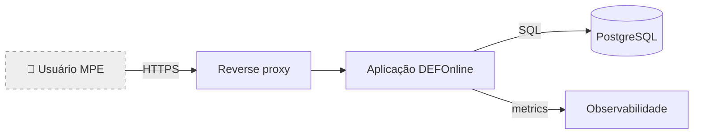
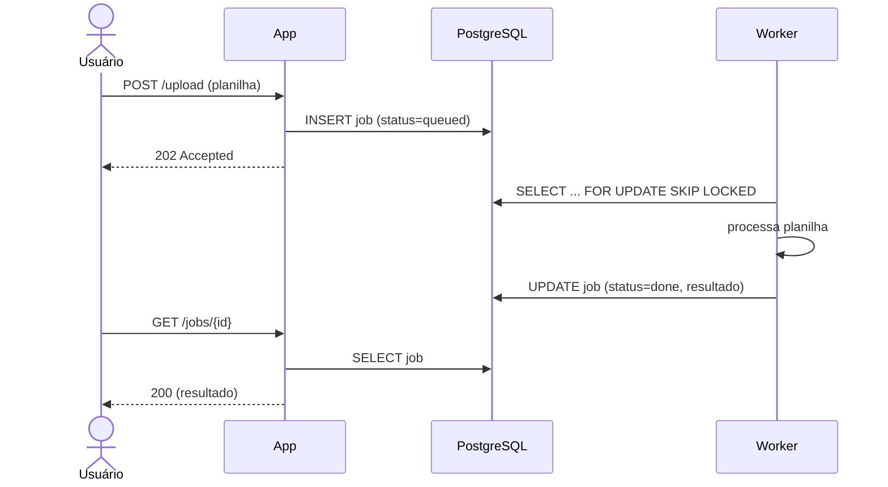
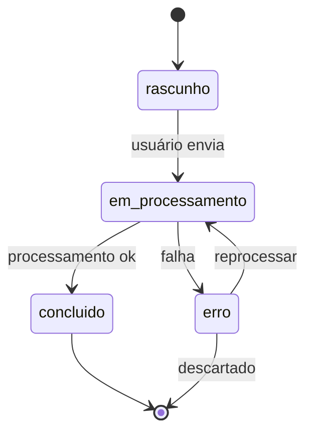
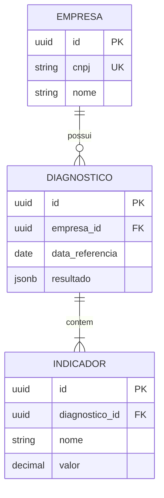

# Diagramas em ADRs — quando e como usar Mermaid

ADRs do DEFOnline usam **Mermaid** para diagramas, inline na própria ADR. Motivos: renderiza nativo no GitHub e em quase todos os viewers de markdown; é texto (versionável, diff-ável); não exige tooling externo.

A regra geral: **se um diagrama te poupa pelo menos um parágrafo de descrição, vale o diagrama**. Se você está fazendo um diagrama só pra "ter um diagrama na ADR", apague-o e escreva prosa.

## Defaults obrigatórios por tipo de ADR

Alguns tipos de ADR são **inerentemente** sobre estrutura espacial — texto sozinho sempre fica ambíguo. Para esses, **diagrama é esperado por default; ausência precisa de justificativa explícita** no ADR.

| Tipo de ADR | Diagrama é... | Tipo Mermaid recomendado |
|---|---|---|
| **Topológico** | **Esperado por default** — componentes e como se conectam | `flowchart LR` |
| **Contrato** (especialmente fluxos multi-step) | **Esperado** quando há sequência temporal | `sequenceDiagram` |
| **Infra** | **Esperado** — provedor, rede, ambientes | `flowchart` ou `architecture-beta` (Mermaid moderno) |
| **Persistência** (com modelagem macro) | **Esperado** quando define entidades/agregados | `erDiagram` |
| **Política de evolução** | Opcional — geralmente prosa basta | `flowchart` ou `gitGraph` |
| **Stack** | Opcional — decisão é textual; diagrama raro | n/a |
| **Observabilidade** | Opcional — geralmente prosa basta | `flowchart` para fluxo de telemetria |

**Como justificar ausência (raro):** se você está escrevendo ADR de tipo Topológico/Contrato/Infra/Persistência **sem** diagrama, registre na seção apropriada do ADR: "Diagrama omitido — a decisão se limita a [X] e prosa é suficiente porque [Y]". Sem essa justificativa, a ADR fica incompleta.

## Quando incluir diagrama (qualquer tipo)

Independente do tipo, inclua diagrama quando a decisão envolve:

| Conteúdo da decisão | Bom diagrama |
|---|---|
| **Topologia** — quem fala com quem | `flowchart` ou `graph` |
| **Fluxo temporal** — sequência de eventos entre atores | `sequenceDiagram` |
| **Estados** — ciclo de vida de uma entidade | `stateDiagram-v2` |
| **Modelo de dados macro** — entidades e relações principais | `erDiagram` |
| **Decomposição** — módulos e suas dependências | `flowchart LR` ou `graph TD` |
| **Pipeline / CI/CD** — estágios e gates | `flowchart LR` |

Não use diagrama quando:

- A decisão é sobre uma escolha sem componente espacial (ex: "qual linguagem usar"). Prosa basta.
- O diagrama vai ter mais de ~15 nós. Está complexo demais — divida em dois diagramas mais simples ou repense a decisão.
- Você está reproduzindo o que já está escrito em prosa, sem adicionar comunicação.

## Tipos recomendados (com exemplo)

### Flowchart (topologia / fluxo geral)

Usar para mostrar como componentes se conectam. Mais comum em ADRs de infra e topologia.

Dicas:
- Use `LR` (left-to-right) para fluxo de chamadas; `TD` (top-down) para decomposição.
- Rotule as setas com o protocolo ou intenção quando ajudar.
- Cilindros `[()]` para bancos, retângulos para serviços, `{}` para decisões.

### Sequence diagram (interação temporal)

Usar quando a ordem das ações importa — autenticação, processamento de evento, transação distribuída.

Dicas:
- `actor` para humano; `participant` para sistemas.
- Setas sólidas `->>` para requisições; tracejadas `-->>` para respostas.
- Use `Note over X: ...` para comentário inline quando precisar explicar uma etapa.

### State diagram (ciclo de vida)

Usar para entidades com estados explícitos — pedidos, jobs, contratos, certificações.

### ER diagram (modelo de dados macro)

Usar quando a ADR define agregados/entidades principais e como se relacionam. Não use para detalhe de coluna — isso é IDR do Programador.

Dicas:
- Liste só os campos essenciais à decisão. Campos de auditoria (`created_at`, etc) costumam ser ruído.
- Use cardinalidades corretas (`||--o{` = um para muitos opcional; `||--|{` = um para muitos obrigatório).

## Boas práticas transversais

- **Mantenha curto.** ADR não é manual técnico. Se o diagrama precisa de 30 nós, simplifique ou divida.
- **Legenda quando ambíguo.** Se você usa um símbolo não óbvio, explique em prosa abaixo do diagrama.
- **Versione com a ADR.** Diagrama desatualizado é pior que diagrama nenhum — gera confiança falsa. Quando a ADR for `superseded`, o diagrama dela permanece como histórico daquele momento.
- **Cuidado com cor.** Mermaid permite cor mas a renderização varia entre temas (claro/escuro). Use cor sutilmente e nunca como única forma de transmitir informação.

## Quando o Mermaid não dá conta

Casos raros em que Mermaid fica limitado:

- Diagramas de muita densidade visual (muitas conexões cruzadas).
- Diagramas que precisam de layout customizado preciso.
- Diagramas com ícones específicos de fornecedor (AWS, etc).

Nesses casos:
1. Primeiro pergunte: a decisão precisa mesmo desse nível de detalhe? Geralmente não.
2. Se sim: gere o diagrama em ferramenta externa (excalidraw, draw.io, c4-puml) e referencie o arquivo de imagem versionado em `decisions/adr/assets/ADR-XXX-<slug>-<diagram>.svg`.
3. Documente como o diagrama foi gerado para que outra pessoa consiga regenerá-lo.

## Referência rápida de sintaxe

A documentação oficial do Mermaid (https://mermaid.js.org) tem exemplos completos. Os tipos acima cobrem ~90% dos casos em ADRs de produto SaaS.
